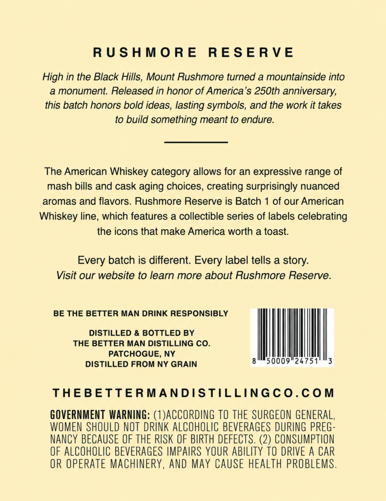

# TTB COLA Label Images - TTBID 26163001000593

**Brand Name:** THE BETTER MAN DISTILLING CO.

**Fanciful Name:** AMERICAN WHISKEY THE ICONS COLLECTION

**Issue Date:** 06/22/2026

**Origin Code:** 02

**Product Class/Type:** 140

**Source:** [TTB Public COLA Registry](https://ttbonline.gov/colasonline/viewColaDetails.do?action=publicFormDisplay&ttbid=26163001000593)

## Label Images

### Back Label

## Extracted Label Text

*Text extracted via OCR - may contain errors*

### Back Label

RUSHMORE RESERVE

High in the Black Hills, Mount Rushmore turned a mountainside into

a monument. Released in honor of America’s 250th anniversary,

this batch honors bold ideas, lasting symbols, and the work it takes

to build something meant to endure.

The American Whiskey category allows for an expressive range of

mash bills and cask aging choices, creating surprisingly nuanced

aromas and flavors. Rushmore Reserve is Batch 1 of our American

Whiskey line, which features a collectible series of labels celebrating

the icons that make America worth a toast

Every batch is different. Every label tells a story.

Visit our website to learn more about Rushmore Reserve.

BE THE BETTER MAN DRINK RESPONSIBLY

DISTILLED & BOTTLED BY

THE BETTER MAN DISTILLING CO.

PATCHOGUE, NY

65000924751 °3

tl

LLED FROM N’

THEBETTERMANDISTILLINGCO.COM

GOVERNMENT WARNING: (1)ACCORDING TO THE SURGEON GENERAL

WOMEN SHOULD NOT DRINK ALCOHOLIC BEVERAGES DURING PREG-

NANCY BECAUSE OF THE RISK OF BIRTH DEFECTS. (2) CONSUMPTION

OF ALCOHOLIC BEVERAGES IMPAIRS YOUR ABILITY TO DRIVE A CAR

OR OPERATE MACHINERY, AND MAY CAUSE HEALTH PROBLEMS
