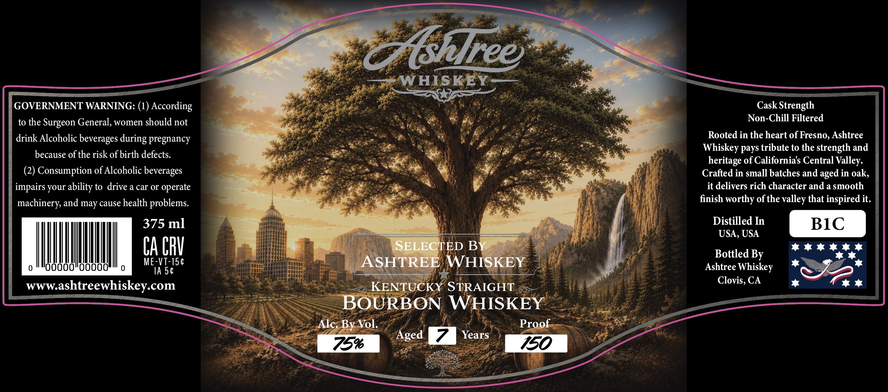
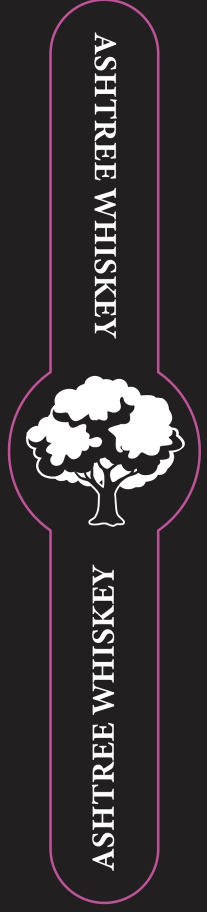

# TTB COLA Label Images - TTBID 26163001000775

**Brand Name:** ASHTREE WHISKEY

**Issue Date:** 06/24/2026

**Origin Code:** 01

**Product Class/Type:** 101

**Source:** [TTB Public COLA Registry](https://ttbonline.gov/colasonline/viewColaDetails.do?action=publicFormDisplay&ttbid=26163001000775)

## Label Images

### Label 1

### Label 2

## Extracted Label Text

*Text extracted via OCR - may contain errors*

*1 image(s) excluded: text did not meet readability threshold*

### Label 1

Ztshlree
WHISKEY
GOVERNMENT WARNING: (1) According
Cask Strength
to the
Surgeon General, women should not
Non-Chill Filtered
drink Alcoholic beverages during pregnancy
Rooted in the heart of Fresno, Ashtree
Whiskey pays tribute to the strength and
because of the risk of birth defects.
of Californias Central Valley:
(2) Consumption of Alcoholic beverages
Crafted in small batches and
in oak,
impairs your ability to drive a car or operate
it delivers rich character and a smooth
machinery and may cause health problems:
finish worthy ofthe valley that inspired it.
375 ml
Distilled In
BIC
USA, USA
CA CRV
SELECTED BY
Bottled By
00
ME-VT-15€
ASHTREE WHISKEY
Ashtree Whiskey
IA 5€
Clovis, CA
wwwashtreewhiskey com
KENTUCKY STRAIGHT
BOURBON WHISKEY
Alc: By Vol:
Proof
Aged
Years
75%6
150
heritage
aged
