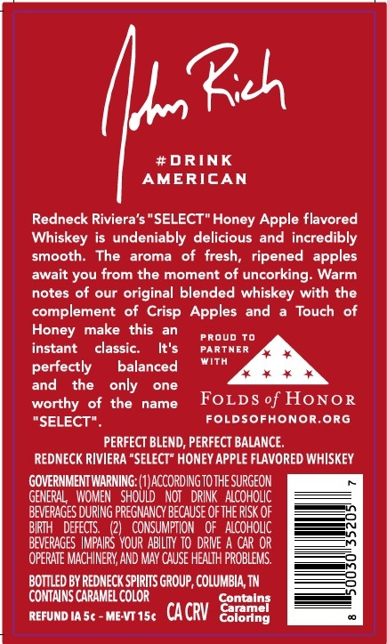
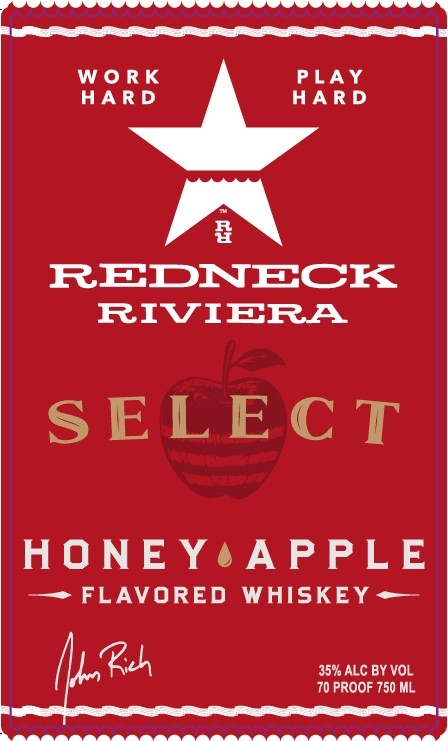

# TTB COLA Label Images - TTBID 26164001000019

**Brand Name:** REDNECK RIVIERA

**Fanciful Name:** HONEY APPLE

**Issue Date:** 07/14/2026

**Origin Code:** 43

**Product Class/Type:** 149

**Source:** [TTB Public COLA Registry](https://ttbonline.gov/colasonline/viewColaDetails.do?action=publicFormDisplay&ttbid=26164001000019)

## Label Images

### Back Label

### Front Label

### Label 2

## Extracted Label Text

*Text extracted via OCR - may contain errors*

*1 image(s) excluded: text did not meet readability threshold*

**Detected Proof:** 140

### Back Label

8
#DRINK
AMERICAN
Redneck Riviera'$ "SELECT" Honey Apple flavored
Whiskey
undeniably
delicious and incredibly
smooth
The
aroma
of   fresh,
ripened  apples
await you from the moment of
uncorking
Warm
notes of our original blended whiskey with the
complement
of Crisp Apples
and
Touch of
Honey
make
this
an
PROUD To
instant
classic:
It'$
PARTNER
With
perfectly
balanced
and
the
only
one
worthy of the
name
FoLDS of HoNOR
"SELECT"
Foldsofhonor,org
PERFECT BLEND, PERFECT BALANCE
REDNECK RIVIERA "SELECT" HONEY APPLE FLAVORED WHISKEY
GOVERNMENT WARNING: (IJACCORDINGTOTHE SURGEON
GENERAL
WOMEN   ShOULD   NOT   DRINK   Alcoholic
BEVERAGES DURING PREGNANCY BECAuSE OF THE RISK OF
BIRTH   DEFECTS.
(21   CoNSuMPTION   oF  Alcoholc
BEVERAGES IMPAIRS  YOUR ABILIY To DRIVE A CAR OR
OFERATE MACHINERY; AND MAY CAUSE HEALTH PROBLEMS.
BOTTLED BY REDNECK SPIRITS GROUP, COLUMBIA; TN
COMTAINS CARAMEL COLOR
Sontniai
REFUND IA 5c
ME-VT 15t
CACRV
Colorng

### Front Label

Sea eee I

wo

HARD

RK

HARD

PLAY

~~

én\

REDNECK

RIVIERA

SELECT

HONEY4APPLE

—~> FLAVORED WHISKEY =—

Be

70 PROOF 750 ML

35% ALC BY VOL

t

pen Re OTD LTC ELD 5
