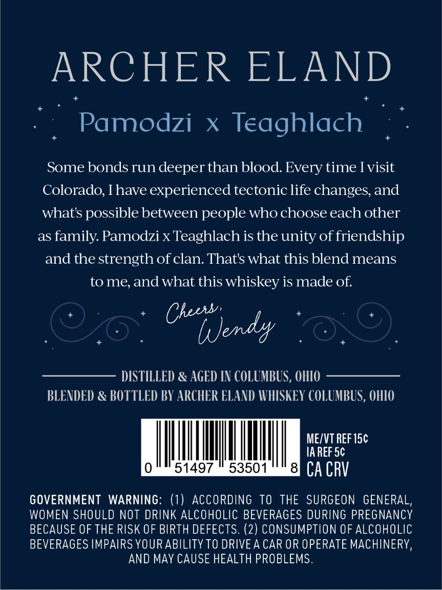
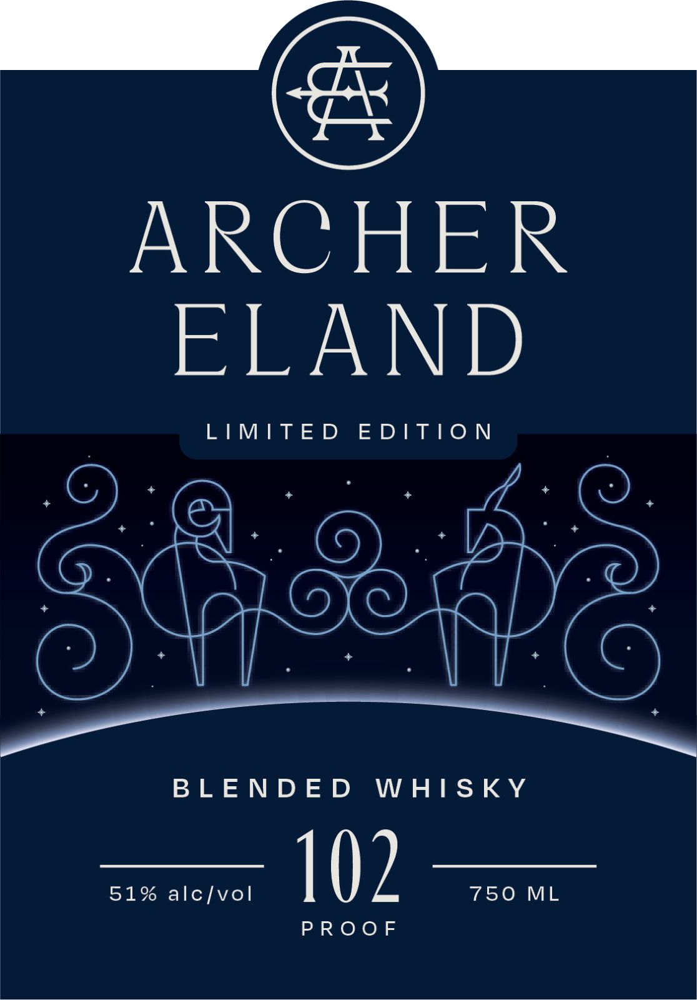

# TTB COLA Label Images - TTBID 26164001000054

**Brand Name:** ARCHER ELAND

**Issue Date:** 07/08/2026

**Origin Code:** 09

**Product Class/Type:** 137

**Source:** [TTB Public COLA Registry](https://ttbonline.gov/colasonline/viewColaDetails.do?action=publicFormDisplay&ttbid=26164001000054)

## Label Images

### Back Label

### Front Label

### Label 3

## Extracted Label Text

*Text extracted via OCR - may contain errors*

*1 image(s) excluded: text did not meet readability threshold*

### Back Label

ARCHER ELAND
Pamodzi
X
Teaghlach
Some bonds run deeper than blood Every time Ivisit
Colorado, Ihave experienced tectonic life changes, and
whats possible between people who choose each other
as
family Pamodzi x Teaghlach is the unity of friendship
and the strength of clan: Thats what this blend means
tome; andwhat this whiskey is made of:
Chets'
Uendy
DISTILLED & AGED IN COLUMBUS, OHIO
BLENDED & BOTTLED BY ARCHER ELAND WVHISKEY COLUMBUS, OHIO
MEZVT REF 15c
IA REF 5c
51497
53501
8
CA CRV
GOVERNMENT WARNING: (1) ACCORDING TO THE SURGEON GENERAL,
WOMEN SHOULD NOT DRINK ALCOHOLIC BEVERAGES DURING PREGNANCY
BECAUSE OF THE RISK OF BIRTH DEFECTS. (2) CONSUMPTION OF ALCOHOLIC
BEVERAGES IMPAIRS YOUR ABILITY TO DRIVEA CAR OR OPERATE MACHINERY,
AND MAY CAUSE HEALTH PROBLEMS.

### Front Label

ARCHER

ELAND

LIMITED EDITION

TT

BLENDED WHISKY

aoe =

PROOF
