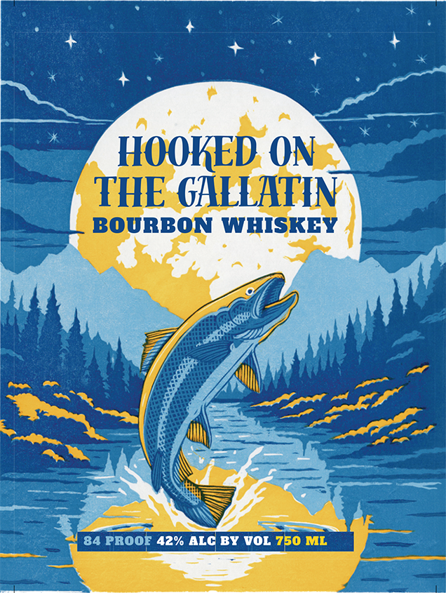
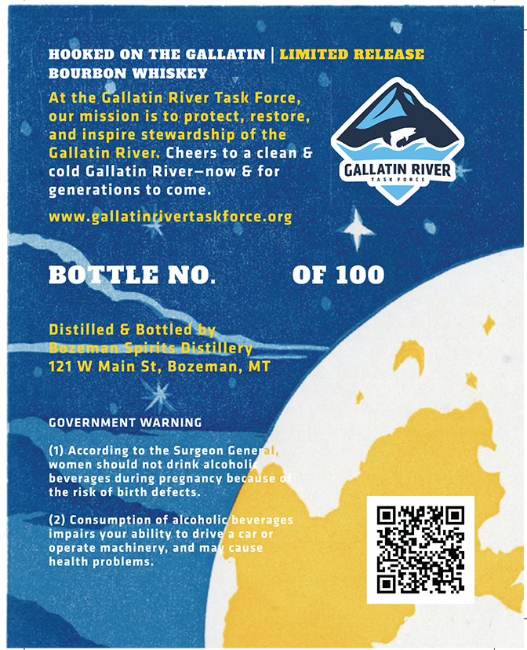

# TTB COLA Label Images - TTBID 26165001000057

**Brand Name:** HOOKED ON THE GALLATIN BOURBON WHISKEY

**Issue Date:** 07/07/2026

**Origin Code:** 30

**Product Class/Type:** 101

**Source:** [TTB Public COLA Registry](https://ttbonline.gov/colasonline/viewColaDetails.do?action=publicFormDisplay&ttbid=26165001000057)

## Label Images

### Label 1

### Label 2

## Extracted Label Text

*Text extracted via OCR - may contain errors*

**Detected Proof:** 84

### Label 1

HOOKED ON
THE GALLATHN
BOURBON WHISKEY
84 PROOE 42% ALC BY VOL 750 ML

### Label 2

HOOKED ON THC GALLATIN
LIMITED RELEASE
BOURBON WHISKEY
At the Gallatin River Task Force,
our mission is to protect, restore,
and inspire stewardship of the
Gallatin River: Cheers to a clean &
cold Gallatin River-now & for
GALLATIN RIVER
generations to come.
WWW .
gallatinrivertaskforce.org
BOTTLE NO.
OF 100
Distilled & Bottled by
Bozeman Gpirits Distillery
121 W Main St, Bozeman, MT
GOVERNMENT WARNING
(1) According to the Surgeon General,
women should not drink alcoholi
beverages during pregnancy because
the risk of birth defects.
(2) Consumption of alcoholic beverages
impairs your ability to drive
ca
operate machinery, and mar
ase
health problems
