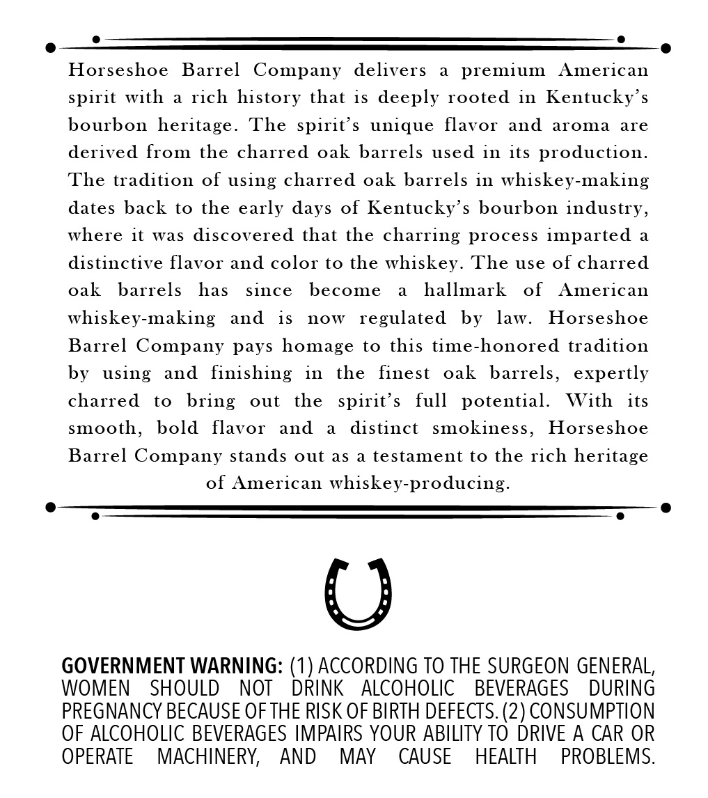
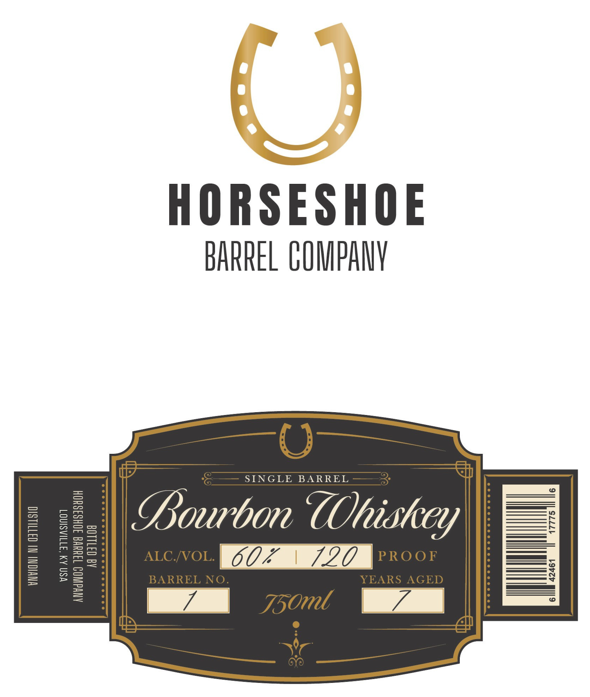

# TTB COLA Label Images - TTBID 26165001000139

**Brand Name:** HORSESHOE BARREL COMPANY

**Issue Date:** 07/16/2026

**Origin Code:** 22

**Product Class/Type:** 101

**Source:** [TTB Public COLA Registry](https://ttbonline.gov/colasonline/viewColaDetails.do?action=publicFormDisplay&ttbid=26165001000139)

## Label Images

### Back Label

### Label 1

## Extracted Label Text

*Text extracted via OCR - may contain errors*

### Back Label

Horseshoe Barrel Company delivers a premium American
spirit with a rich history that is deeply rooted in Kentucky’s
bourbon heritage. The spirit’s unique flavor and aroma are
derived from the charred oak barrels used in its production.
The tradition of using charred oak barrels in whiskey-making
dates back to the early days of Kentucky’s bourbon industry,
where it was discovered that the charring process imparted a
distinctive flavor and color to the whiskey. The use of charred
oak barrels has since become a hallmark of American
whiskey-making and is now regulated by law. Horseshoe
Barrel Company pays homage to this time-honored tradition
by using and finishing in the finest oak barrels, expertly
charred to bring out the spirit’s full potential. With its
smooth, bold flavor and a distinct smokiness, Horseshoe
Barrel Company stands out as a testament to the rich heritage

of American whiskey-producing.

GOVERNMENT WARNING: (1) ACCORDING TO THE SURGEON GENERAL,
WOMEN SHOULD NOT DRINK ALCOHOLIC BEVERAGES DURING
PREGNANCY BECAUSE OF THE RISK OF BIRTH DEFECTS. (2) CONSUMPTION
OF ALCOHOLIC BEVERAGES IMPAIRS YOUR ABILITY TO DRIVE A CAR OR
OPERATE MACHINERY, AND MAY CAUSE HEALTH PROBLEMS.

### Label 1

HORSESHOE

BARREL COMPANY

—__ Oo _—

[oe DS ING DE BARRE Lie

Bourbon COhishey

ALC/VOL. |G AAI PROOF

—ee

3ARREL NO.

YEARS AGED

——

_aa 7x00

i a
