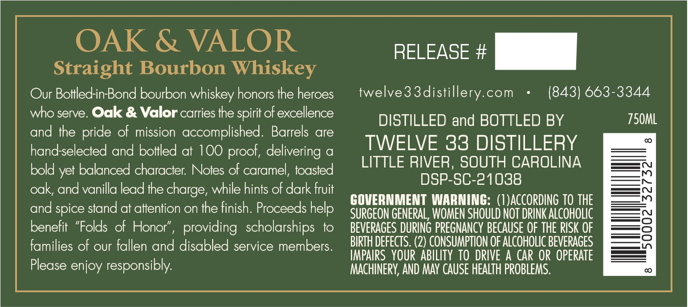
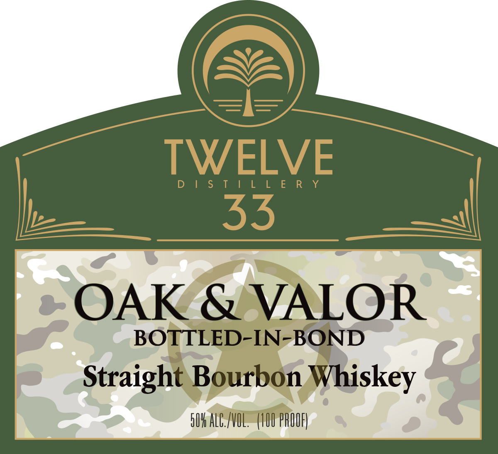
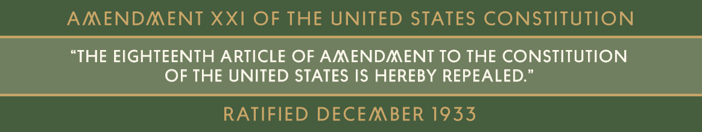

# TTB COLA Label Images - TTBID 26166001000100

**Brand Name:** TWELVE 33 DISTILLERY

**Fanciful Name:** OAK & VALOR

**Issue Date:** 06/23/2026

**Origin Code:** 41

**Product Class/Type:** 101

**Source:** [TTB Public COLA Registry](https://ttbonline.gov/colasonline/viewColaDetails.do?action=publicFormDisplay&ttbid=26166001000100)

## Label Images

### Back Label

### Front Label

### Label 3

## Extracted Label Text

*Text extracted via OCR - may contain errors*

### Back Label

OAK & VALOR
RELEASE #
Straight Bourbon Whiskey
Our Bollled-in-Bond bourbon whiskey honors the heroes
twelve3 3distillery com
(843) 663-3344
who serve: Oak & Valor carries the spirit of excellence
DISTILLED and BOTTLED BY
750ML
and the
of mission
accomplished.
Barrels are
hand-selected and bottled at 100
delivering
a
TWELVE 33 DISTILLERY
LITTLE RIVER, SOUTH CAROLINA
bold yet balanced character: Notes of caramel,; toasted
DSP-SC-21038
oak; and vanilla lead the
while hints of dark fruit
GOVERNMENT WARNING: (I )ACCORDING TO THE
and spice stand at attention on the finish. Proceeds help
SURGEON GENERAL, WOMEN SHOULD NOT DRINK ALcoHOLIc
benefit "Folds of Honor"
providing   scholarships
to
BEVERAGES DURING PREGNANCY BECAUSE OF THE RISK OF
families of our fallen and disabled service members.
BIRTH DEFECTS. (2) CONSUMPTION OF ALCOHOLIC BEVERAGES
IMPAIRS   YOUR ABILITY  TO  DRIVE A CaR OR OPERATE
Please enjoy responsibly:
MACHINERY; AND MAY CAUSE HEALTH PROBLEMS.
pride
proof,
charge,

### Front Label

TWELVE
a 535 al
OAK & VALOR
BOTTLED-IN-BOND
Straight Bourbon Whiskey

### Label 3

AMENDMENT XXI OF THE UNITED STATES CONSTITUTION

“THE EIGHTEENTH ARTICLE OF AMENDMENT TO THE CONSTITUTION

OF THE UNITED STATES IS HEREBY REPEALED.”

RATIFIED DECEMBER 1933
