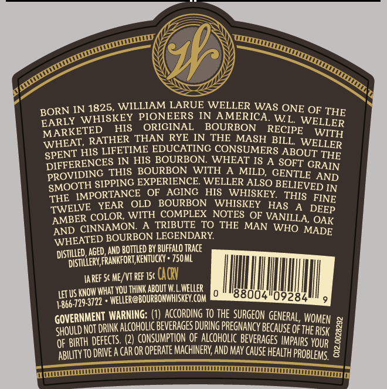
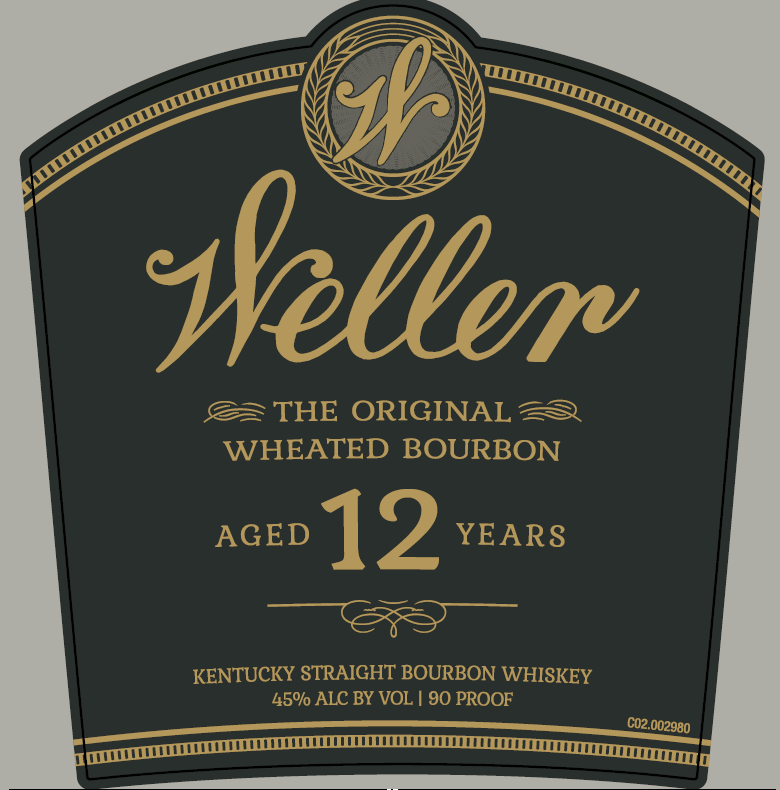

# TTB COLA Label Images - TTBID 26166001000120

**Brand Name:** WELLER

**Issue Date:** 06/30/2026

**Origin Code:** 22

**Product Class/Type:** 101

**Source:** [TTB Public COLA Registry](https://ttbonline.gov/colasonline/viewColaDetails.do?action=publicFormDisplay&ttbid=26166001000120)

## Label Images

### Back Label

### Front Label

### Label 2

## Extracted Label Text

*Text extracted via OCR - may contain errors*

*1 image(s) excluded: text did not meet readability threshold*

**Detected Proof:** 90
**Detected Age:** 12 Years

### Back Label

BORN IN 1825, WILLIAMERSENWELER WAS ONE OF
BORLY WHISKEY PTONEERS INOAMMERICA  WL' WELLER
MARKETED
HIS
ORIGINAL
BOURBON
RECIPE
WITH
WHEAT, RATHER THAN RYE IN
THE
MASH BILL
HIS LIFETIME EDUCATING CONSUMERS ABOUT
DIFFERENCES _N HIS BOURBON_
WHEAT IS A SOFT CRAIN
PROVIDING THIS BOURBONCWITH
MILD;
GENTLE AND
SIPPING EXPERIENCE WELLER ALSO BELIEVED IN
SHE IMPORTANCE OFRACING MHIS  WHISKEY   THIS FINE
TWELVE   YEAR
OLD
BOURBON
WHISKEY
HAS
AMBER COLOR WITH COMPLEXCNOTES QF VANILLA; OAK
CINNAMON
A TRIBUTE
TO THE MAN WHO
WHEATED BOURBON LECENDARY
MADE
AGeD,AND BOTTLED By BUFFalo Trace
) Distillery FRANKfoRT, kentucky * 750 ML
Ia REF Sc ME/VT Ref 15c CAgV
LET US KNOW What YoU ThINK ABoUt W
WelleR
18004
4866,7293722 ^ Weler@BourBoHHISkEV CoM
'09284
GOVERNMENT WARNING; ( DLAccoRdrng P0 the_SuRGEON GENERAL  WOMEN
ShouLd NOT DrINk Alcoholic BeveRAGeS DuRING PreGMaNcy Because ofihe RISk
OF BIRTH defects: (2) CONSUMPTION Qe caLcoHoLIC BeveRaGeS IMpalRS Your
ABHLITY T0 DRIEA CAR OR operate Machinerv AND Mav cause healih PRoBleMs
THE
WELLER
SPENT
THE
SMOOTH
DEEP
AND
DISTILLED ,
1

### Front Label

seller
THE ORIGINAL
WHEATED BOURBON
AGED
12
YEARS
KENTUCKY STRAIGHT BOURBON WHISKEY
45% ALC BY VOL [ 90 PROOF
C0z.C
.002980
