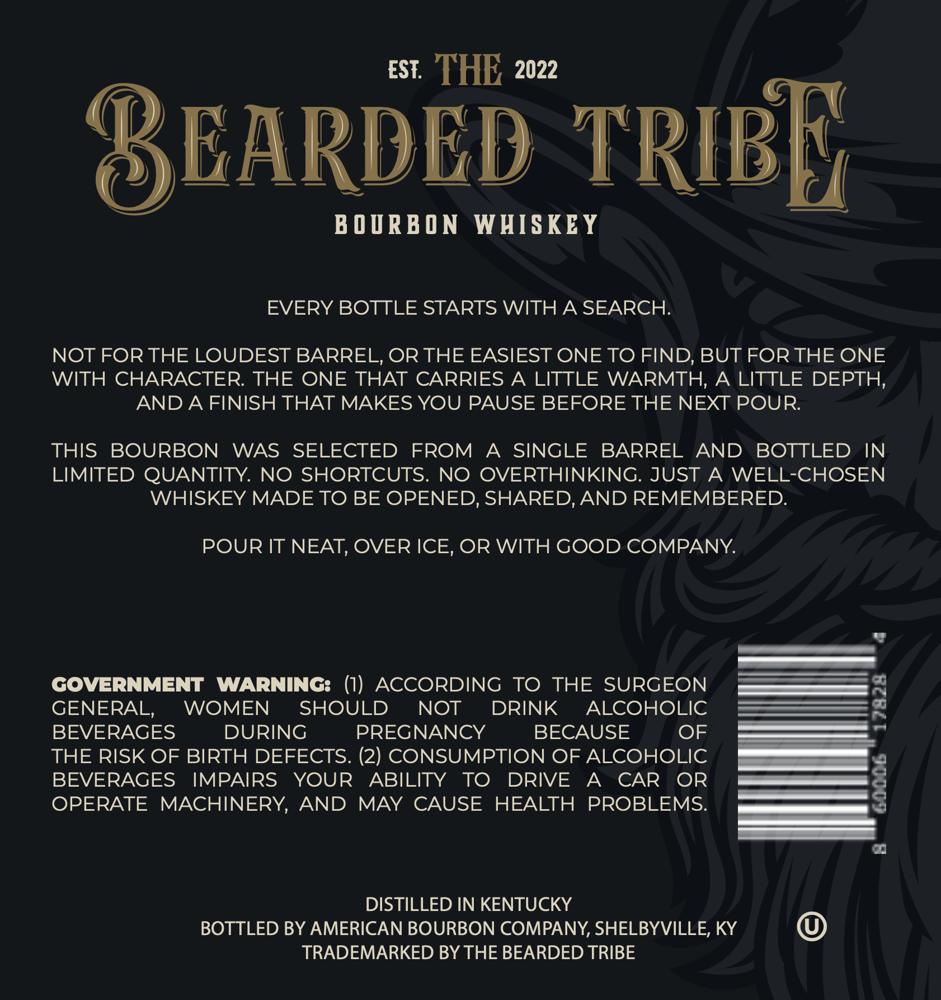
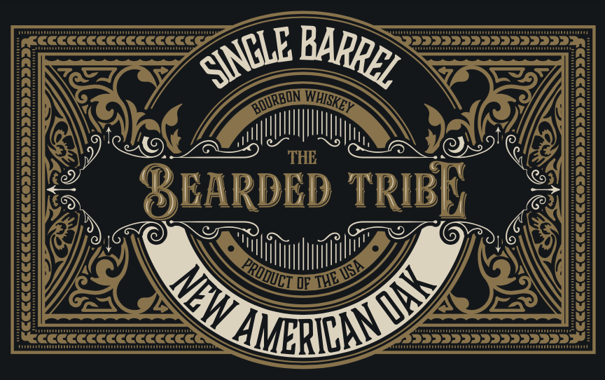
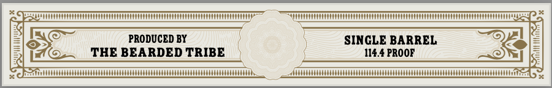

# TTB COLA Label Images - TTBID 26166001000176

**Brand Name:** BEARDED TRIBE

**Issue Date:** 06/29/2026

**Origin Code:** 22

**Product Class/Type:** 101

**Source:** [TTB Public COLA Registry](https://ttbonline.gov/colasonline/viewColaDetails.do?action=publicFormDisplay&ttbid=26166001000176)

## Label Images

### Back Label

### Front Label

### Label 3

## Extracted Label Text

*Text extracted via OCR - may contain errors*

**Detected Proof:** 114.4

### Back Label

EST:
THE 2022
BEARDED TRIBF
B 0 DRB O N
WHISKEY
EVERY BOTTLE STARTS WITH A SEARCH:
NOT FOR THE LOUDEST BARREL, OR THE EASIEST ONE TO FIND, BUT FOR THE ONE
WITH CHARACTER THE ONE THAT CARRIES
A LITTLE
WARMTH,
A LITTLE DEPTH,
AND A FINISH THAT MAKES YOU PAUSE BEFORE THE NEXT POUR
THIS
BOURBON
WAS
SELECTED
FROM
A
SINGLE
BARREL
AND
BOTTLED
IN
LIMITED QUANTITY. NO SHORTCUTS:
NO
OVERTHINKING. JUST
A
WELL-CHOSEN
WHISKEY MADE TO BE OPENED, SHARED,AND REMEMBERED.
POUR IT NEAT, OVER ICE, OR WITH GOOD COMPANY:
GOVERNMENT
WARNING: (1)
ACCORDING
TO
THE SURGEON
GENERAL,
WOMEN
SHOULD
NOT
DRINK
ALCOHOLIC
BEVERAGES
DURING
PREGNANCY
BECAUSE
OF
THE RISK OF BIRTH DEFECTS. (2) CONSUMPTION OF ALCOHOLIC
BEVERAGES
IMPAIRS
YOUR
ABILITY
TO
DRIVE
A
CAR
OR
OPERATE
MACHINERY,
AND
MAY CAUSE
HEALTH PROBLEMS:
DISTILLED IN KENTUCKY
BOTTLED BY AMERICAN BOURBON COMPANY, SHELBYVILLE, KY
TRADEMARKED BY THE BEARDED TRIBE

### Front Label

Ludutaautdatadaad
CCCCCCCCCCCCCCC
THE
EARDED TRIB
Dod
CCCCCCCCcCCCCccc
annaaainan
BARREL
SINCLE
RBON
WHISKEY
PRODILI =
NW
AMERICIDSY

### Label 3

uaa

ST a

TTT TTTTTTTTVT TTT ETTTO TTT TTOV TTT TTT TTTOTTOETTTVT TTT

ped

PRO

DUCED BY

SINGLE BARREL oy

v

HE BEARDED TRIBE

114.4 PROOF =O)

at

4

pDTIENEETOOOOOOIOTOOOOOCOOO TONNE STOOD TOOTS

BP NNTNNTTONETON OOOO TOO STOO OOOO ETO TOOITE TOOT
