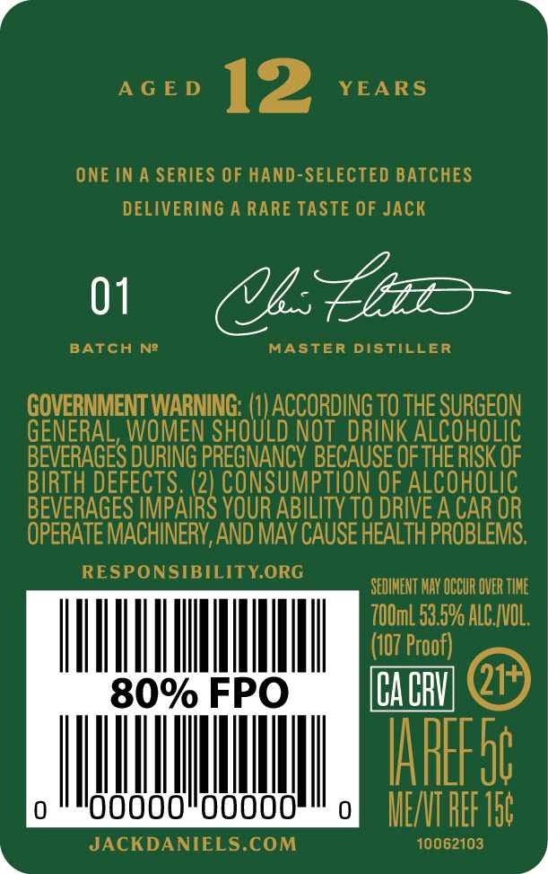
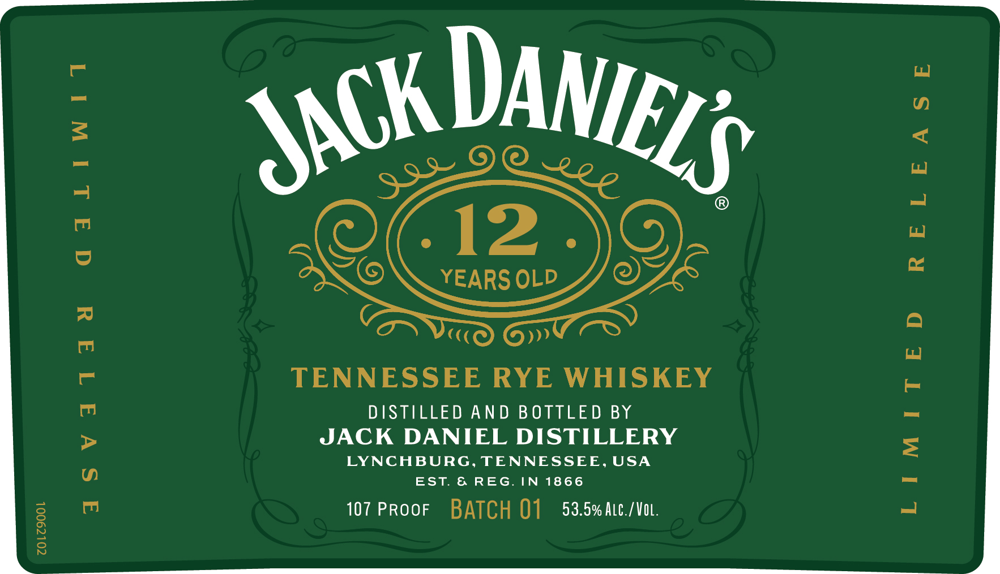

# TTB COLA Label Images - TTBID 26166001000190

**Brand Name:** JACK DANIEL'S

**Fanciful Name:** 12 YEARS OLD RYE

**Issue Date:** 06/23/2026

**Origin Code:** 43

**Product Class/Type:** 142

**Source:** [TTB Public COLA Registry](https://ttbonline.gov/colasonline/viewColaDetails.do?action=publicFormDisplay&ttbid=26166001000190)

## Label Images

### Back Label

### Front Label

## Extracted Label Text

*Text extracted via OCR - may contain errors*

**Detected Proof:** 107
**Detected Age:** 12 Years

### Back Label

.

ty) | Wh

AGED 12 YEARS

ONE IN A SERIES OF HAND-SELECTED BATCHES
DELIVERING A RARE TASTE OF JACK

1 ULE

BATCH N2 MASTER DISTILLER

STE OMEN STOLL ) ACCORDING te ue SURGEON

GENERAL, WOMEN SHOULD NOT DRINK ALCOHOLIC
BEVERAGES DURING PREGNANCY Bl bf THERISK OF

BIRTH DEFECTS. eater ION OF ALCOHOLIC
BEVERAGES IMPAIRS YOUR ABILITY TO DRIVE A CAR OR

OPERATE MACHINERY, AND MAY CAUSE HEALTH PROBLEMS.

N i
See Ean EOne SEDIMENT MAY OCCUR OVER TIME

UVM esi
tr Proo
80% FPO oa @

1H

00000!" o MIE
JACKDANIELS.COM 10062103

4

### Front Label

ZOLZ9OOL

qaLiwtit

asvati1adua

TENNESSEE RYE WHISKEY

DISTILLED AND BOTTLED BY
JACK DANIEL DISTILLERY

LYNCHBURG, TENNESSEE, USA
EST. & REG. IN 1866

107 PROOF BATCH Q1 53.5% Atc./Vo.

RELEASE

LIMITED
