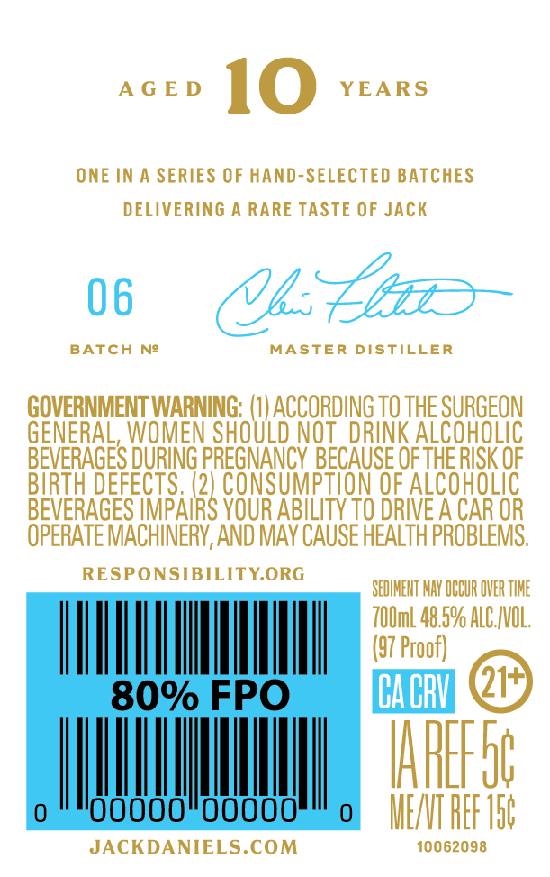
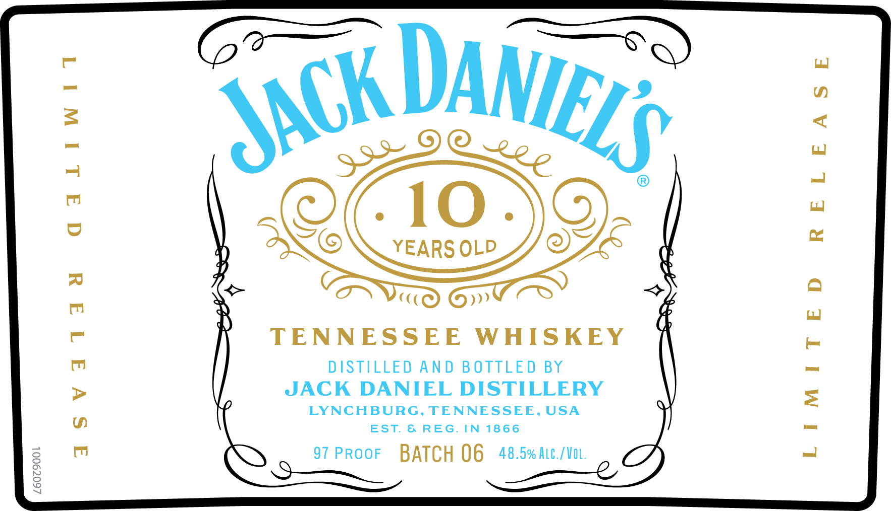

# TTB COLA Label Images - TTBID 26166001000195

**Brand Name:** JACK DANIEL'S

**Fanciful Name:** 10 YEARS OLD

**Issue Date:** 06/23/2026

**Origin Code:** 43

**Product Class/Type:** 140

**Source:** [TTB Public COLA Registry](https://ttbonline.gov/colasonline/viewColaDetails.do?action=publicFormDisplay&ttbid=26166001000195)

## Label Images

### Back Label

### Front Label

## Extracted Label Text

*Text extracted via OCR - may contain errors*

**Detected Proof:** 97

### Back Label

AGED 1 O YEARS
ONE IN A SERIES OF HAND-SELECTED BATCHES
DELIVERING A RARE TASTE OF JACK
GOVERNMENT WARNING: (1) ACCORDING TO THE SURGEON
GENERAL, WOMEN SHOULD NOT DRINK ALCOHOLIC
BEVERAGES DURING PREGNANCY BECAUSE OF THE RISK OF
BIRTH DEFECTS. ee OF ALCOHOLIC
BEVERAGES IMPAIRS YOUR ABILITY TO DRIVE A CAR OR
OPERATE MACHINERY, AND MAY CAUSE HEALTH PROBLEMS.
sitar eens aos SEDIMENT MAY CUR OVERTIME
700ml 48.5% ALC,/VOL.
(57 Proof) @
ME/VT REF Tot
JACKDANIELS.COM 10062098

### Front Label

TENNESSEE WHISKEY

DISTILLED AND BOTTLED BY
JACK DANIEL DISTILLERY

LYNCHBURG, TENNESSEE, USA
EST. & REG. IN 1866

97 PROoF BATCH 06 48.5% Atc./Vo.
