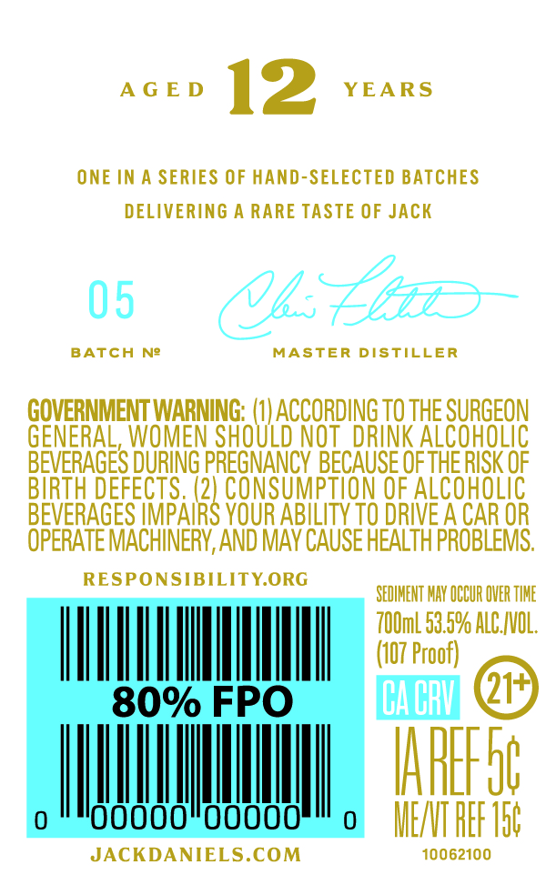
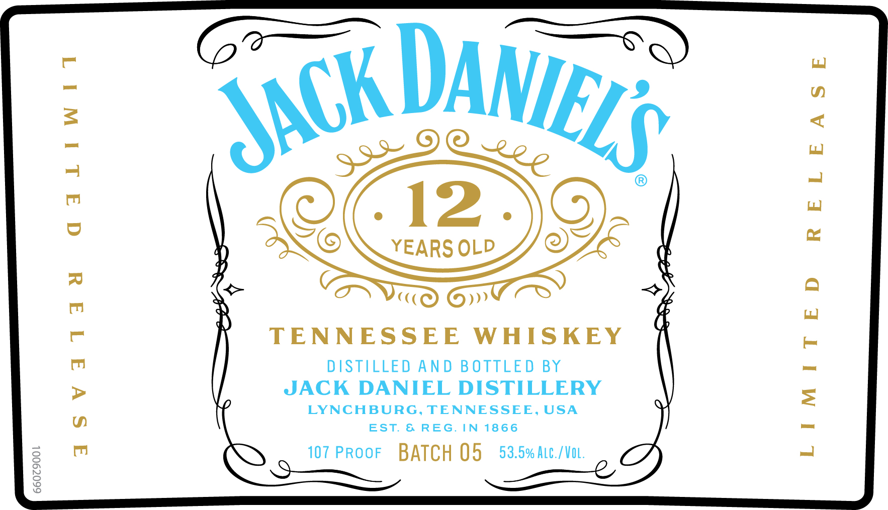

# TTB COLA Label Images - TTBID 26166001000198

**Brand Name:** JACK DANIEL'S

**Fanciful Name:** 12 YEARS OLD

**Issue Date:** 06/23/2026

**Origin Code:** 43

**Product Class/Type:** 140

**Source:** [TTB Public COLA Registry](https://ttbonline.gov/colasonline/viewColaDetails.do?action=publicFormDisplay&ttbid=26166001000198)

## Label Images

### Back Label

### Front Label

## Extracted Label Text

*Text extracted via OCR - may contain errors*

**Detected Proof:** 107
**Detected Age:** 12 Years

### Back Label

A G E D
12
YEARS
ONE IN
SERIES OF HAND-SELECTED BATCHES
DELIVERING A RARE TASTE OF JACK
05
Q4Eaz
BATCH
Ne
MASTER DISTILLER
GOVERNMENT WARNING:
ACCORDING TO THE SURGEON
GENERAL, WOMEN SHOULD NOT   DRINK ALCOHOLIC
BEVERAGES DURING PREGNANCY BECAUSE OF THE RISK OF
BIRTH DEFECTS: (2] CONSUMPTION OF ALCOHOLIC
BEVERAGES IMPAIRS YOUR ABILITY TO DRIVE A CAR OR
OPERATE MACHINERV, AND MAV CAUSE HEALTH PROBLEMS;
RESPONSIBILITYORG
SEDIMENT MAY OCCUR OVER TIHE
7OOmL 53.59 ALC IVOL,
(107 Proof)
80% FPO
IBACbU]
IAFEFS6
Ooooo"ooooo
MENT REF 156
JACKDANIELS.COM
10062100

### Front Label

TENNESSEE WHISKEY

DISTILLED AND BOTTLED BY
JACK DANIEL DISTILLERY

LYNCHBURG, TENNESSEE, USA
EST. & REG. IN 1866

107 PROOF BATCH 05 53.5% Ate./Vot
