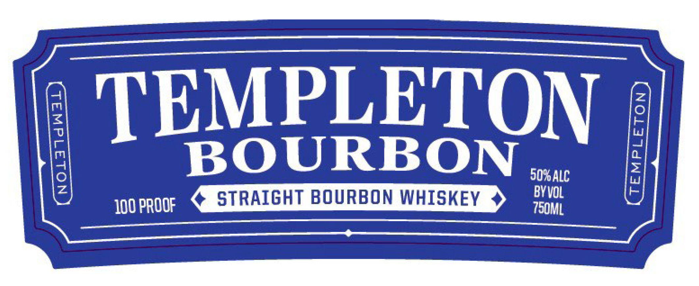
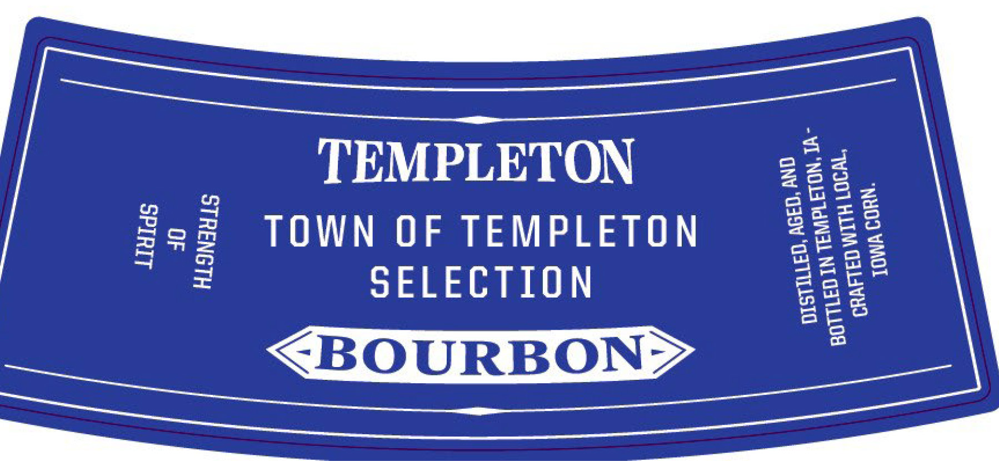
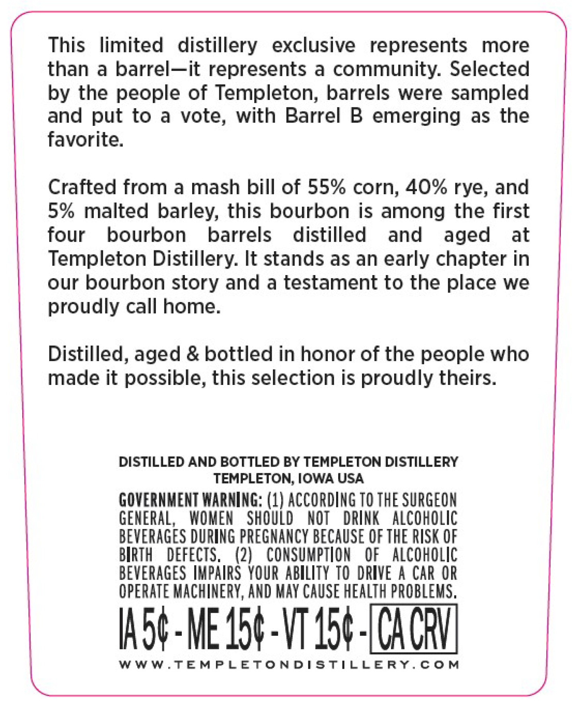
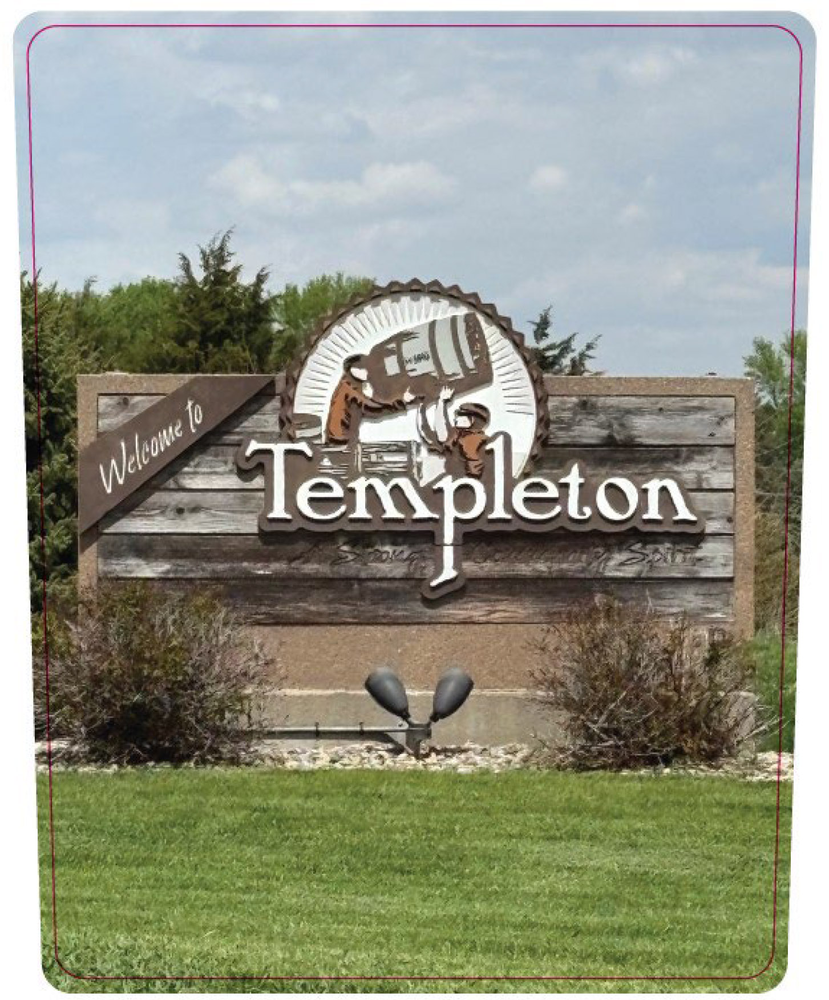

# TTB COLA Label Images - TTBID 26166001000343

**Brand Name:** TEMPLETON

**Issue Date:** 06/23/2026

**Origin Code:** 20

**Product Class/Type:** 101

**Source:** [TTB Public COLA Registry](https://ttbonline.gov/colasonline/viewColaDetails.do?action=publicFormDisplay&ttbid=26166001000343)

## Label Images

### Label 1

### Label 2

### Label 3

### Label 4

## Extracted Label Text

*Text extracted via OCR - may contain errors*

*1 image(s) excluded: text did not meet readability threshold*

**Detected Proof:** 100

### Label 1

TEMPLETON
1
BOURBON
50rAlc
I
STRAIGHT BOURBON WHISKEY
BV VoL
100 pROOF
750mL

### Label 2

TT

TEMPLETON

OQ 2a

2ce9

[wep

mo] sal =

a © m

TOWN OF TEMPLETON

2s

zz65

Ss =

of

SELECTION

MK Zuo

Soe toe

ew

oot

on)

OU RB OS rss

BOURBON > ;

—————

### Label 3

This limited distillery exclusive represents more
than a barrel—it represents a community. Selected
by the people of Templeton, barrels were sampled
and put to a vote, with Barrel B emerging as the
favorite.
Crafted from a mash bill of 55% corn, 40% rye, and
5% malted barley, this bourbon is among the first
four bourbon barrels distilled and aged at
Templeton Distillery. It stands as an early chapter in
our bourbon story and a testament to the place we
proudly call home.
Distilled, aged & bottled in honor of the people who
made it possible, this selection is proudly theirs.
DISTILLED AND BOTTLED BY TEMPLETON DISTILLERY
TEMPLETON, IOWA USA
GOVERNMENT WARNING: (1) ACCORDING TO THE SURGEON
GENERAL, WOMEN SHOULD NOT DRINK ALCOHOLIC
BEVERAGES DURING PREGNANCY BECAUSE OF THE RISK OF
BIRTH DEFECTS. (2) CONSUMPTION OF ALCOHOLIC
BEVERAGES IMPAIRS YOUR ABILITY T0 DRIVE A CAR OR
OPERATE MACHINERY, AND MAY CAUSE HEALTH PROBLEMS,
WWW.TEMPLETONDISTILLERY.COM
