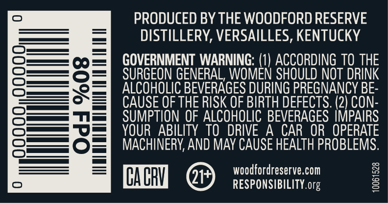
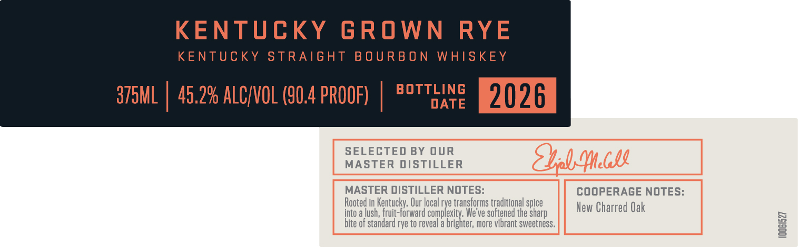

# TTB COLA Label Images - TTBID 26166001000381

**Brand Name:** WOODFORD RESERVE

**Fanciful Name:** KENTUCKY GROWN RYE

**Issue Date:** 06/23/2026

**Origin Code:** 22

**Product Class/Type:** 101

**Source:** [TTB Public COLA Registry](https://ttbonline.gov/colasonline/viewColaDetails.do?action=publicFormDisplay&ttbid=26166001000381)

## Label Images

### Back Label

### Front Label

### Label 1

### Label 4

### Label 5

## Extracted Label Text

*Text extracted via OCR - may contain errors*

*1 image(s) excluded: text did not meet readability threshold*

**Detected Proof:** 90.4

### Back Label

PRODUCED BY THE WOODFORD RESERVE
DISTILLERY, VERSAILLES, KENTUCKY
GOVERNMENT WARNING: (1) ACCORDING TO THE
SURGEON GENERAL, WOMEN SHOULD NOT DRINK
ALCOHOLIC BEVERAGES DURING PREGNANCY BE
CAUSE OF THE RISK OF BIRTH DEFECTS: (2) CON-
SUMPTION OF ALCOHOLIC BEVERAGES IMPAIRS
YOUR   ABILITY TO }
DRIVE A
CAR  OR   OPERATE
MACHINERY AND MAY CAUSE HEALTH PROBLEMS.
woodfordreserve.com
CA CRV
21+
RESPONSIBILITY org
1

### Front Label

KENTUCKY GROWN RYE

KENTUCKY STRAIGHT BOURBON WHISKEY

BOTTLING

375ML | 45.2% ALC/VOL (90.4 PROOF)

DATE

2026

SELECTED BY OUR

MASTER DISTILLER

MASTER ISTILLER NOTES:

COOPERAGE NOTES

Into a lush,

Rooted in Ke

jur local ry

yard

transform:

eve

spl

sharp

New Charred Oak

bite of standard rye to reveal

, more vibrant sweetness,

eS

### Label 4

tint

PELEEUEEUEEEEETEEOEE

PELLUEEEUEEDEEEEEEEE

DOUUO OU

PEneneanee

benuniat

Vrtineaneds

PEDUEEUEEEEREEETEEE EE

tonite

HILVE 1TIVWS

HANOCRAFTEO

O3aljavyuagogNnvu

SMALL BATCH

PEUEEUUEEDEUEETT EEG

DEDUCE EUUEOCEE EEOC EET

PEUEEEGEEGEe eee

Preennieeds

PEDUUEUEEEEO Tea

tonne

### Label 5

PEEP EEEEED EEE PTET EE EE EEE PTET EEE EERE EEE ~

LIMITED

RELEASE

PEEEEEEE ED EE EET EE EE EEE PEPE TEEPE EE EEE EEE TEEPE EEE EEE EEE EEE y
