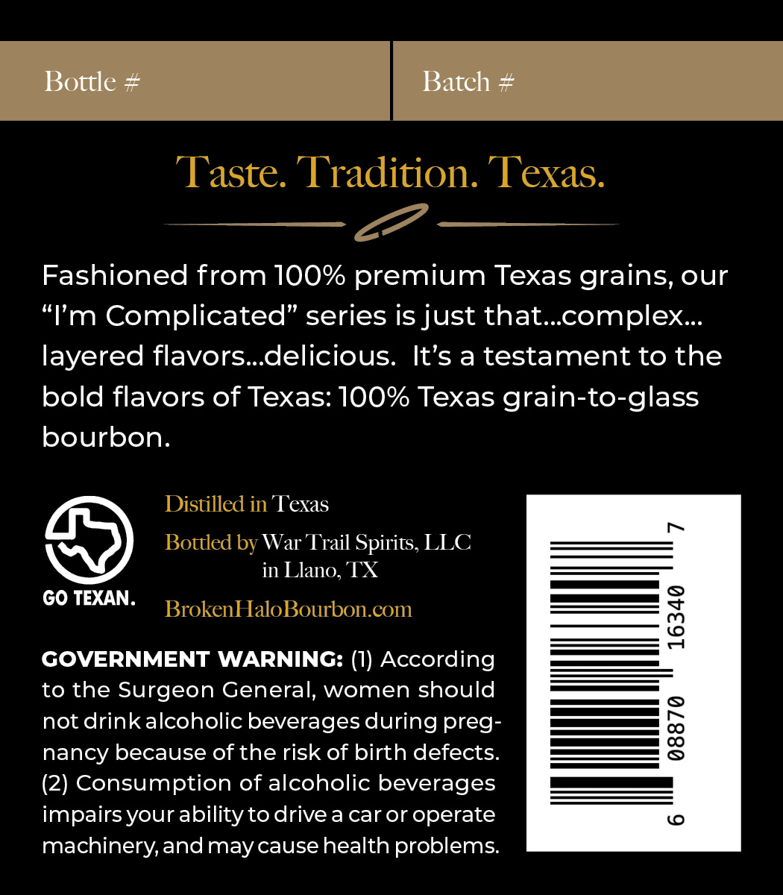
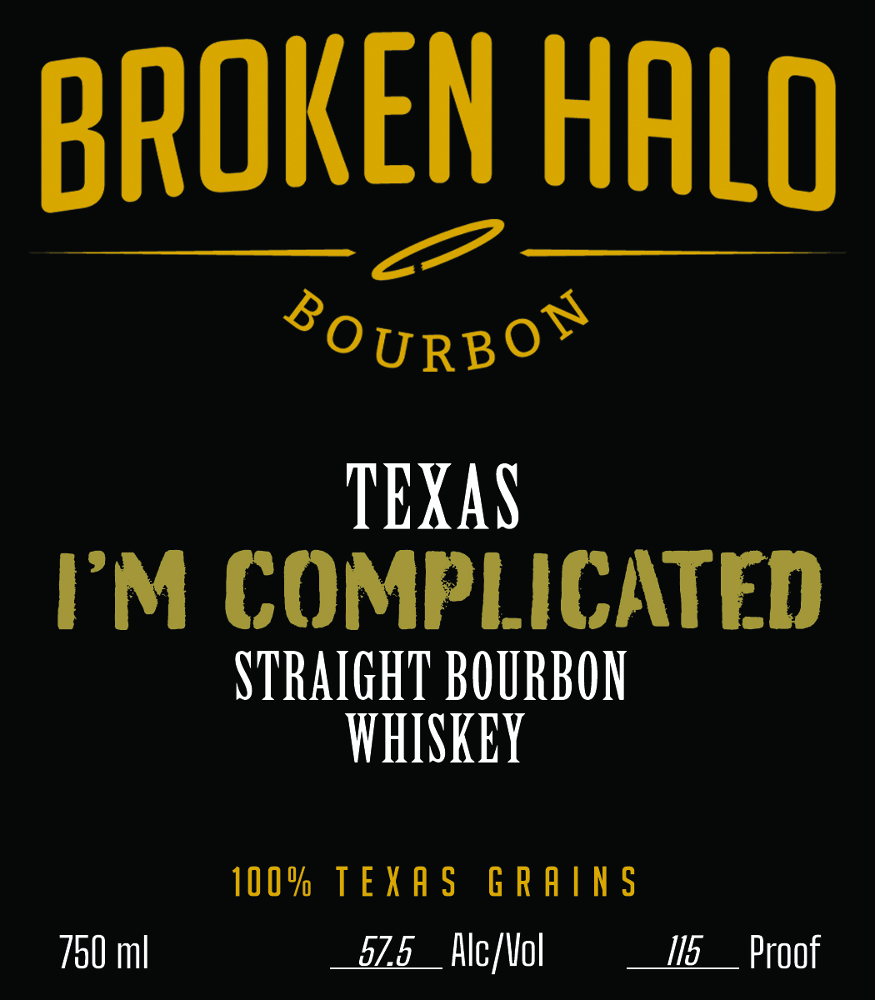

# TTB COLA Label Images - TTBID 26166001000515

**Brand Name:** BROKEN HALO BOURBON

**Fanciful Name:** I'M COMPLICATED

**Issue Date:** 06/23/2026

**Origin Code:** 44

**Product Class/Type:** 101

**Source:** [TTB Public COLA Registry](https://ttbonline.gov/colasonline/viewColaDetails.do?action=publicFormDisplay&ttbid=26166001000515)

## Label Images

### Back Label

### Label 1

## Extracted Label Text

*Text extracted via OCR - may contain errors*

### Back Label

Bottle #
Batch #
Taste. Tradition. Texas:
Fashioned from IOO% premium Texas grains, our
"Im Complicated" series is just that_complex_
layered flavors_delicious:
It's a testament to the
bold flavors of Texas: 10O% Texas grain-to-glass
bourbon
Distilled in Texas
Bottled by War Trail Spirits, LLC
in Llano, TX
GO TEXAN.
BrokenHaloBourbon com
9
GOVERNMENT WARNING: (I) According
to the Surgeon General, women should
not drink alcoholic beverages during preg-
3
nancy because of the risk of birth defects:
(2) Consumption of alcoholic beverages
impairs your abilitytodrivea car or operate
(0
machinery,andmay causehealth problems:

### Label 1

BROKEN HALO

%0 URBO™

TEXAS
PM COMPLICATED

STRAIGHT BOURBON
WHISKEY

100% TEXAS GRAINS
