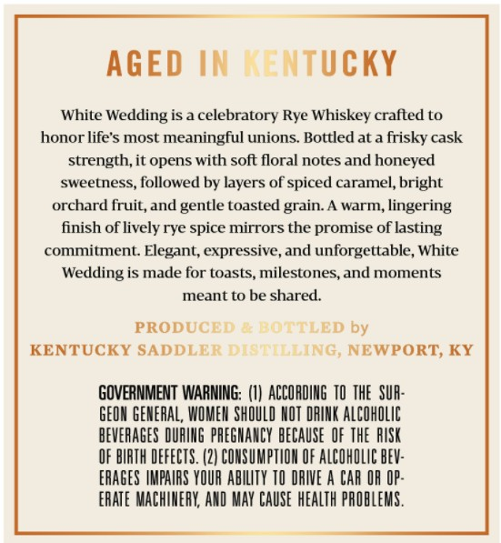
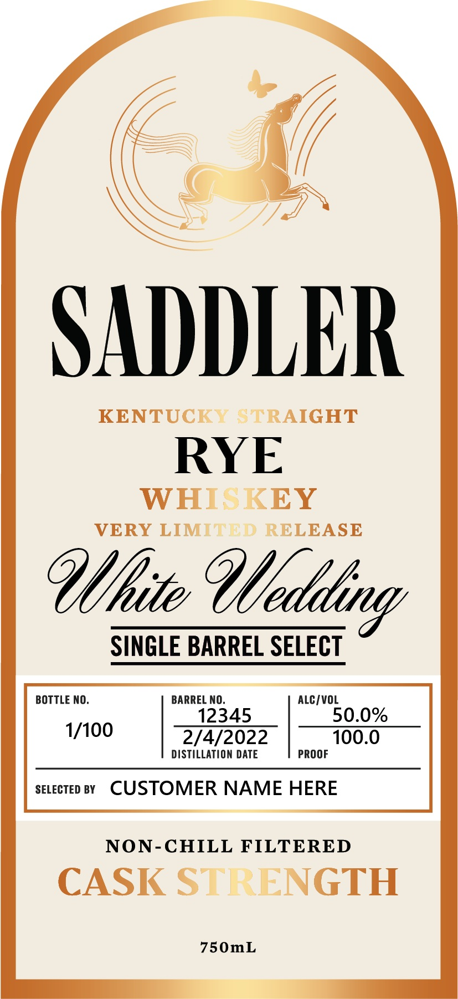
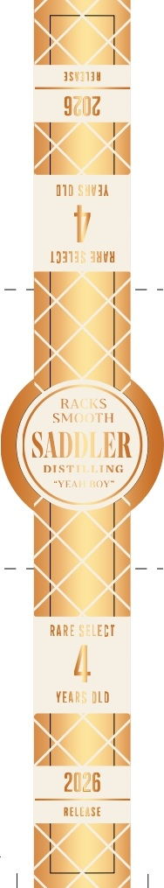

# TTB COLA Label Images - TTBID 26166001000554

**Brand Name:** SADDLER

**Issue Date:** 06/24/2026

**Origin Code:** 22

**Product Class/Type:** 102

**Source:** [TTB Public COLA Registry](https://ttbonline.gov/colasonline/viewColaDetails.do?action=publicFormDisplay&ttbid=26166001000554)

## Label Images

### Back Label

### Front Label

### Label 3

## Extracted Label Text

*Text extracted via OCR - may contain errors*

**Detected Proof:** 100

### Back Label

AGED IN   ntucky
White
Wedding is & celebratory Rye Whiskey crafted to
honor life's most meaningful unions. Bottled at a frisky cask
strength,it opens with soft floral notes and honeyed
sweetness, followed by layers of spiced caramel, bright
orchard fruitand gentle toasted
warm
lingering
finish of lively rye spice mirrors the promise of lasting
commitment Elegant; expressive, and unforgettable, White
Wedding is made for toasts, milestones,and moments
meant to be shared:
PRODUCEI LED by
KENTUCKY SADDLERNG; NEWPORT;, KY
GOVERNMENT WARNING;
ACCORDIHG  TO THE  SUA:
GEON GENERAL, WOMEH ShOULD HOT DRINK ALChOLIC
BEVERAGES DUFIUG  PREGHANCY BECAUSE  OF thE  RUSK
OF BIRTH DEFECTS . (2| COMSUMPTHOA OF AlCohOlIC BEV:
ERAGeS IMPAIRS YOUR abilty TO DRIVE A CAR OR OP:
ERATE MACHIMERK; AND MAY CAUSe hEAlTh PAOBLEMS .
grain:

### Front Label

SAILER
KENTUCKY STRAIGHT
RYE
WHISKEY
VERY LIMITED RELEASE
SINGLE BARREL SELECT
BOTTLE NO
BARREL NO,
ALC /VOL
12345
50.0%
1/100
2/4/2022
100.0
DISTILLATION DATE
PROOF
SELECTED BY
CUSTOMER NAME HERE
NON-CHILL FILTERED
CASK STRENGTH
750mL
Qlflite
Qlfedldling

### Label 3

1501714
9z02
IID SuhJA
19319; J04
RA  KS
SM( TH
SADDLER
DISTNG
"YEI OYe
RARE SCLECI
YEAR; DLD
2026
Rell_Se
