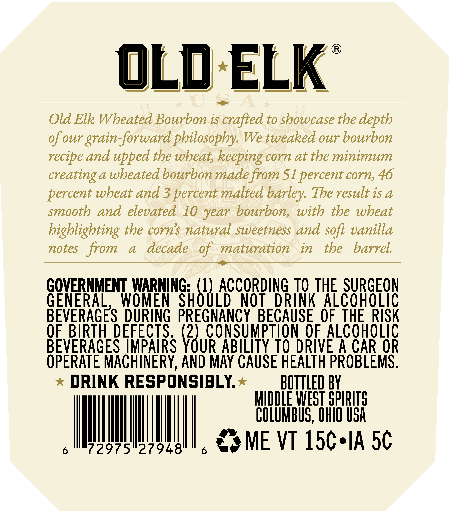
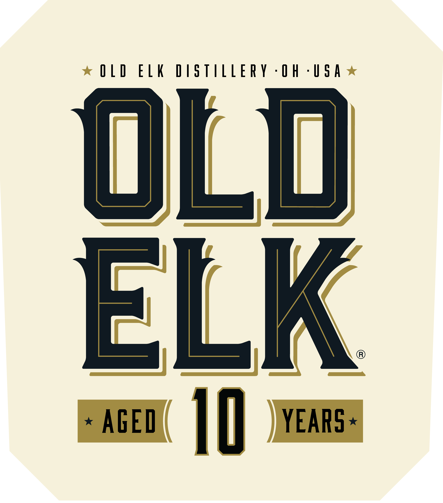
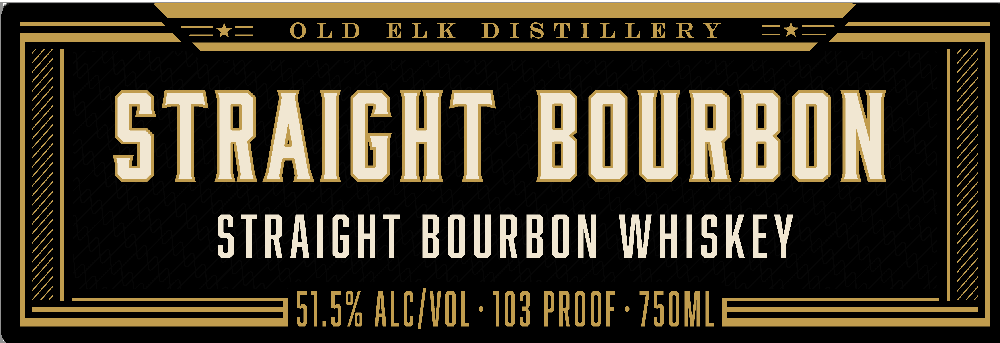

# TTB COLA Label Images - TTBID 26166001000607

**Brand Name:** OLD ELK

**Issue Date:** 06/23/2026

**Origin Code:** 09

**Product Class/Type:** 101

**Source:** [TTB Public COLA Registry](https://ttbonline.gov/colasonline/viewColaDetails.do?action=publicFormDisplay&ttbid=26166001000607)

## Label Images

### Back Label

### Front Label

### Label 2

### Label 4

## Extracted Label Text

*Text extracted via OCR - may contain errors*

*2 image(s) excluded: text did not meet readability threshold*

**Detected Age:** 10 Years

### Back Label

OLd ELK
9
Old Elk Wheated Bourbon is crafted to showcase the depth
Of our grain-forward philosopby: We tweaked our bourbon
recipe and upped the wheat; keeping corn at the minimum
creatinga wbeated bourbon madefrom Sl percent corn, 46
percent wbeat and 3 percent malted
The result is &
smooth and elevated
10 year bourbon, with the wbeat
bigblighting the corns natural sweetness and soft vanilla
notes
from
a
decade
ofmaturation
in
the
barrel
GOVERNMENT WARNING: (1) ACCORDING TO THE SURGEON
GENERAC
WOMEN
SHOULD
NOT
DRINK Alcoholic
BEVERAGES DURING PREGNANCY BECAUSE OF  THE  RISK
QF.BWRTH DEFECTS ; (2) CoNSumptION O.ALCOHOLIC
BEVERAGES IMPAIRS YOUR ABILITY TO DRIVE A CAR OR
OPERATE MACHINERY, AND MAY CAUSE HEALTH PROBLEMS ;
DRINK RESPONSIBLY
BOTTLED BY
MiddLE WEST SpIRITS
COLuMbUS, Ohd OSA
6
72975"27948'
ME VT 15c*IA 5c
barley:

### Front Label

OLD ELK DISTILLERY -OH -USA

ULU

ELK

* AGED iT] YEARS ~
