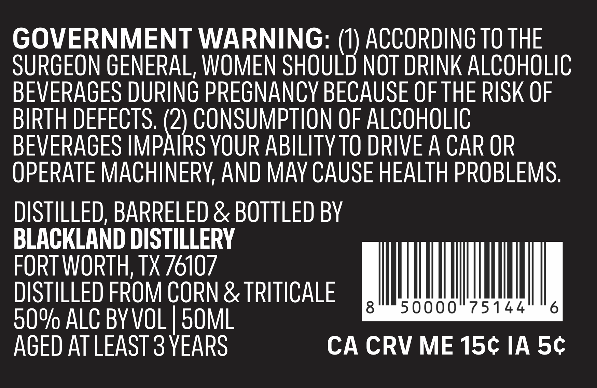
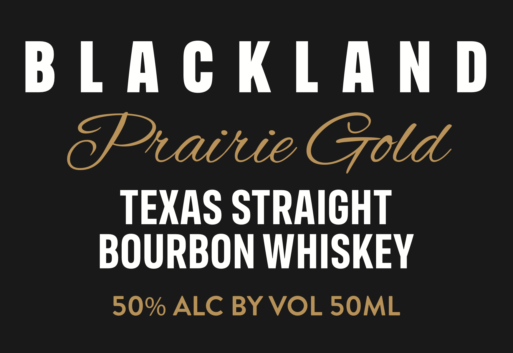

# TTB COLA Label Images - TTBID 26166001000612

**Brand Name:** BLACKLAND

**Fanciful Name:** PRAIRIE GOLD

**Issue Date:** 06/23/2026

**Origin Code:** 44

**Product Class/Type:** 101

**Source:** [TTB Public COLA Registry](https://ttbonline.gov/colasonline/viewColaDetails.do?action=publicFormDisplay&ttbid=26166001000612)

## Label Images

### Back Label

### Front Label

## Extracted Label Text

*Text extracted via OCR - may contain errors*

**Detected Proof:** 90
**Detected Age:** 3 Years

### Back Label

GOVERNMENT WARNING: (1) ACCORDING TO THE

SURGEON GENERAL, WOMEN SHOULD NOT DRINK ALCOHOLIC

BEVERAGES DURING PREGNANCY BECAUSE OF THE RISK OF

BIRTH DEFECTS.

CONSUMPTION OF ALCOHOLIC

BEVERAGES IMP

i

9 YOUR ABILITY TO DRIVE A CAR OR

OPERATE MACHINERY, AND MAY CAUSE HEALTH PROBLEMS.

DISTILLED, BARRELED & BOTTLED BY

BLACKLAND DISTILLERY

FORT WORTH, TX 76107

DISTILLED FROM CORN & TRITICALE

90% ALC BYV

AGED AT LEAST 3 YEARS

CA CRV ME 15¢ IA 5¢€

### Front Label

BLACKLAND

Sratiue Gold

TEXAS STRAIGHT

BOURBON WHISKEY

90% ALC BY VOL 50ML
