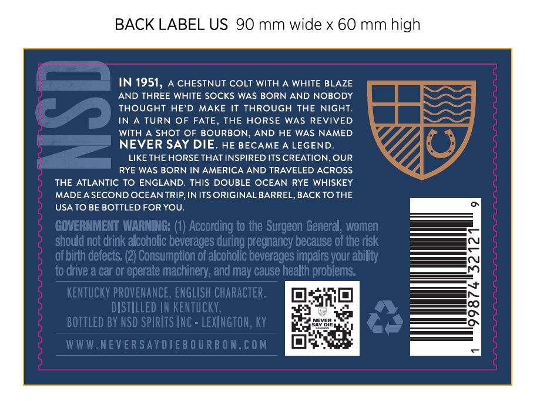

# TTB COLA Label Images - TTBID 26166001000624

**Brand Name:** NEVER SAY DIE

**Issue Date:** 08/24/2026

**Origin Code:** 22

**Product Class/Type:** 102

**Source:** [TTB Public COLA Registry](https://ttbonline.gov/colasonline/viewColaDetails.do?action=publicFormDisplay&ttbid=26166001000624)

## Label Images

### Back Label

## Extracted Label Text

*Text extracted via OCR - may contain errors*

### Back Label

BACK LABEL US 90 mm wide x 60 mm high
IN 1951,
A CHESTNUT COLT WITH A WHITE BLAZE
5
AND THREE WHITE SOCKS WAS BORN AND NOBODY
THOUGhT HE'D
MAKE IT THROUGH THE NIGHT
IN
TURN OF FATE
THE HORSE
WAS REVIVED
WITH A SHOT OF BOURBON
AND HE WAS NAMED
NEVER SAY DIE
HE BECAME A LEGEND.
LIKE THE HORSE THAT INSPIRED ITS CREATION, OUR
RYE WAS BORN IN AMERICA AND TRAVELED ACROSS
THE ATLANTIC TO ENGLAND_
THIS DOUBLE OCEAN RYE WHISKEY
MADEA SECOND OCEAN TRIP,IN ITS ORIGINAL BARREL, BACK TOTHE
USA TO BE BOTTLED FOR YOU:
GOVERNMENT WARNING: (1) According to the Surgeon General;, women
should not drink alcoholic beverages during pregnancy because of the risk
of birth defects; (2) Consumption of alcoholic beverages impairs your ability
t0 drive a car or operate machinery; and may cause health problems:
kENTuCkY PROVENANCE, ENGLISH Character:
DISTILLED IN KENTUCKY;
BoTtled BY NSD SPIRITS INC = LEXINGTON, KY
W W W.NEVER SAYDIEB O URB ON.COM
