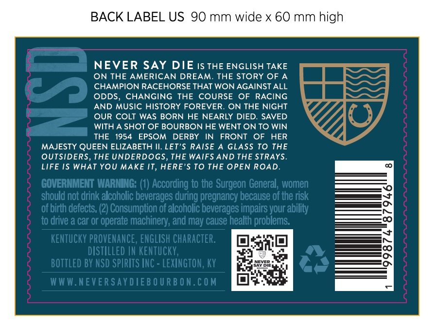

# TTB COLA Label Images - TTBID 26166001000629

**Brand Name:** NEVER SAY DIE

**Issue Date:** 08/24/2026

**Origin Code:** 22

**Product Class/Type:** 141

**Source:** [TTB Public COLA Registry](https://ttbonline.gov/colasonline/viewColaDetails.do?action=publicFormDisplay&ttbid=26166001000629)

## Label Images

### Back Label

## Extracted Label Text

*Text extracted via OCR - may contain errors*

### Back Label

BACK LABEL US 90 mm wide X 60 mm high
NEVER SAY DIE IS THE ENGLISH TAKE
ON THE AMERICAN DREAM: THE STORY OF A
CHAMPION RACEHORSE THAT WON AGAINST ALL
ODDS, CHANGING THE COURSE OF RACING
AND MUSIC HISTORY FOREVER
ON THE NIGHT
OUR COLT WAS BORN HE NEARLY DIED. SAVED
WITH A SHOT OF BOURBON HE WENT ON TO WIN
THE
1954
EPSOM
DERBY
IN
FRONT
OF
HER
MAJESTY QUEEN ELIZABETH Il. LET'$ RAISE
GLASS TO THE
OUTSIDERS, THE UNDERDOGS, THE WAIFS AND THE STRAYS.
LIFE IS WHAT YOU MAKE IT, HERE'S TO THE OPEN ROAD.
GOVERNMENT WARNING: (1) According to the Surgeon General , women
should not drink alcoholic beverages during pregnancy because of the risk
of birth defects: (2) Consumption of alcoholic beverages impairs your ability
to drive a Car or operate machinery; and may Cause health problems:
kenTuckY PROVENANCE, ENGLISH character:
distILLEd IN KENTUCKY,
bottled BY NSD SPIRITS INC - LEXINGTON, KY
WWW.NEVER SAY DIEB O UR B ON.€OM
