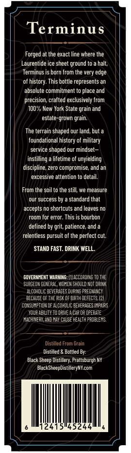
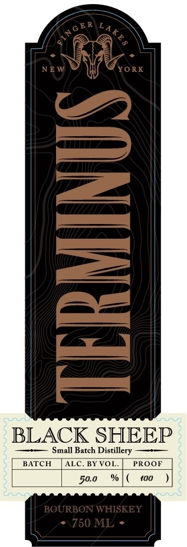

# TTB COLA Label Images - TTBID 26166001000669

**Brand Name:** BLACK SHEEP DISTILLERY

**Fanciful Name:** TERMINUS
BOURBON WHISKEY

**Issue Date:** 06/29/2026

**Origin Code:** 02

**Product Class/Type:** 141

**Source:** [TTB Public COLA Registry](https://ttbonline.gov/colasonline/viewColaDetails.do?action=publicFormDisplay&ttbid=26166001000669)

## Label Images

### Back Label

### Front Label

## Extracted Label Text

*Text extracted via OCR - may contain errors*

**Detected Proof:** 100

### Back Label

Terminus
at the exact line where the
Laurentide ice sheet ground to
halt;
Terminus
born from the very edge
of history: This bottle represents an
absolute commitment to place and
precision; crafted exclusively from
100% New York State
and
estale-grown grain:
The terrain shaped our land, but
foundational history of military
service shaped our mindset-
instilling
lifetime of unyielding
discipline, zero compromise; and an
excessive attention t0 detail:
From the soil to the still; we measure
our success by
standard that
accepts no shortcuts and leaves nO
room for error. This is bourbon
defined by grit, patience, and
relentless pursuit of the perfect cut:
STAND FAST. DRINK WELL
GOVERNHENT MARMING: |I| ACCOROINE To The
SURGEL
CENEPAL , WOHEN ShCULD MOt DAMNK
ALCOHOLIC BEVERACES DUFINC PRECMANCY
BECAUSE @F THE PISK OF EIRTH DEFECTS. [21
CONSUHPTICH @F ALCOHOLIC EEVEPAGE S IMPAIPS
XDLR AEILITY TO DRIVE A CAp OP OPERATE
HachINeRY, AD MAY CAUSE HEaLTH peOelers.
Distilled From Grain
Distilled
Bottled By:
Black Sheep Distiuery, Frattsburgh NY
Black SheepDistilleryNYcom
52
Forged
grain e

### Front Label

E R
YORK
1
BLACK SHEEP
Small Batch Distillery
BATCH
ALC
BY VOL
PROOF
50.0
{00
BOURBON WHISKEY
750 ML
