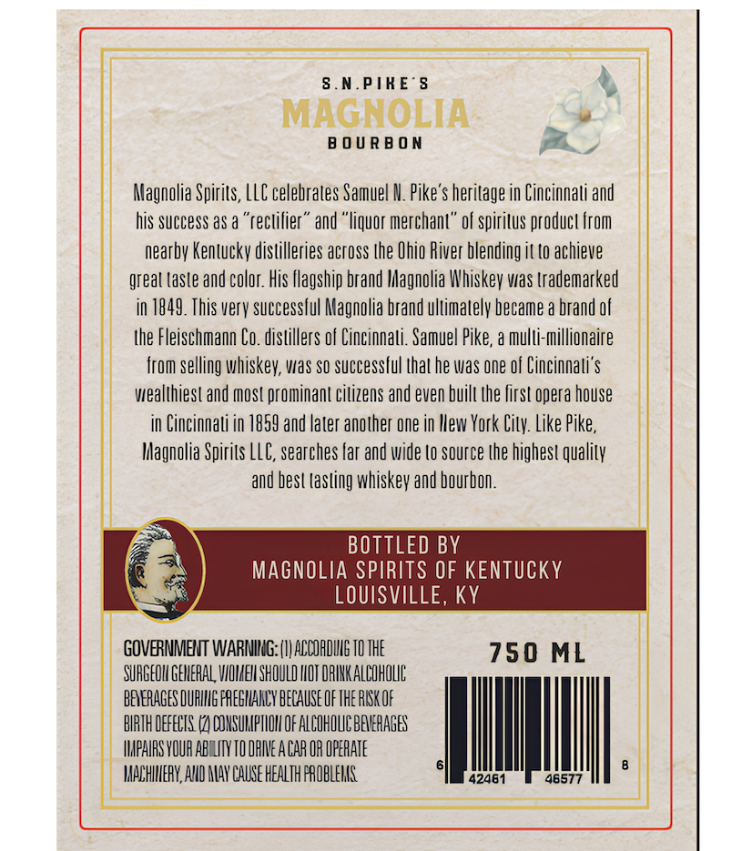
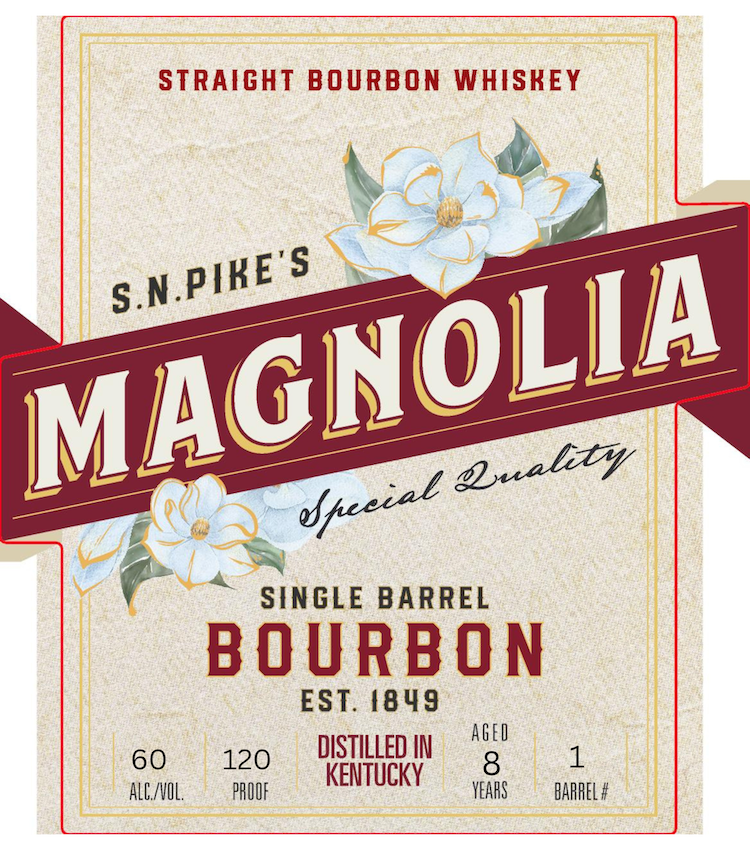
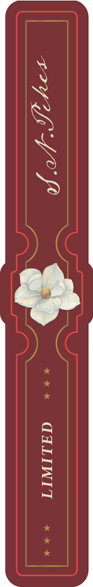

# TTB COLA Label Images - TTBID 26166001000746

**Brand Name:** MAGNOLIA

**Issue Date:** 06/26/2026

**Origin Code:** 22

**Product Class/Type:** 101

**Source:** [TTB Public COLA Registry](https://ttbonline.gov/colasonline/viewColaDetails.do?action=publicFormDisplay&ttbid=26166001000746)

## Label Images

### Back Label

### Label 1

### Label 3

## Extracted Label Text

*Text extracted via OCR - may contain errors*

*1 image(s) excluded: text did not meet readability threshold*

### Back Label

S.N.PIKES 4

MAGNOLIA

”
BOURBON Mm

Magnolia Spirits, LLC celebrates Samuel NV. Pike's heritage in Cincinnati and
his success as a “rectifier” and “liquor merchant” of spiritus product from
nearby Kentucky distilleries across the Ohio River blending it to achieve
greal taste and color. His flagship brand Magnolia Whiskey was trademarked
in 1849. This very successful Magnolia brand ultimately became a brand of
the Fleischmann Co. distillers of Cincinnati. Samuel Pike, a multi-millionaire
from selling whiskey, was so successful thal he was one of Cincinnati's
wealthiest and most prominant citizens and even built the first opera house
in Cincinnati in 1859 and later another one in New York City. Like Pike,
Magnolia Spirits LLC, searches far and wide to source the highest quality
and best tasting whiskey and bourbon.

BOTTLED BY
MAGNOLIA SPIRITS OF KENTUCKY
LOUISVILLE, KY

GOVERNMENT WARIUUG:() CCOROUS TOTHE 750 ML
SUNGEDU GENERAL VION SHOULD HOT OANKALCOROE
BEVERAGES DURING REGAN ELAUSEOF THE ISKOF | |

q 48577 :

BIRTH DEFECIS (2 OONSUMPIION OF ALCOMOLICBEVERAGES
IMPAIRS YOUR ABILITY TO DRIVE AGAR OR OPERATE
TMACHIVERY, AUD NAY CAUSE HEALTH PROBLEMS.

42461

### Label 1

STRAIGHT BOURBON WHISKEY
SINGLE BARREL
B O U RBO N
EST. 4849
AGED
60
120
DISTILLED IN
8
KENTUCKY
ALE/VOL;
PROUF
VEAHS
BARREL #
S.N.PIKE'S
MAGNOLIA
@uality
Uceeal
