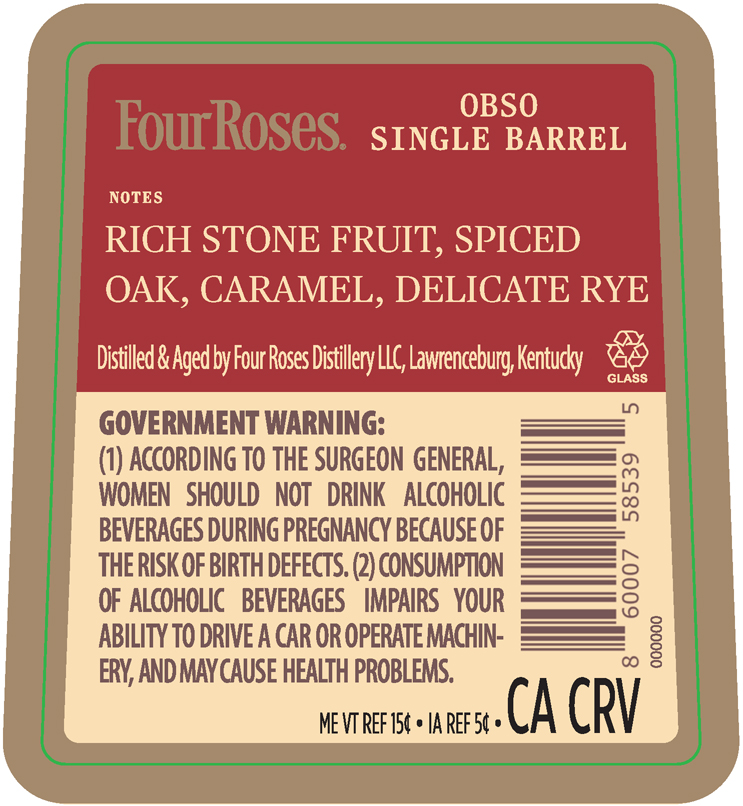
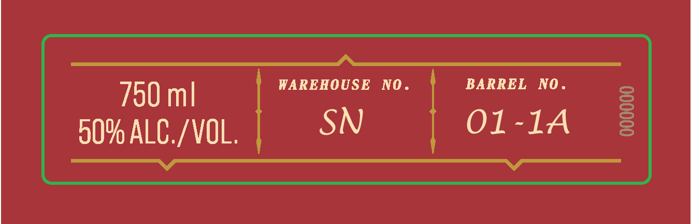
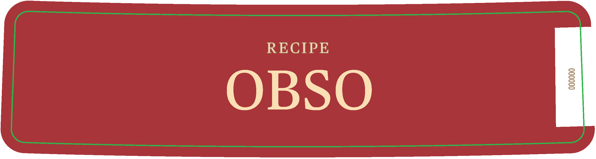

# TTB COLA Label Images - TTBID 26166001000748

**Brand Name:** FOUR ROSES

**Fanciful Name:** SINGLE BARREL

**Issue Date:** 06/24/2026

**Origin Code:** 22

**Product Class/Type:** 101

**Source:** [TTB Public COLA Registry](https://ttbonline.gov/colasonline/viewColaDetails.do?action=publicFormDisplay&ttbid=26166001000748)

## Label Images

### Back Label

### Front Label

### Label 4

## Extracted Label Text

*Text extracted via OCR - may contain errors*

*2 image(s) excluded: text did not meet readability threshold*

### Back Label

OBSO
FourRoses
SINGLE BARREL
NOTES
RICH STONE FRUIT; SPICED
OAK, CARAMEL, DELICATE RYE
Distilled & Aged by Four RosesL
LLG Lawrenceburg Kentucry
GLASS
GOVERNMENT WARNING:
(0) ACCORding TO THE SURGEON GENERAL ,
WOMEN   SHOULD   NOT   DRINK
ALCOHOLIC
8
BEVERAGES DURING PREGNANCY BECAUSE OF
THE RISK OF BIRTH DEFECTS. (2) CONSUMPTION
OF ALCOHOLIC   BEVERAGES
IMPAIRS   YOUR
8
ABILITY TO DRIVE A CAR OR OPERATE MACHIN:
8
ERY, AND MAYCAUSE HEALTH PROBLEMS:
ME VT REF 154 + IA REF 54 =
CA CRV
Distillery L
