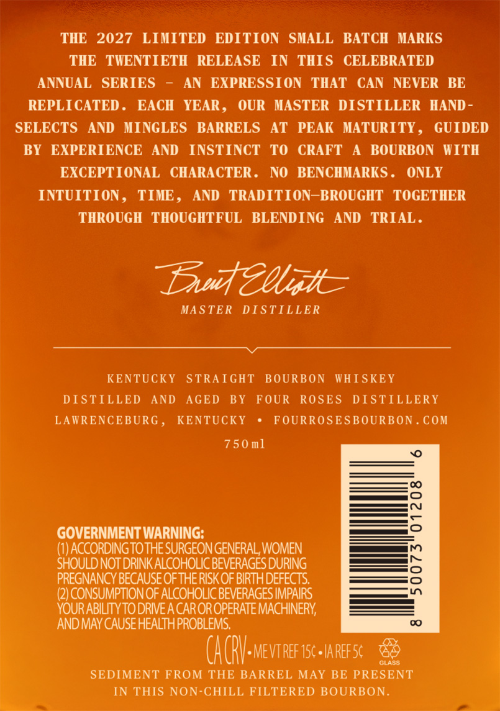
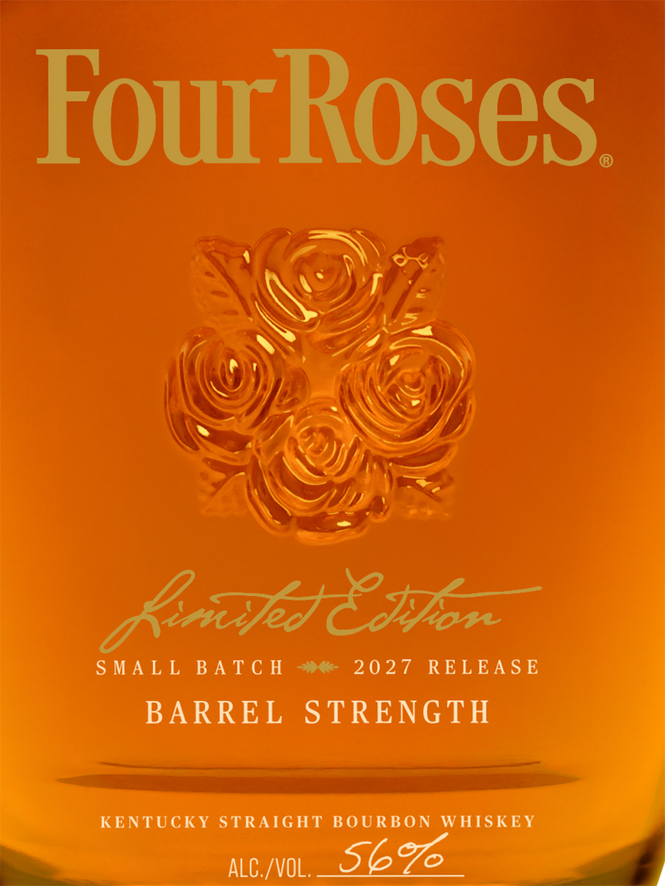
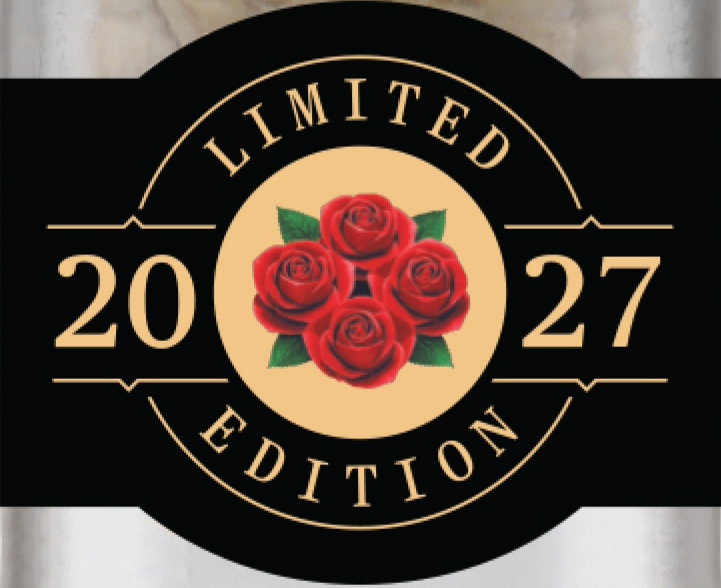

# TTB COLA Label Images - TTBID 26166001000751

**Brand Name:** FOUR ROSES

**Fanciful Name:** LIMITED EDITION

**Issue Date:** 07/14/2026

**Origin Code:** 22

**Product Class/Type:** 101

**Source:** [TTB Public COLA Registry](https://ttbonline.gov/colasonline/viewColaDetails.do?action=publicFormDisplay&ttbid=26166001000751)

## Label Images

### Back Label

### Front Label

### Label 3

## Extracted Label Text

*Text extracted via OCR - may contain errors*

*1 image(s) excluded: text did not meet readability threshold*

### Back Label

THE
2027
LIMITED
EDITION   SMALL  BATCH
MIARKS
THE TWENTIETH
RELEASE
IN
THIS
CELEBRATED
ANNUAL   SERIES
AN  EXPRESSION
THAT
CAN
NEVER
BE
REPLICATED
EACH   YEAR ,
OUR
MASTER
DISTILLER
HAND
SELECTS
AND   MINGLES
BARRELS
AT
PEAK    MATURITY ,
GUIDED
BY
EXPERIENCE
AND
INSTINCT
TO
CRAFT
BOURBON
WITH
EXCEPTIONAL
CHARACTER .
NO
BENCHMARKS
ONLY
INTUITION
TIME ,
AND
TRADITION
BROUGHT
TOGETHER
THROUGH
THOUGHTFUL
BLENDING
AND
TRIAL .
Suteelt
MA STER
DISTILLER
KENTUCKY
STRAIGHT
BOURBON
WHISKEY
DISTILLED
AND
AGED
BY
FOUR
ROSES
DISTILLERY
LAWRENCEBURG ,
KENTUCKY
FOURROSESBOURBON
COM
750 m]
3
GOVERNMENT WARNING;
(I) ACCORDINGTOTHE SURGEON GENERAL, WOMEN
SHOULDNOT DRINK ALCOHOLIC BEVERAGES DURING
8
PREGNANCY BECAUSE OFTHERISKOFBIRTHDEFECTS:
(2) CONSUMPTIONOF ALCOHOLIC BEVERAGES IMPAIRS
Ln
YOURABILITY TODRIVE A CAROROPERATE MACHINERY
AND MAY CAUSE HEALTHPROBLEMS:
(ACRV-mevtreft5c areesk
GLASS
SEDIMENT FROM THE BARREL MAY BE PRESENT
IN THIS NON-CHILL FILTERED BOURBON_

### Front Label

FourRoses
Bp8szon
S MA L L
B A T € H
20 27
RE LEA S E
BARREL
STRENGTH
KENTUCKY
STRAIGHT
BOURBON
WHISKEY
aLC /VOL;
Sb%
