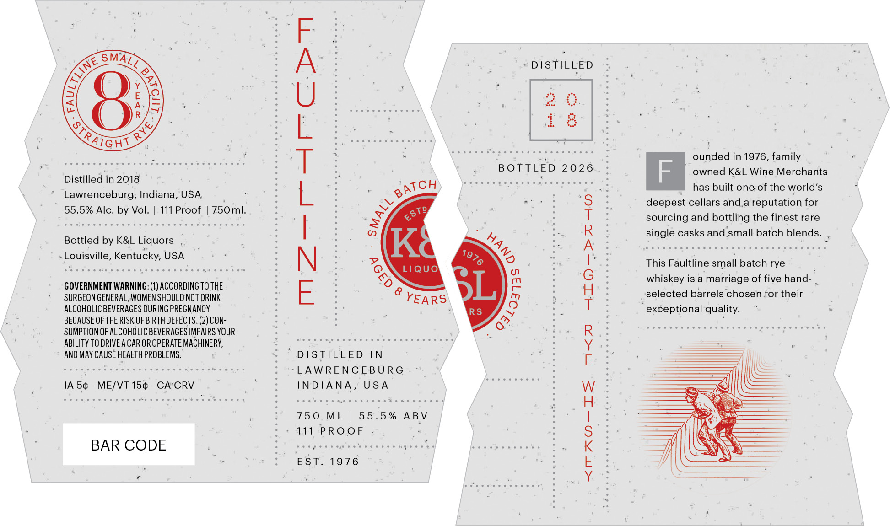
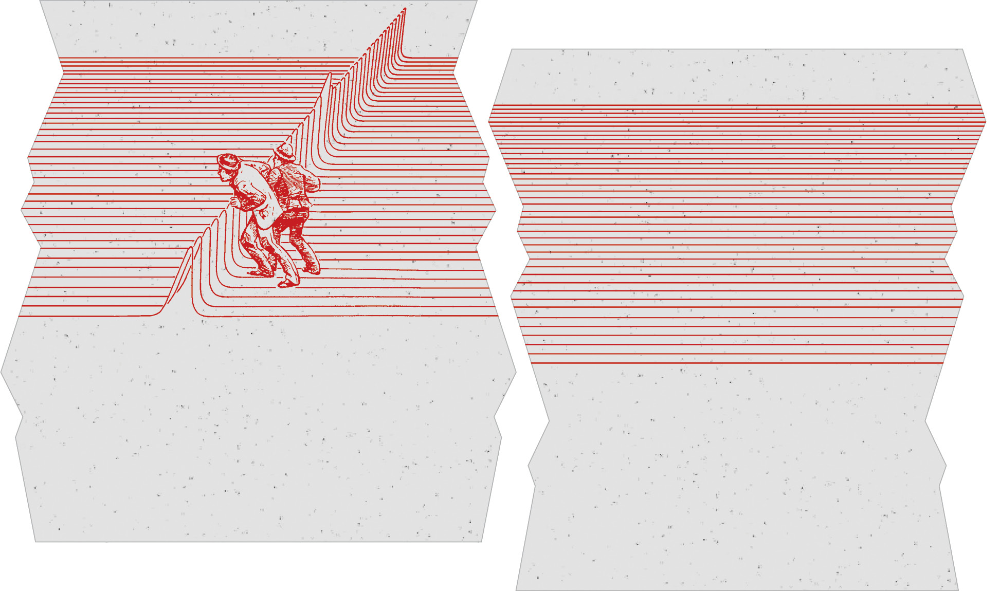

# TTB COLA Label Images - TTBID 26166001000784

**Brand Name:** FAULTLINE

**Issue Date:** 07/13/2026

**Origin Code:** 22

**Product Class/Type:** 102

**Source:** [TTB Public COLA Registry](https://ttbonline.gov/colasonline/viewColaDetails.do?action=publicFormDisplay&ttbid=26166001000784)

## Label Images

### Label 1

### Label 2

## Extracted Label Text

*Text extracted via OCR - may contain errors*

*1 image(s) excluded: text did not meet readability threshold*

**Detected Proof:** 111

### Label 1

DISTILLED
R
Distilled in 2018
1
B OTTLED
2 0 2 6
F
ouneecKia  9ine aeichants
has built one of the world's
Lawrenceburg, Indiana, USA
deepest cellars and a reputation for
55.5% Alc. by Vol:
111 Proof
750ml.
sourcing and bottling the finest rare
single casks and small batch blends_
Bottled by K&L Liquors
Ka
Louisville, Kentucky, USA
LIQUO
1
This Faultline small batch rye
whiskey is a marriage of five hand-
GOVERNMENT WARNING: (1) ACCORDING To THE
SURGEON GENERAL, WOMEN SHOULD NOT DRINK
YEARS
selected barrels chosen for their
alCoHOLIC BevERAGES DURING PREGNANCY
RS
exceptional quality.
BECAUSE OF THE RISK OF BIRTHDEFECTS: (2) CON-
SUMPTION OF ALCOHOLIC BEVERaGes IMPAIRS YOUR
ABILITY TODRIVE A CAR OR OPERATE MACHINERY,
E
AND May CAUSE HEALTH PROBLEMS.
DSTILLED IN
LAWRENCEB U RG
IA 54
ME/VT 15c
CA CRV
INDIA NA
US A
75 0
ML
5 5 . 5 %
A BV
BAR CODE
111
PROOF
1
EST.
1976
SMALL
TLINE
0
RYE
TRATGHS
BATCH
1
ESTD
8
1976
8
0
