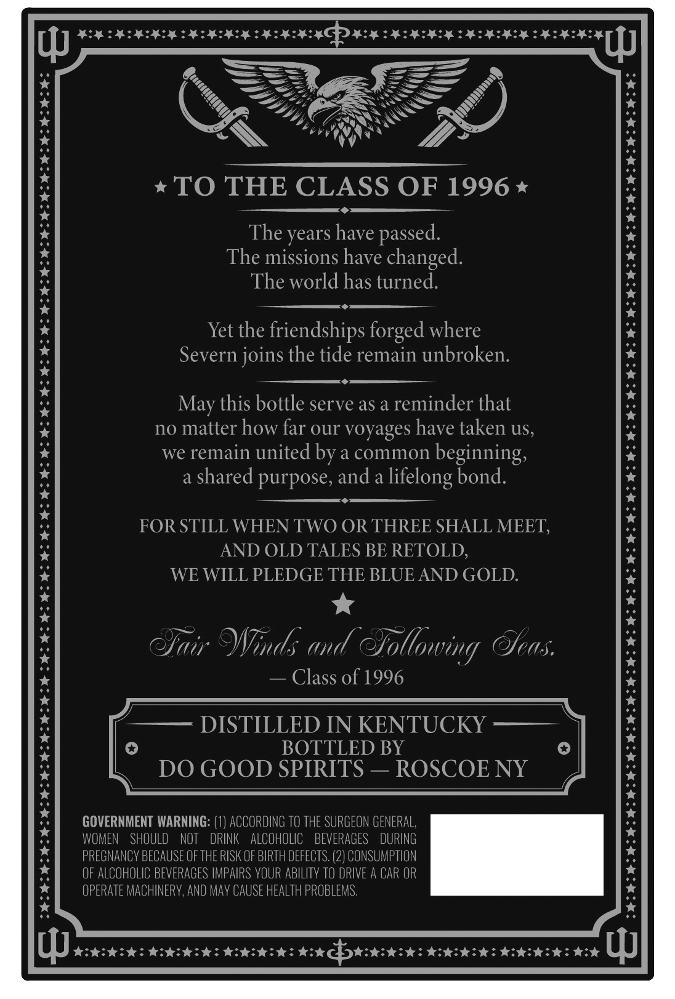
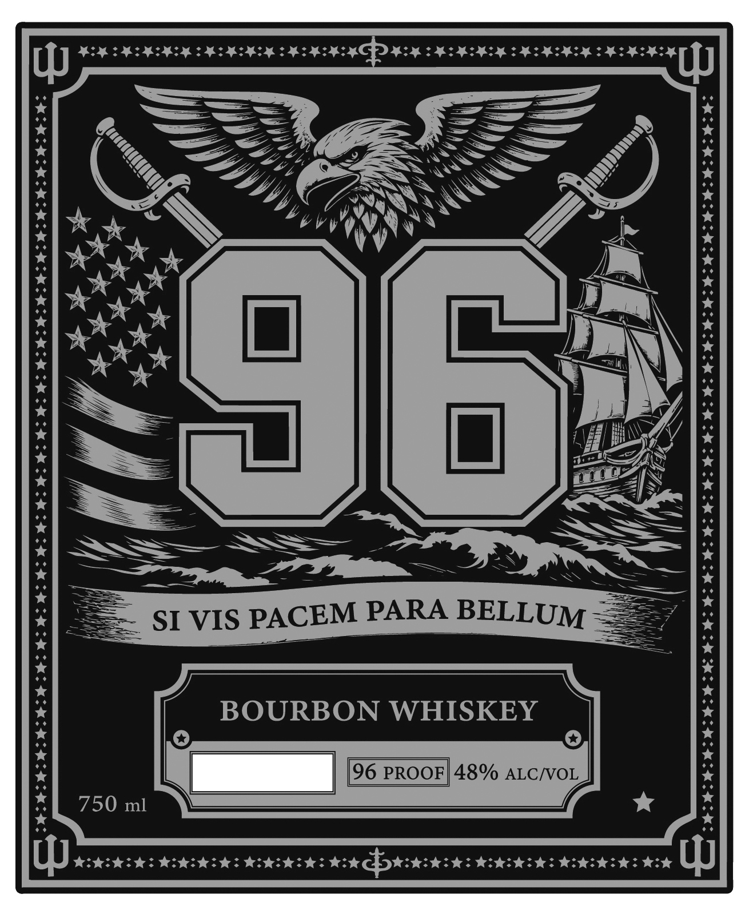

# TTB COLA Label Images - TTBID 26166001000852

**Brand Name:** 96

**Fanciful Name:** SI PACEM PARA BELLU

**Issue Date:** 06/23/2026

**Origin Code:** 02

**Product Class/Type:** 141

**Source:** [TTB Public COLA Registry](https://ttbonline.gov/colasonline/viewColaDetails.do?action=publicFormDisplay&ttbid=26166001000852)

## Label Images

### Back Label

### Front Label

## Extracted Label Text

*Text extracted via OCR - may contain errors*

**Detected Proof:** 96

### Back Label

TO THE CLASS OF 1996
The years have
The missions have changed.
The world has turned
Yet the
friendships forged where
Severn joins the tide remain unbroken:
this bottle serve as a reminder that
no matter how far our voyages have taken uS,
we remain united by a common beginning,
a shared purpose, and a
lifelong bond:
FOR STILL WHEN TWO OR THREE SHALL MEET,
AND OLD TALES BE RETOLD,
WE WILL PLEDGE THE BLUE AND GOLD:
Jair @nds and Tollowing Oeas:
Class of 1996
DISTILLED IN KENTUCKY
BOTTLED BY
DO GOOD SPIRITS
ROSCOE NY
GOVERNMENT WARNING: (1) ACCORDING TO THE SURGEON GENERAL,
WOMEN
shOULD   NOT
DRINK
ALCOHOLIC
BEVERAGES
DURING
PRECNANCV BECAUSE OF THE RISK OF BIRTH DEFECTS: (2) CONSUMPTION
OF ALCOHOLIC BEVERAGES IMPAIRS VOUR ABILITV To DRIVE A CAR OR
OPERATE MACHINERV, AND Mav CAUSE HEALTH PROBLEMS.
passed.
May

### Front Label

4
SI VIS PACEM PARA BELLUM
BOURBON WHISKEY
96 PROOF| 48% ALCNOL
750 ml
