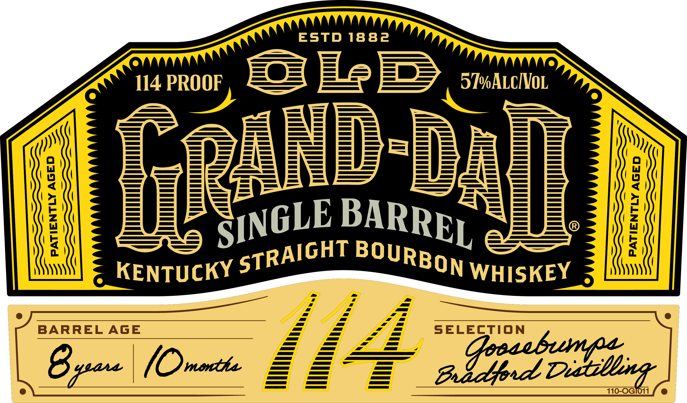
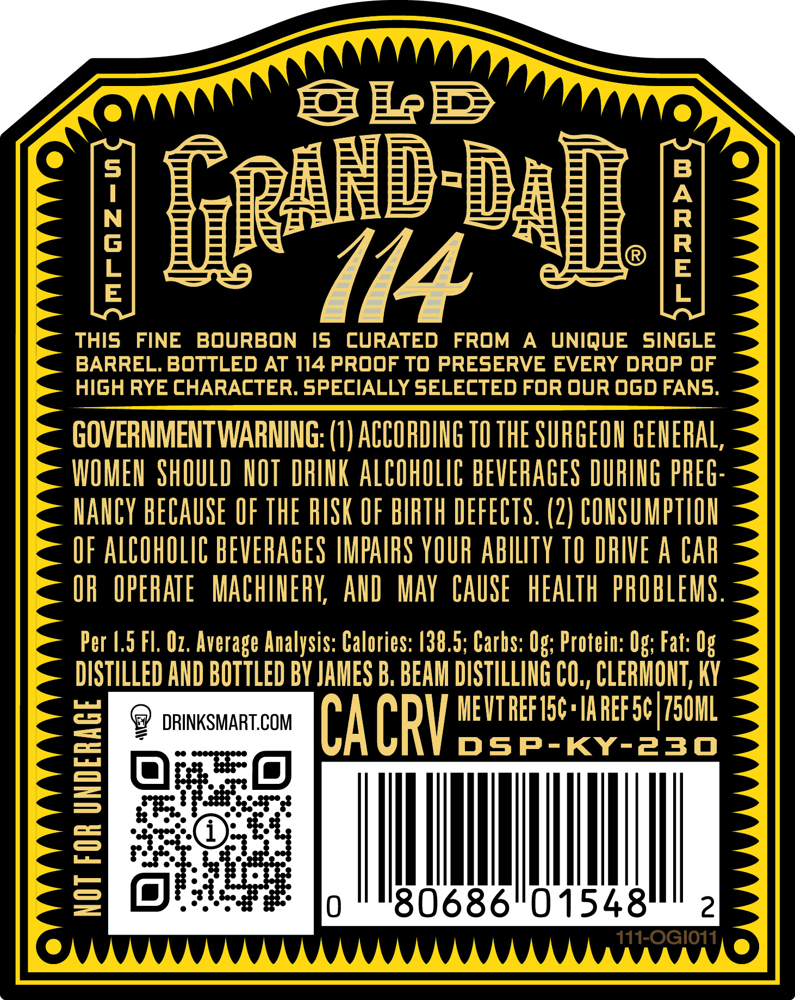
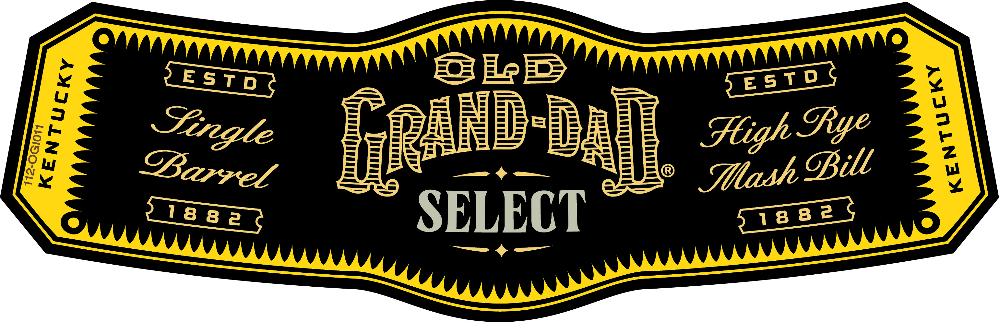

# TTB COLA Label Images - TTBID 26167001000040

**Brand Name:** OLD GRAND-DAD

**Issue Date:** 06/23/2026

**Origin Code:** 22

**Product Class/Type:** 101

**Source:** [TTB Public COLA Registry](https://ttbonline.gov/colasonline/viewColaDetails.do?action=publicFormDisplay&ttbid=26167001000040)

## Label Images

### Label 1

### Label 2

### Label 3

### Label 4

## Extracted Label Text

*Text extracted via OCR - may contain errors*

*1 image(s) excluded: text did not meet readability threshold*

**Detected Proof:** 114

### Label 1

ESTD 1882
114 PROOF
ReE
5@ALcIVOL
9
1
1
1
KENTUCKY
WHISKEY
BARREL AGE
SELECTION
4eax
(Omonthz
a @oradonfsg
m0 od0i
BARREL
SINGLE
STRAIGHT
BOURBON

### Label 2

4 Se im
IN| BRBREP’, BR IR -
me | i
_ THIS FINE BOURBON IS CURATED FROM A UNIQUE SINGLE —
BARREL. BOTTLED AT 114 PROOF TO PRESERVE EVERY DROP OF .

; HIGH RYE CHARACTER. SPECIALLY SELECTED FOR QUR OGD FANS.
- GOVERNMENT WARNING: (1) ACCORDING T0 THE SURGEON GENERAL, -
= WOMEN SHOULD NOT DRINK ALCOHOLIC BEVERAGES DURING PREG-
NANCY BECAUSE OF THE RISK OF BIRTH DEFECTS. (2) CONSUMPTION =<
OF ALCOHOLIC BEVERAGES IMPAIRS YOUR ABILITY TO DRIVE A CAR
OR OPERATE MACHINERY, AND MAY CAUSE HEALTH PROBLEMS. -
> Per 1.5 Fl. 0 Average Analysis: Calories: 138.5; Carbs: Og; Protein: Og; Fat: Og
- DISTILLED AND BOTTLED BY JAMES B. BEAM DISTILLING CO,, CLERMONT, KY -
—_ MEVTREFISC AREF 5¢)750ML -
— 9 nase CACR ee
= OFA, |
Sea
= cee it | | MANN |
eS] SNSEE fo '"'80686'01548t" om

### Label 3

a Se rryy p=e= He E> —_ resTDS S

tes & ak FLEE “BR REE Stigh Sye :
apa \ | sgiadlied,\\ OW ae
iigses _ ceaenhea NTT
