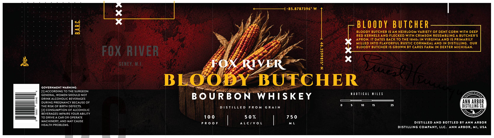

# TTB COLA Label Images - TTBID 26167001000113

**Brand Name:** FOX RIVER BLOODY BUTCHER BOURBON

**Issue Date:** 06/29/2026

**Origin Code:** 06

**Product Class/Type:** 141

**Source:** [TTB Public COLA Registry](https://ttbonline.gov/colasonline/viewColaDetails.do?action=publicFormDisplay&ttbid=26167001000113)

## Label Images

### Back Label

## Extracted Label Text

*Text extracted via OCR - may contain errors*

**Detected Proof:** 100

### Back Label

GOVERNMENT WARNING:

[1] ACCORDING TO THE SURGEON
GENERAL, WOMEN SHOULD NOT
DRINK ALCOHOLIC BEVERAGES
DURING PREGNANCY BECAUSE OF
THE RISK OF BIRTH DEFECTS.

[2] CONSUMPTION OF ALCOHOLIC
BEVERAGES IMPAIRS YOUR ABILITY
TO DRIVE A CAR OR OPERATE
MACHINERY, AND MAY CAUSE
HEALTH PROBLEMS.

BLOODY BUTCHER

BLOODY BUTCHER IS AN HEIRLOOM VARIETY OF DENT CORN WITH DEEP
RED KERNELS AND FLECKED WITH CRIMSON RESEMBLING A BUTCHER’S
__APRON. IT DATES BACK TO THE 1840s IN VIRGINIA AND IS PRIMARILY
MILLED INTO FLAVORFUL RUSTIC CORNMEAL AND IN DISTILLING. OUR
BLOODY BUTCHER IS GROWN BY CARES FARM IN DEXTER MICHIGAN.

+————_——_1-85.8787396.W. |
b
a

nN
wu
~.
o
x
=
uw
°

ESORY BUTCHER
falegdhonceec

pil pai Y\ Swe

BOURBON WHISKEY NAUTICAL MILES

— E

5 10 15
DISTILLED FROM GRAIN

50%

ALC/VOL DISTILLED AND BOTTLED BY ANN ARBOR

DISTILLING COMPANY, LLC. ANN ARBOR, MI,

USA
