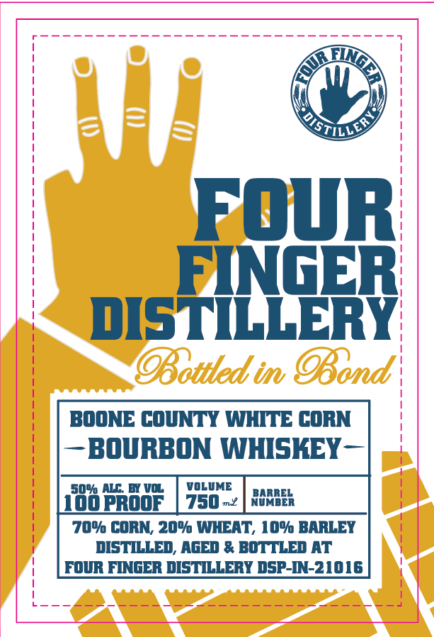
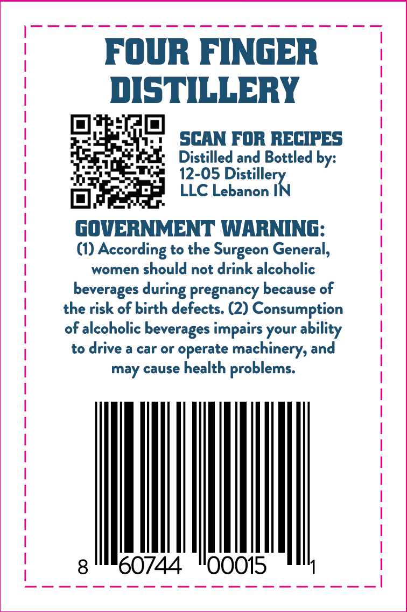

# TTB COLA Label Images - TTBID 26167001000239

**Brand Name:** FOUR FINGER DISTILLERY

**Fanciful Name:** BOONE COUNTY WHITE CORN BOURBON

**Issue Date:** 06/24/2026

**Origin Code:** 19

**Product Class/Type:** 111

**Source:** [TTB Public COLA Registry](https://ttbonline.gov/colasonline/viewColaDetails.do?action=publicFormDisplay&ttbid=26167001000239)

## Label Images

### Label 1

### Label 2

## Extracted Label Text

*Text extracted via OCR - may contain errors*

### Label 1

Fowr
EiNgER
diSTILLERY
OBottled in OBond
BOONE COUNTY WHITE CORN
S
BOURBON WHISKEY-
5090 ALc BVo
VOLVME
[oopROOF
750_2 ]Wum;
709 CoRN; 20% WHEAT, 109 BARLEY
diSTILLEd, AgEd & BOTTLEd AT
FOVR FINGER DISMILLERY DSp-IN-21016
QisTiLLY

### Label 2

FoWR FINGER
DISTILLERY
SCAN FOR RECIPES
Distilled and Bottled by:
12-05
LLC Lebanon
@ardlerN
gOVERNMENT WARNING:
(1)
According ~
to the
Surgeon General;
women
should not drink alcoholic
beverages
pregnancy because of
the risk of birth defects. (2) Consumption
of alcoholic beverages impairs your ability
to drive a car or
operate machinery, and
may cause health
problems:
60744
00015
during
