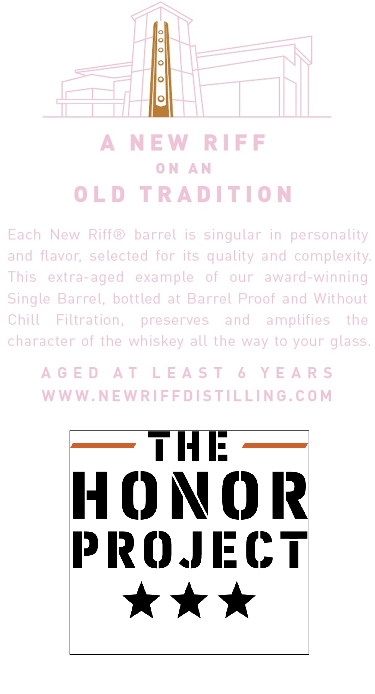
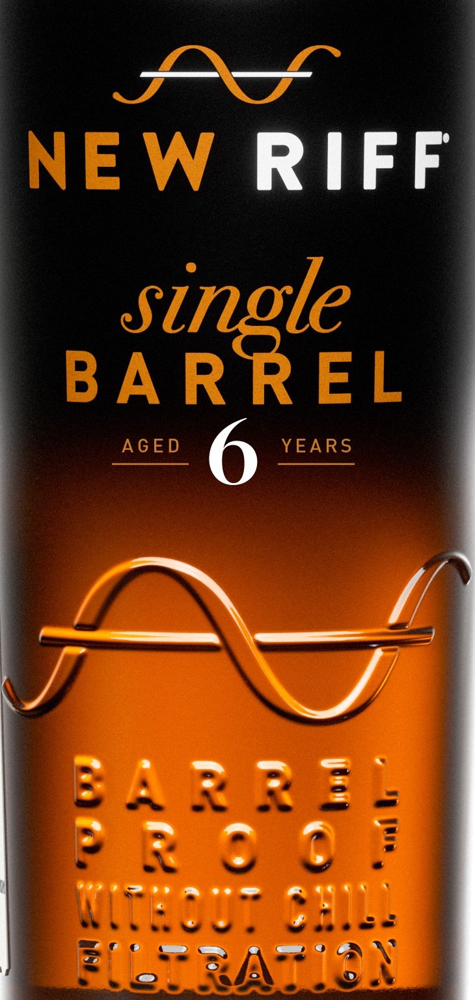
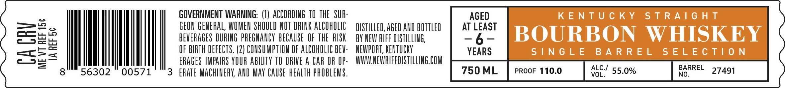
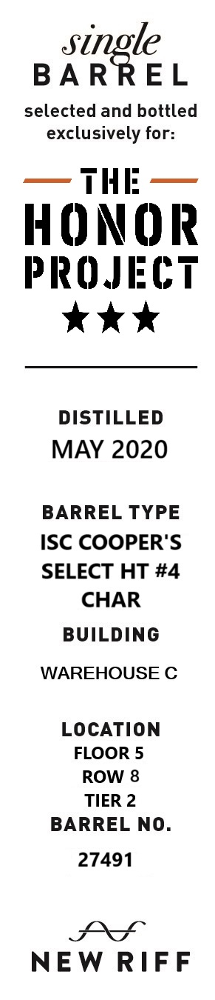
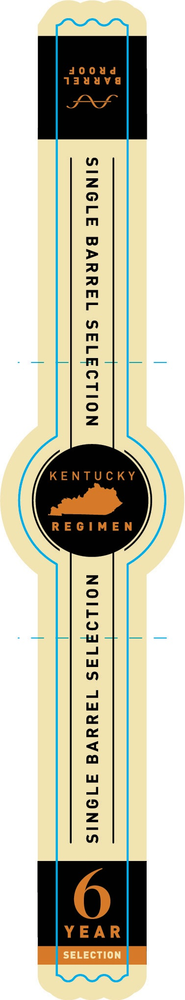

# TTB COLA Label Images - TTBID 26167001000412

**Brand Name:** NEW RIFF

**Issue Date:** 06/23/2026

**Origin Code:** 22

**Product Class/Type:** 101

**Source:** [TTB Public COLA Registry](https://ttbonline.gov/colasonline/viewColaDetails.do?action=publicFormDisplay&ttbid=26167001000412)

## Label Images

### Back Label

### Front Label

### Label 3

### Label 4

### Label 5

## Extracted Label Text

*Text extracted via OCR - may contain errors*

*1 image(s) excluded: text did not meet readability threshold*

**Detected Age:** 6 Years

### Back Label

A
N EW
RIFF
0 N
AM
0LD
TRADITIO N
Each
New
Riffo
barrel
is singular in
personality
and
flavor; selected
for its quality and
complexity.
This
extra-aged
example
of
our
award-winning
Single Barrel,
bottled
at Barrel Proof and Without
Chill
Filtration,
preserves
and
amplifies
the
character of the whiskey all the way to your
A G E D
A T
LE A $ T
6
Y E A R $
WWW.NEWRIFFDISTILLING.COM
TIE:
HONOR
pROJECT
glass

### Front Label

NEW RIFF
single
BA RREL
AGED
6
YEARS
MA 22]
: %
3f7

### Label 3

GOVERNMENT WARNING: (1) ACCORDING 10 THE SUA

AGED

>=.

osu

GEON GENERAL, WOMEN SHOULD NOT DRINK ALCOHOLIC

DISTILLED, AGED AND BOTTLED

AT LEAST

an

BEVERAGES DURING PREGNANCY BECAUSE OF THE RISK

BY NEW AIFF DISTILLING,

eo

OF BIRTH DEFECTS. (2) CONSUMPTION OF ALCOHOLIC BEV

NEWPORT, KENTUCKY

YEARS.

a

=—l>=

|

ERAGES IMPAIRS YOUR ABILITY T0 DRIVE A CAR OR OP

WWW.NEWRIFFDISTILLING. COM

Nl

00571

3 ERATE MACHINERY, AND MAY CAUSE HEALTH PROBLEMS

### Label 4

single

BARREL

selected and bottled
exclusively for:

— THE —

HONOR

PROJECT
tok

DISTILLED
MAY 2020

BARREL TYPE
ISC COOPER'S
SELECT HT #4
CHAR
BUILDING

WAREHOUSE C

LOCATION
FLOOR 5
ROW 8
TIER 2
BARREL NO.

27491

LOS
NEW RIFF
