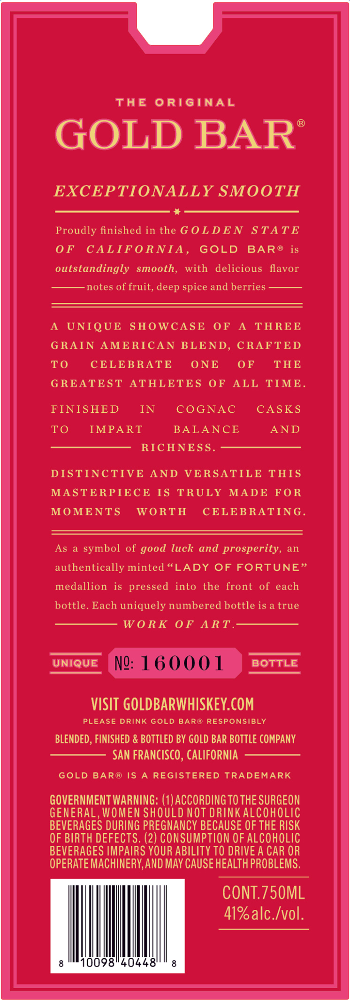
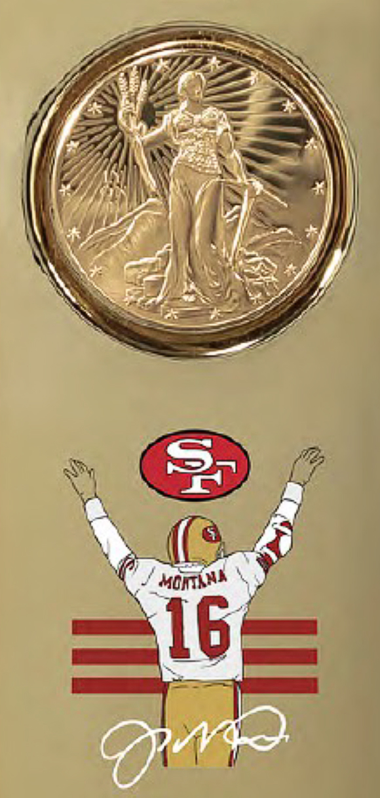

# TTB COLA Label Images - TTBID 26167001000484

**Brand Name:** GOLD BAR

**Fanciful Name:** BLEND NO. 273

**Issue Date:** 06/25/2026

**Origin Code:** 01

**Product Class/Type:** 137

**Source:** [TTB Public COLA Registry](https://ttbonline.gov/colasonline/viewColaDetails.do?action=publicFormDisplay&ttbid=26167001000484)

## Label Images

### Back Label

### Front Label

## Extracted Label Text

*Text extracted via OCR - may contain errors*

*1 image(s) excluded: text did not meet readability threshold*

**Detected Proof:** 82

### Back Label

THE
ORIGINAL
GOLD BARS
EXCEPTIONALLY SMOOTH
Proudly finished in the G OLDE N
STATE
0F
CALIF O RNIA ,
GOLD
BARo
is
outstandingly smooth,
with
delicious  flavor
notes of fruit,
spice and berries
UNIQUE
SHOWCASE
0F
A
TAREE
G RAIN
AMERICAN BLEND, CRAFTED
To
CELEBRATE
ONE
0F
THE
G REATEST
ATHLETES
OF
ALL
TIME_
FINISHED
IN
COGNAC
CASKS
To
IMPART
BALANCE
AND
RICHNESS
DISTINCTIVE
AND
VERSATILE
THIS
MASTERPIECE
IS
TRULY
MADE
FOR
MOMENTS
WORTH
CELEBRATING
As
symbol of good luck and prosperity,
an
authentically minted <LADY
OF FORTUNE"
medallion
is pressed
into the
front of each
bottle. Each uniquely numbered bottle is a true
W0 RK
0F
ART_
UNIQUE
NW: 160001
BOTTLE
VISIT GOLDBARWHISKEY.COM
PLEASE DRINK GOLD BAR@ RESPONSIBLY
BLENDED , FINISHED & BOTTLED BY GOLD BAR BOTTLE COMPANY
SAN FRANCISCO , CALIFORNIA
GOLD BAR@ IS
REGISTERED
TRADEMARK
GOVERNMENT WARNING: (1) ACCORDING TO THE SURGEON
GENERAL, WOMEN SHOULD NOT DRINKALCOHOLIC
BEVERAGES DURING PREGNANCY BECAUSE OF THE RISK
OF BIRTH DEFECTS. (2) CONSUMPTION OF ALCOHOLIC
BEVERAGES IMPAIRS YOUR ABILITY TO DRIVE A CAR OR
OPERATE MACHINERY,AND MAY CAUSE HEALTH PROBLEMS,
CONT.75OML
41%alc Ivol.
10098"40448'
deep
