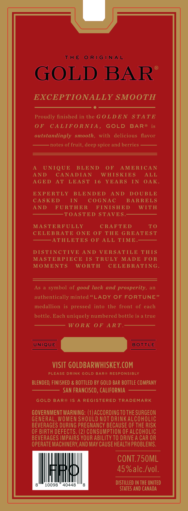
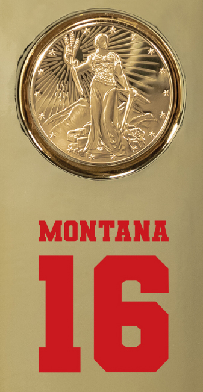

# TTB COLA Label Images - TTBID 26167001000492

**Brand Name:** GOLD BAR

**Fanciful Name:** BLEND NO. 117

**Issue Date:** 06/23/2026

**Origin Code:** 01

**Product Class/Type:** 140

**Source:** [TTB Public COLA Registry](https://ttbonline.gov/colasonline/viewColaDetails.do?action=publicFormDisplay&ttbid=26167001000492)

## Label Images

### Back Label

### Front Label

### Label 4

## Extracted Label Text

*Text extracted via OCR - may contain errors*

*1 image(s) excluded: text did not meet readability threshold*

**Detected Proof:** 90
**Detected Age:** 16 Years

### Back Label

THE
0 RIGINAL
GOLD BAR
EXCEPTIONALLY SMOOTH
Proudly finished in the G 0LDE N
STATE
0F
CALIFORNIA,
GOLD
BAR @
outstandingly
smooth,
with
delicious
flavor
notes of fruit, deep spice and berries
UNIQUE
BLEND
0F
AMERICAN
AND
CANADIAN
WHIS KIES
ALL
AGED
AT
LEAST
16
YEARS
IN
OAK
EXPERTLY
BLENDED
AND
DOUBLE
CASKED
IN
COGNAC
BARRELS
AND
FURTHE R
FINISHED
WITH
TOASTED STAVES.
MASTE RFULLY
CRAFTED
To
CELEBRATE ONE
OF THE GREATEST
ATHLETES OF ALL TIME
DISTINCTIVE
AND
VERSATILE THIS
MASTERPIECE
IS
TRULY
MADE FO R
MOMENTS
WO RTH
CELEBRATING
As
symbol
good luck
and prosperity,
an
authentically minted <LADY OF FORTUNE"
medallion
is pressed
into
the
front
of
each
bottle
Each uniquely numbered bottle is a true
W 0 RK
0F ART
UNIQUE
BOTTLE
VISIT GOLDBARWHISKEY.COM
PLEASE DRINK GOLD BAR@ RESPONSIBLY
BLENDED; FINISHED & BOTTLED BY GOLD BAR BOTTLE COMPANY
San FRANCISCO , CAlifornIa
GOLD BAR@ IS
REGISTERED TRADEMARK
GOVERNMENT WARNING: (1) ACCORDINGTOTHE SURGEON
GENERAL , WOMEN SHOULD NOT DRINKALCOHOLIC
BEVERAGES DURING PREGNANCY BECAUSE OF THE RISK
OF BIRTH DEFECTS; (2) CONSUMPTION OF ALCOHOLIC
BEVERAGES IMPAIRS YOUR ABILITY TO DRIVE A CAR OR
OPERATE MACHINERV,AND MAV CAUSE HEALTH PROBLEMS.
CONT.75OML
45%alc Ivol.
DISTILLED IN THE UNITED
0098
40448
STATES AND Canada

### Label 4

LIMITED EDITION

gan

s

JOE MONTANA COLLECTION

NOILIG3 GaLIWIT
