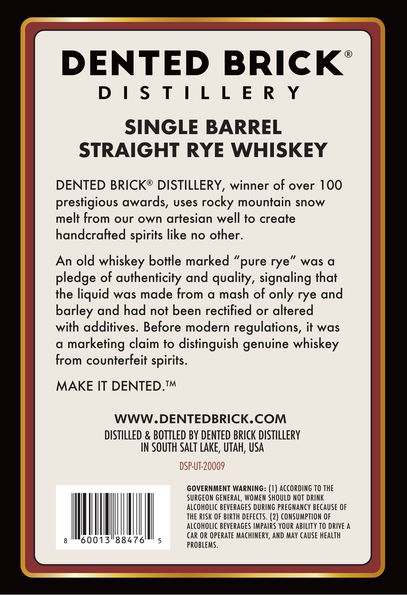
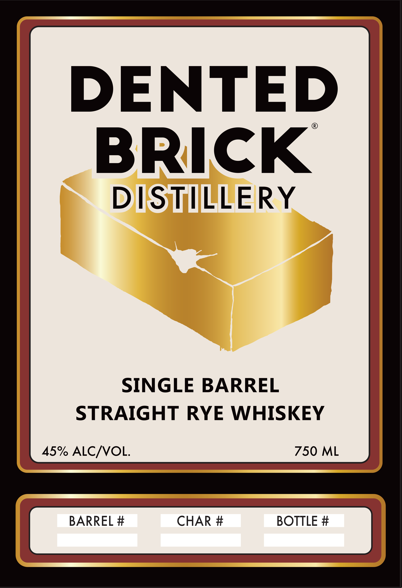

# TTB COLA Label Images - TTBID 26167001000498

**Brand Name:** DENTED BRICK DISTILLERY SINGLE BARREL STRAIGHT RYE WHISKEY

**Issue Date:** 06/23/2026

**Origin Code:** 45

**Product Class/Type:** 102

**Source:** [TTB Public COLA Registry](https://ttbonline.gov/colasonline/viewColaDetails.do?action=publicFormDisplay&ttbid=26167001000498)

## Label Images

### Back Label

### Front Label

## Extracted Label Text

*Text extracted via OCR - may contain errors*

**Detected Proof:** 90

### Back Label

DENTED BRICK’

DISTILLER Y

SINGLE BARREL

STRAIGHT RYE WHISKEY

DENTED BRICK® DISTILLERY, winner of over 100

prestigious awards, uses rocky mountain snow

melt from our own artesian well to create

handcrafted spirits like no other

An old whiskey bottle marked “pure rye” was a

pledge of authenticity and quality, signaling that

the liquid was made from a mash of only rye and

barley and had not been rectified or altered

with additives. Before modern regulations, it was

a marketing claim to distinguish genuine whiskey

from counterfeit spirits

MAKE IT DENTED.™

WWW.DENTEDBRICK.COM

DISTILLED & BOTTLED BY DENTED BRICK DISTILLERY

IN SOUTH SALT LAKE, UTAH, USA

SURGEON GENERAL, WOMEN SHOULD NOT DRINK

GOVERNMENT WARNING: (1) ACCORDING TO THE

ALCOHOLIC BEVERAGES DURING PREGNANCY BECAUSE OF

THE RISK OF BIRTH DEFECTS. (2) CONSUMPTION OF

ALCOHOLIC BEVERAGES IMPAIRS YOUR ABILITY TO DRIVE A

wT

CAR OR OPERATE MACHINERY, AND MAY CAUSE HEALTH

OBLEMS

### Front Label

DENTED
BRICK
DISTILLERY
SINGLE BARREL
STRAIGHT RYE
WHISKEY
45% ALCNOL
750 ML
BARREL #
CHAR #
BOTTLE #
