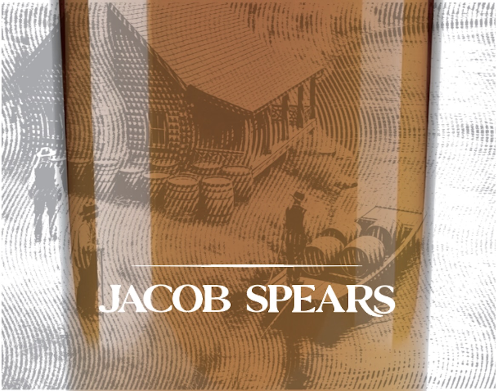
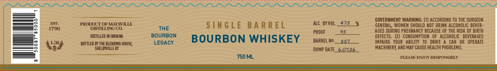
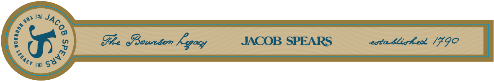
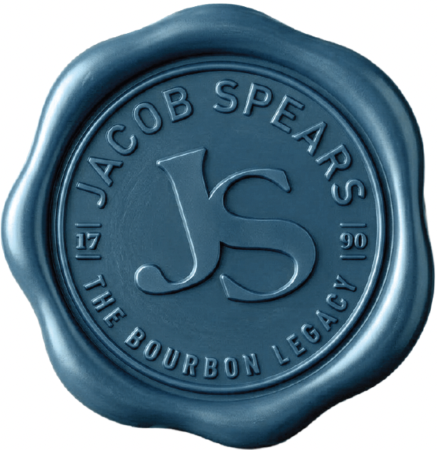

# TTB COLA Label Images - TTBID 26167001000534

**Brand Name:** JACOB SPEARS

**Fanciful Name:** SINGLE BARREL

**Issue Date:** 06/24/2026

**Origin Code:** 22

**Product Class/Type:** 101

**Source:** [TTB Public COLA Registry](https://ttbonline.gov/colasonline/viewColaDetails.do?action=publicFormDisplay&ttbid=26167001000534)

## Label Images

### Label 1

### Label 2

### Label 3

### Label 4

## Extracted Label Text

*Text extracted via OCR - may contain errors*

*2 image(s) excluded: text did not meet readability threshold*

### Label 2

GOVERNMENT WARNING: (1) ACCORDING TO THE SURGEON
8
ESI
PRODUCT OFMAYSVILLE
SIN GLE
BA RREL
alC. BYVOL
475
GENERAL
WOMEN SHOULD NOT DRINK ALCOHOLIC BEVER
1790
DISTILLING CO.
THE
PROOF
AGES DURING PREGNANCY BECAUSE OF THE RISK OF BIRTH
DISTILLED IM INDIANA
BOURBON
BOURBON WHISKEY
DEFECTS_
CONSUMPTION
OF   ALCOHOLIC   BEVERA GES
bottled BY THE BLEWDING HOUSE
LEGACY
BARREL No_
357
IMPAIRS   YOUR   ABILITY   TO   DRNE
CAR OR   OPERATE
SHELBWILLE Ky
DUMP DATE_
0126
MACHINERY AND MAY CAUSE HEALTH PROBLEMS:
750 ML
PLEASE ENJOY RESPONSIBLY

### Label 3

(JJ
Fhe Pounton Kepasy JACOB SPEARS cota tlicheol [90
