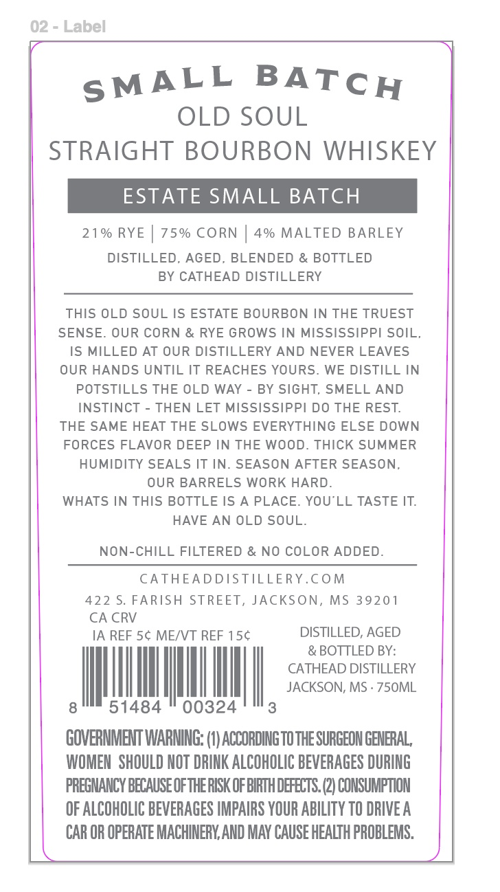
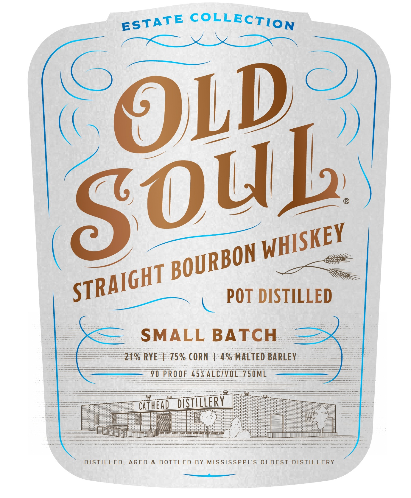

# TTB COLA Label Images - TTBID 26167001000546

**Brand Name:** OLD SOUL

**Fanciful Name:** SMALL BATCH

**Issue Date:** 06/24/2026

**Origin Code:** 28

**Product Class/Type:** 101

**Source:** [TTB Public COLA Registry](https://ttbonline.gov/colasonline/viewColaDetails.do?action=publicFormDisplay&ttbid=26167001000546)

## Label Images

### Back Label

### Front Label

## Extracted Label Text

*Text extracted via OCR - may contain errors*

**Detected Proof:** 90

### Back Label

02
Label
OLD SOUL
STRAIGHT BOURBON
WHISKEY
ESTATE SMALL BATCH
21 % RYE
75% CORN
4% MALTED BARLEY
DISTILLED, AGED_
BLENDED & BOTTLED
BY CATHEAD DISTILLERY
THIS OLD SOUL IS ESTATE BOURBON IN THE TRUEST
SENSE
OUR CORN & RYE GROWS IN MISSISSIPPI SOIL;
IS MILLED AT OUR DISTILLERY AND NEVER LEAVES
OUR HANDS UNTIL IT REACHES YOURS.
WE DISTILL IN
POTSTILLS THE OLD WAY
BY SIGHT, SMELL AND
INSTINCT
THEN LET MISSISSIPPI DO THE REST
THE SAME HEAT THE SLOWS EVERYTHING ELSE DOWN
FORCES FLAVOR DEEP IN THE WOOD. THICK SUMMER
HUMIDITY SEALS IT IN
SEASON AFTER SEASON;
OUR BARRELS WORK HARD
WHATS IN THIS BOTTLE IS A PLACE
YOU LL TASTE IT
HAVE AN OLD SOUL.
NON-CHILL FILTERED & NO COLOR ADDED.
CATHEADDISTILLERY.€OM
422 $. FARISH STREET, JACKSON, MS 39201
CA CRV
IA REF 5c MEIVT REF 15c
DISTILLED; AGED
& BOTTLED BY:
CATHEAD DISTILLERY
JACKSON, MS . 7S0ML
51484
00324
GOVERMMENT WARMING: (I) ACCORDING TOTHE SURGEON GENERAL,
WOMEN   SHOULD NOT DRINK ALCOHOLIC BEVERAGES DURING
PREGNANCY BECAUSE OFTHERISK OF BIRTH DEFECTS (2) CONSUMPTION
OF ALCOHOLIC BEVERAGES IMPAIRS YOUR ABILITY TO DRIVE A
CAR OR OPERATE MACHINERY,AND MAY CAUSE HEALTH PROBLEMS.
SMALL
BATCH

### Front Label

COLLECTION
OLd
POT DISTILLED
SMALL BATCH
219 RYE E 75% CORN 4-4% MALTED BARLEY
90 PROOF 45% AEEHVOL#5OML
WHEM DSTILeRV
DISTILLED,
AGED
BOTTLED
BY MISSISSPPI'S OLDEST
DISTILLERY
ESTATE
Soub
WHISKEY
BOURBON
STRAIGHT
