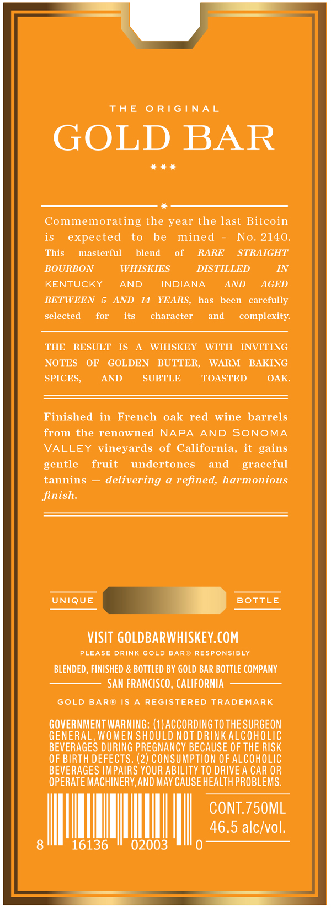
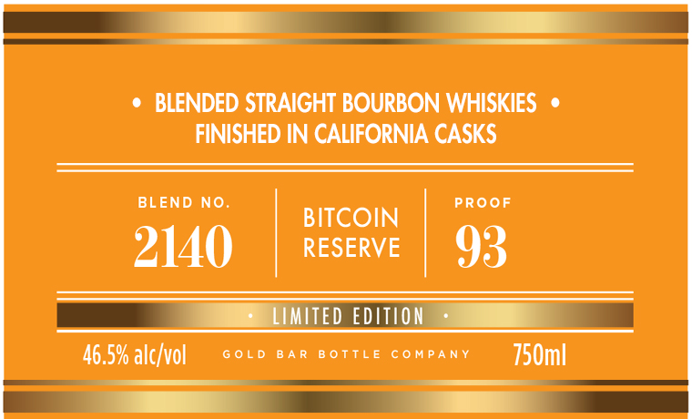

# TTB COLA Label Images - TTBID 26167001000606

**Brand Name:** GOLD BAR

**Fanciful Name:** BITCOIN RESERVE

**Issue Date:** 06/23/2026

**Origin Code:** 01

**Product Class/Type:** 121

**Source:** [TTB Public COLA Registry](https://ttbonline.gov/colasonline/viewColaDetails.do?action=publicFormDisplay&ttbid=26167001000606)

## Label Images

### Back Label

### Front Label

### Label 3

### Label 4

## Extracted Label Text

*Text extracted via OCR - may contain errors*

*1 image(s) excluded: text did not meet readability threshold*

**Detected Proof:** 93
**Detected Age:** 14 Years

### Back Label

TH E
0 RIG I NAL
GOLD BAR
Commemorating the year the last Bitcoin
is
expected
to
be
mined
No: 2140
This
masterful
blend
of
RARE
STRAIGHT
BOURBON
WHISKIES
DISTILLED
IN
KENTUCKY
AND
INDIANA
AND
AGED
BETWEEN
AND
14  YEARS,
has
been
carefully
selected
for
its
character
and
complexity
THE
RESULT
IS
WHISKEY
WITH
INVITING
NOTES
OF
GOLDEN
BUTTER,
WARM
BAKING
SPICES;
AND
SUBTLE
TOASTED
OAK:
Finished in
French
oak red
wine
barrels
from the renowned
NAPA
AND
SONOMA
VALLEY
vineyards of California, it
gentle
fruit
undertones
and
graceful
tannins
delivering
refined,
harmonious
finish.
UNIQUE
BOTTLE
VISIT GOLDBARWHISKEY.COM
PLBASE
DRINK
GOLD
BARW Responsibly
BLENDED , FINISHED & BOTTLED BY GOLD BAR BOTTLE COMPANY
SAN FRANCISCO , CALIFORNIA
GOLD
BAR  I5
REGISTERED
TRADEMARK
GOVERNMENT WARNING: (1) ACCORDINGTOTHE SURGEON
GENERAL , WOMEN SHOULD NOT DRINKALCOHOLIC
BEVERAGES DURING PREGNANCY BECAUSE OF THE RISK
OF BIRTH DEFECTS; (2) CONSUMPTION OF AlcOHOLIC
BEVERAGES IMPAIRS YOUR ABILITY TO DRIVE A CAR OR
OPERATE MACHINERY,AND MAY CAUSE HEALTH PROBLEMS,
CONT.750ML
46.5 alcIvol:
16136
02003
gains

### Front Label

OSE

¢ BLENDED STRAIGHT BOURBON WHISKIES ¢

FINISHED IN CALIFORNIA CASKS

BLEND NO.

PROOF

BITCOIN

RESERVE

2140

93

EE

GOLD

BAR BOTTLE COMPANY

150ml

46.5% alc/vol

EE —

### Label 4

LIMITED EDITION BITCOIN RESERVE

LIMITED EDITION BITCOIN RESERVE
