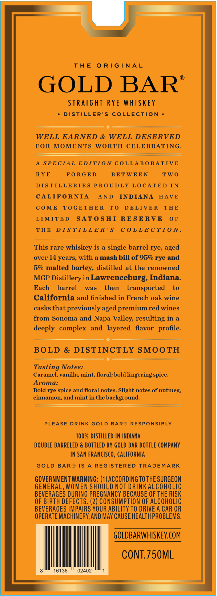
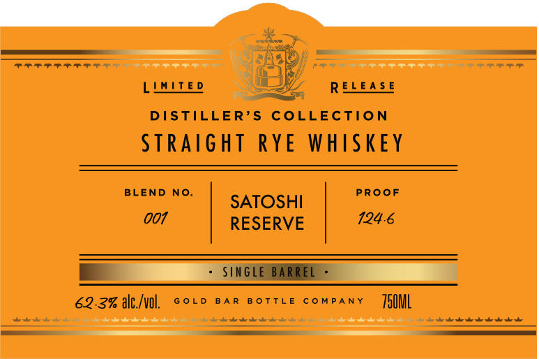
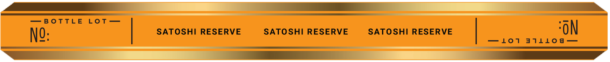

# TTB COLA Label Images - TTBID 26167001000619

**Brand Name:** GOLD BAR

**Fanciful Name:** SATOSHI RESERVE

**Issue Date:** 06/23/2026

**Origin Code:** 01

**Product Class/Type:** 102

**Source:** [TTB Public COLA Registry](https://ttbonline.gov/colasonline/viewColaDetails.do?action=publicFormDisplay&ttbid=26167001000619)

## Label Images

### Back Label

### Front Label

### Label 3

### Label 4

## Extracted Label Text

*Text extracted via OCR - may contain errors*

*1 image(s) excluded: text did not meet readability threshold*

**Detected Age:** 14 Years

### Back Label

THE ORIGINAL

GOLD BAR’

STRAIGHT RYE WHISKEY

+ DISTILLER’S COLLECTION +

WELL EARNED & WELL DESERVED
FOR MOMENTS WORTH CELEBRATING.

A SPECIAL EDITION COLLABORATIVE
RYE FORGED BETWEEN TWO
DISTILLERIES PROUDLY LOCATED IN
CALIFORNIA AND INDIANA HAVE
COME TOGETHER TO DELIVER THE
LIMITED SATOSHI RESERVE OF
THE DISTILLER’S COLLECTION.

This rare whiskey is a single barrel rye, aged
over 14 years, with a mash bill of 95% rye and
5% malted barley, distilled at the renowned
MGP Distillery in Lawrenceburg, Indiana.
Each barrel was then transported to
California and finished in French oak wine
casks that previously aged premium red wines
from Sonoma and Napa Valley, resulting in a
deeply complex and layered flavor profile.

BOLD & DISTINCTLY SMOOTH

Tasting Notes:
Caramel, vanilla, mint, floral; bold lingering spice.
Aroma:

Bold rye spice and floral notes. Slight notes of nutmeg,
cinnamon, and mint in the background.

PLEASE DRINK GOLD BAR® RESPONSIBLY

100% DISTILLED IN INDIANA
DOUBLE BARRELED & BOTTLED BY GOLD BAR BOTTLE COMPANY
IN SAN FRANCISCO, CALIFORNIA

GOLD BAR® IS A REGISTERED TRADEMARK

GOVERNMENT WARNING: (1) ACCORDING TO THE SURGEON
GENERAL, WOMEN SHOULD NOT DRINK ALCOHOLIC
BEVERAGES DURING PREGNANCY BECAUSE OF THE RISK
OF BIRTH DEFECTS. (2) CONSUMPTION OF ALCOHOLIC
BEVERAGES IMPAIRS YOUR ABILITY TO DRIVE A CAR OR
OPERATE MACHINERY, AND MAY CAUSE HEALTH PROBLEMS.

GOLDBARWHISKEY.COM
CONT.750ML

### Front Label

ann -¥
a QO) ——_—_—_—=—=—= —
a) Fae P ETT ie es Raaeae ===
LiMiteo La RELEASE
DISTILLER’S COLLECTION
STRAIGHT RYE WHISKEY
BLEND NO. SATOSHI PROOF
Dae RESERVE GE
I:
62.2% tg, sovo sar sortie company  ]5QML

### Label 4

—BOrTle Lot ‘ON

No: SATOSHI RESERVE SATOSHI RESERVE SATOSHI RESERVE
cat —101 411100 —
