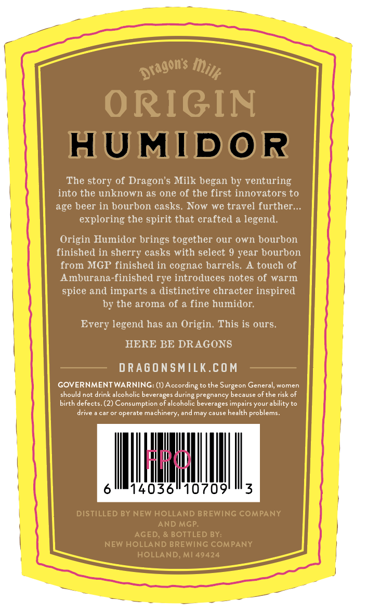
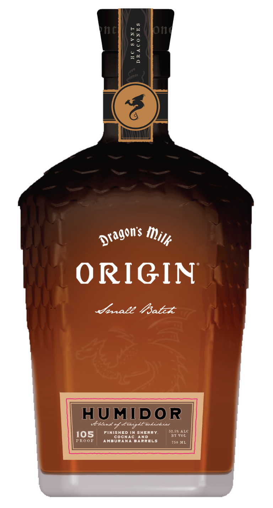

# TTB COLA Label Images - TTBID 26167001000664

**Brand Name:** DRAGON'S MILK ORIGIN

**Fanciful Name:** HUMIDOR

**Issue Date:** 06/24/2026

**Origin Code:** 06

**Product Class/Type:** 120

**Source:** [TTB Public COLA Registry](https://ttbonline.gov/colasonline/viewColaDetails.do?action=publicFormDisplay&ttbid=26167001000664)

## Label Images

### Back Label

### Front Label

## Extracted Label Text

*Text extracted via OCR - may contain errors*

**Detected Age:** 9 Years

### Back Label

ORIGIN
HUMIDOR
The story of Dragon'$ Milk began by venturing
into the unknown as one of the first innovators to
age beer in bourbon casks. Now
we travel further..
exploring the spirit that crafted a legend
Origin Humidor brings together our own bourbon
finished in sherry casks with select 9 year bourbon
from MGP finished in cognac barrels.
A touch of
Amburana-finished rye introduces notes of warm
spice and imparts a distinctive chracter inspired
by the aroma of a fine humidor;
Every legend has an Origin: This is ours.
HERE BE DRAGONS
D RAGONSMILK.COM
GOVERNMENT WARNING: (I) According to the
General, women
should not drink alcoholic beverages during pregnancy because ofthe risk of
birth defects.(2) Consumption of alcoholic beverages impairs your ability to
drive
Galoi
operate machinery; and may cause health problems:
Hd
14036"10709'
3
DISTILLED BY NEW HOLLAND BREWING COMPANY
AND MGP
AGED
& BOTTLED BY:
NEW HOLLAND BREWING COMPANY
HOLLAND; Ml 49424
Dragons _
Milk
Surgeon

### Front Label

hc
Fa
one
7 7
7 0
0 &
52
ORIGIN
dale /atz
HUMIDOR
ebsnd %ud htukukie
FINISHED IN SherRY
52,67 ALC
105
coghaC
AND
BY VOL
F RO0F
AMBURANA BARRELS
750 ML
Dragons _
milk
