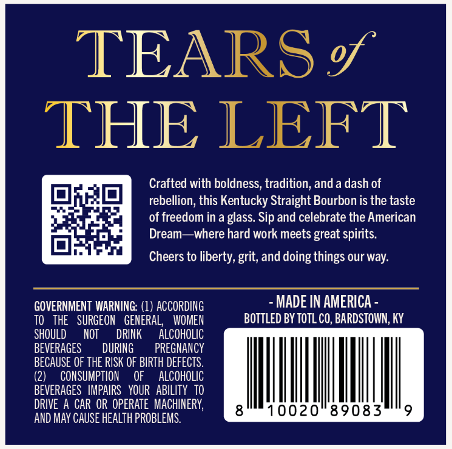
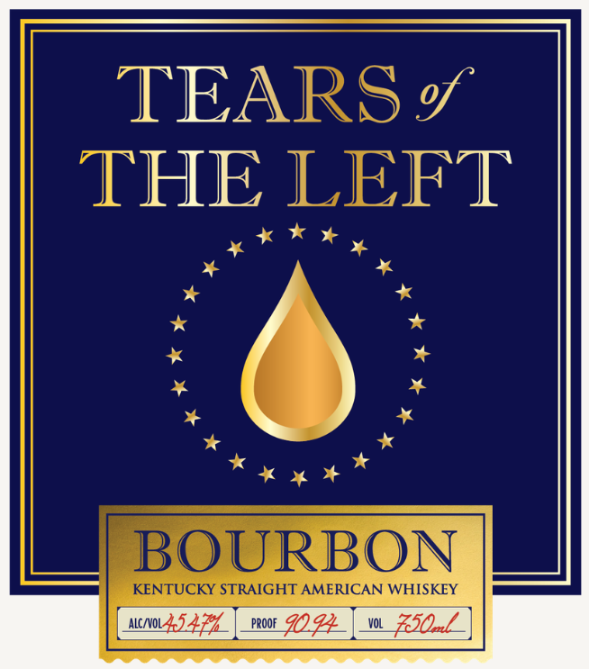
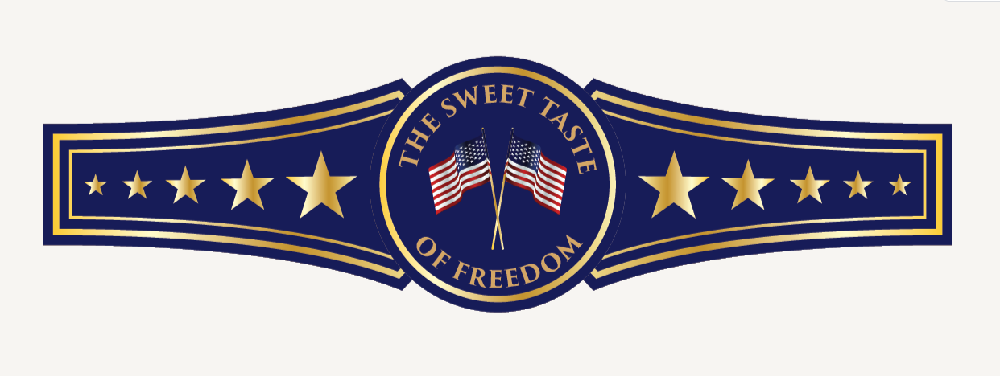

# TTB COLA Label Images - TTBID 26167001000750

**Brand Name:** TEARS OF THE LEFT

**Issue Date:** 06/24/2026

**Origin Code:** 22

**Product Class/Type:** 100

**Source:** [TTB Public COLA Registry](https://ttbonline.gov/colasonline/viewColaDetails.do?action=publicFormDisplay&ttbid=26167001000750)

## Label Images

### Back Label

### Front Label

### Label 2

## Extracted Label Text

*Text extracted via OCR - may contain errors*

*1 image(s) excluded: text did not meet readability threshold*

### Back Label

TEARS $
THE LEFT
Crafted with boldness, tradition; anda dash of
rebellion; this Kentucky Straight Bourbon is the taste
of freedom in a glass. Sip and celebrate the American
Dream
where hard work meets great spirits.
Cheers to liberty,
and doing things our way:
GOVERNMENT WARNING: (1) ACCORDING
MADE IN AMERICA =
TO
THE
SURGEON   GENERAL,
WOMEN
BOTTLED BY TOTL CO, BARDSTOWN, KY
SHOULD
NOT
DRINK
ALCOHOLIC
BEVERAGES
DURING
PREGNANCY
BECAUSE OF THE RISK OF BIRTH DEFECTS.
(2)
CONSUMPTION
OF
ALCOHOLIC
BEVERAGES   IMPAIPS   YOUR   ABILITY TO
DRIVE A CAR OR OPERATE   MACHINERY,
10020"89083
9
AND MAY CAUSE HEALTh PROBLEMS.
grit;

### Front Label

TEARS %
THE LEFT
BOURBON
KENTUCKY STRAIGHT AMERICAN WHISKEY
ALC NOL
41ZEA
Proof
909
Vol
EiDal
