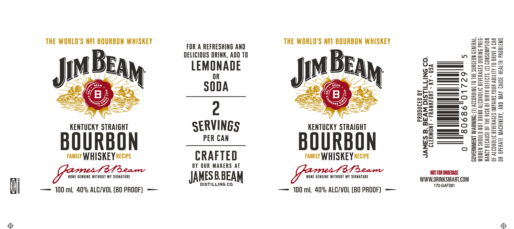

# TTB COLA Label Images - TTBID 26167001000794

**Brand Name:** JIM BEAM

**Issue Date:** 07/17/2026

**Origin Code:** 44

**Product Class/Type:** 101

**Source:** [TTB Public COLA Registry](https://ttbonline.gov/colasonline/viewColaDetails.do?action=publicFormDisplay&ttbid=26167001000794)

## Label Images

### Label 1

## Extracted Label Text

*Text extracted via OCR - may contain errors*

**Detected Proof:** 80

### Label 1

Carian

THE WORLD'S NO] BOURBON WHISKEY

KENTUCKY STRAIGHT

FAMILY WHISKEY RECIPE

y, NONE GENUINE WITHOUT MY SIGNATURE

—— 100 mL 40% ALC/VOL (80 PROOF) ——

0000000-01

FOR A REFRESHING AND
DELICIOUS DRINK, ADD 10

LEMONADE
OR
SODA

SERVINGS

PER CAN

CRAFTED

BY OUR MAKERS AT

JAMESB.BEAM

DISTILLING CO.

THE WORLD'S NOI BOURBON WHISKEY

KENTUCKY STRAIGHT

BOURBON

FAMILY WHISKEY RECIPE

y, NONE GENUINE WITHOUT MY SIGNATURE

—— 100 ml 40% ALC/VOL (80 PROOF) -——

PRODUCED BY

JAMES B. BEAM DISTILLING CO.

WWW.DRINKSMART.COM

80686

NT WARNING
QULD NOT OR

CLERMONT - FRANKFORT - KY - USA
AUSE OF THE

NOT FOR UNDERAGE

170-GAF281

5

01729

0
GOVERNM
WOMEN $

1
—c = co

cco cc — «5

Sec 7 ee
ao —

cn

eH ¢> oo

10
BEV
EFE
HA

a —

(1) ACCORDIN
Nk ALCOHOLI
ISK OF BIRTH
§ IMPAIRS YO

ae

LIC BEVERAG
E MACHINE

WW = «5 @

NANCY BE
OF ALCOW

os

paren

a
=

—

Lh
ow

(ar)

c=

—
