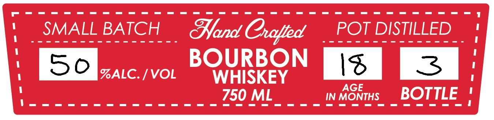
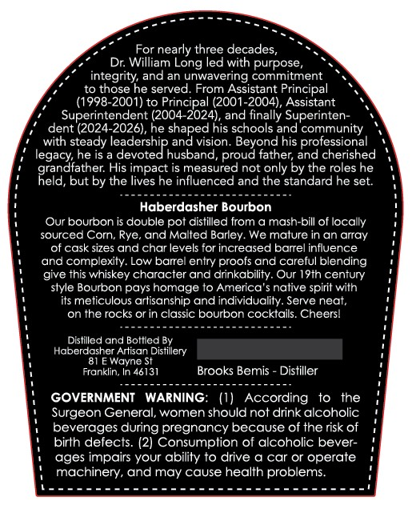

# TTB COLA Label Images - TTBID 26167001000930

**Brand Name:** LEGACY RESERVE

**Issue Date:** 06/26/2026

**Origin Code:** 19

**Product Class/Type:** 141

**Source:** [TTB Public COLA Registry](https://ttbonline.gov/colasonline/viewColaDetails.do?action=publicFormDisplay&ttbid=26167001000930)

## Label Images

### Label 1

### Label 2

### Label 3

## Extracted Label Text

*Text extracted via OCR - may contain errors*

*1 image(s) excluded: text did not meet readability threshold*

### Label 2

SMALL BATCH
Band
POT DISTILLED
50
BOURBON
Is
%ALC. / VOL
WHISKEY
AGE
750 ML _
IN MONTHS
BOTTLE_
Cxlied

### Label 3

For nearly three decades,
Dr: William Long led with purpose
integrity; and an unwavering commitment
to those he served
From Assistant Principal
(1998-2001) to Principal (2001-2004), Assistant
Superintendent (2004-2024), and finally Superinten .
dent (2024-2026), he shaped his schools and community
with steady leadership and vision: Beyond his professional
he is
devoted husband;
proud father; and cherished
R3a 5,
His impact is measured not only by the roles he
d, but by the lives he influenced and the standard he set:
Haberdasher Bourbon
Our bourbon is double pot distilled from & mash-bill of locally
sourced Corn, Rye
and Malted Barley We malure in an array
of cask sizes and char levels for increased barrel influence
and complexity: Low barrel entry proofs and careful blending
give this whiskey character and drinkability. Our I9th century
slyle Bourbon pays homage t0 America
nalive spiril with
its meticulous artisanship and individuality. Serve neat;
on the rocks Or in classic bourbon cocktails. Cheersl
Distilled and Bottled By
Haberdasher Artisan Distillery
Wayne St
Franklin; In 46131
Brooks Bemis
Distiller
GOVERNMENT
WARNING: (1)
According
the
Surgeon General; women should not drink alcoholic
beverages during pregnancy because of the risk of
birlh defects: (2) Consumplion of alcoholic bever-
ages impairs your ability to drive & car or operate
machinery, and may cause health problems
