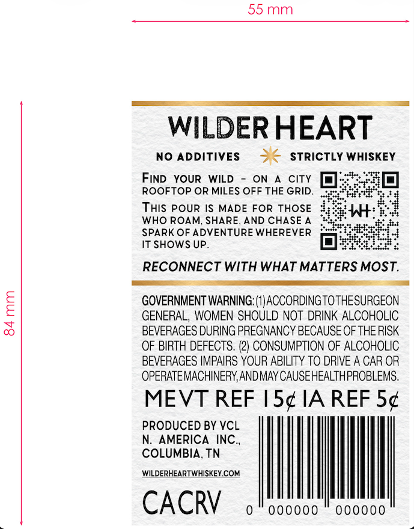
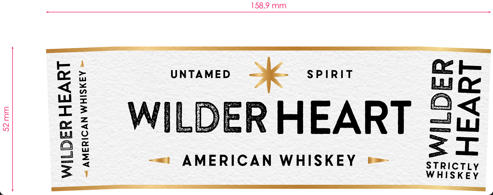
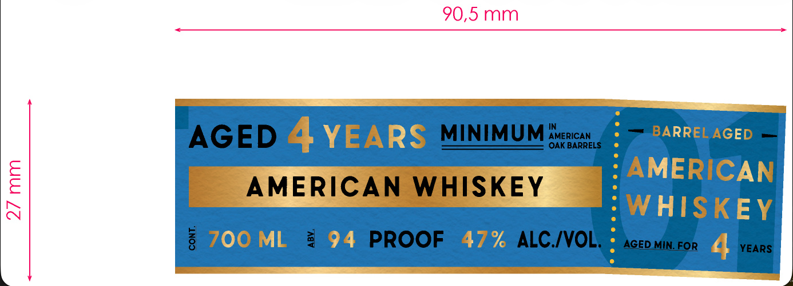
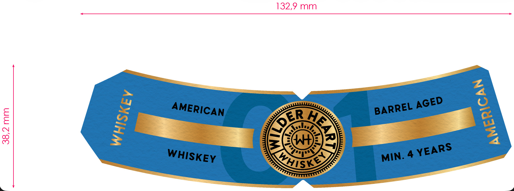

# TTB COLA Label Images - TTBID 26168001000117

**Brand Name:** WILDER HEART AMERICAN WHISKEY

**Issue Date:** 07/27/2026

**Origin Code:** 43

**Product Class/Type:** 140

**Source:** [TTB Public COLA Registry](https://ttbonline.gov/colasonline/viewColaDetails.do?action=publicFormDisplay&ttbid=26168001000117)

## Label Images

### Back Label

### Front Label

### Label 3

### Label 4

## Extracted Label Text

*Text extracted via OCR - may contain errors*

**Detected Proof:** 94
**Detected Age:** 4 Years

### Back Label

55mm

WILDER HEART

NO ADDITIVES x STRICTLY WHISKEY

FIND YOUR WILD - ON A CITY

ROOFTOP OR MILES OFF THE GRID.

THIS POUR IS MADE FOR THOSE

EEE,

art *s

WHO ROAM, SHARE, AND CHASE A

WwW:

a des

SPARK OF ADVENTURE WHEREVER

IT SHOWS UP.

tae

RECONNECT WITH WHAT MATTERS MOST.

GOVERNMENT WARNING: (1) ACCORDINGTOTHESURGEON

GENERAL, WOMEN SHOULD NOT DRINK ALCOHOLIC

BEVERAGES DURING PREGNANCY BECAUSE OF THE RISK

OF BIRTH DEFECTS. (2) CONSUMPTION OF ALCOHOLIC

BEVERAGES IMPAIRS YOUR ABILITY TO DRIVE A CAR OR

OPERATE MACHINERY, AND MAY CAUSEHEALTHPROBLEMS.

MEVT REF |5¢ IA REF 5¢

PRODUCED BY VCL

N. AMERICA INC.,

COLUMBIA, TN

WILDERHEARTWHISKEY.COM

CACRY

0 000000

000000

### Front Label

158,9 mm
UNTAMED
SPIRIT
1
W
WILDERHEART
0
1
AMERICAN
WHISKEY
STRictLy
WhISKEY

### Label 3

90,5 mm
AGED 4 YEARS
MINIMUM
OAEBIRRELS
BARREL AGED
0
AMERICAN WHISKEY
AMERICAN
~
WHISKEY
8
700 ML
9
94
PROOF
47% ALC IVOL;
AGED MIN FOR
YEARS

### Label 4

132,9 mm
ER
1
4
mse
1
1
AGED
AMERICAN
BARREL
)
3
YEARS
WHISKEY
MIN.
