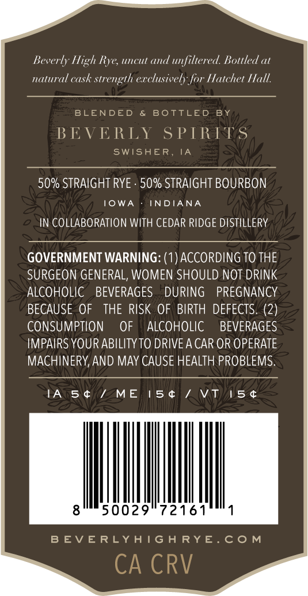
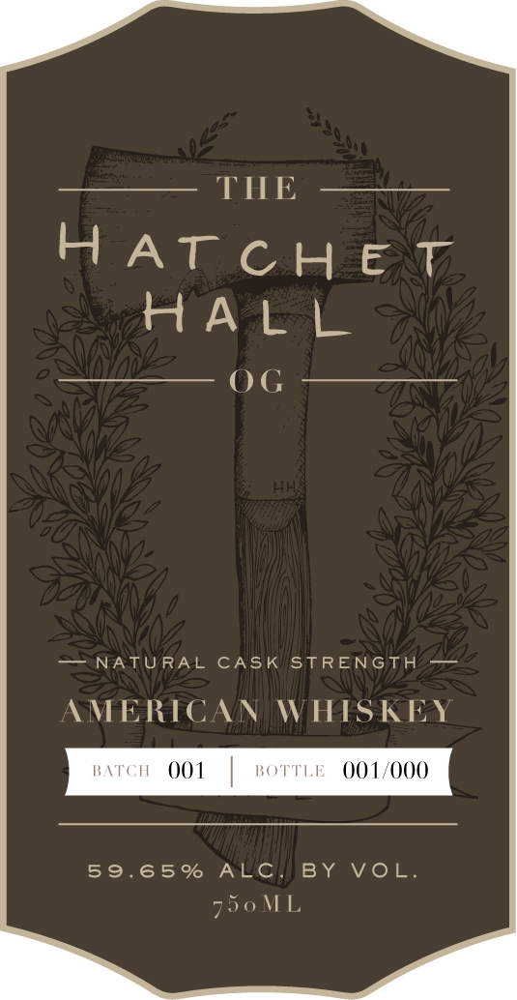
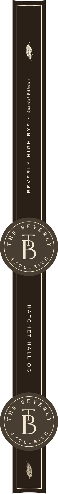

# TTB COLA Label Images - TTBID 26168001000255

**Brand Name:** THE HATCHET HALL OG

**Issue Date:** 06/29/2026

**Origin Code:** 20

**Product Class/Type:** 140

**Source:** [TTB Public COLA Registry](https://ttbonline.gov/colasonline/viewColaDetails.do?action=publicFormDisplay&ttbid=26168001000255)

## Label Images

### Back Label

### Front Label

### Label 2

## Extracted Label Text

*Text extracted via OCR - may contain errors*

**Detected Proof:** 119.3

### Back Label

Beverly High Rye; uncut
unfiltered Bottled at
natural cask
strength erclusively for Hatchet Hall
BLENDED
BoTTLED
BY
BEVERLY
S PTRITS
SWISHER, IA
50% STRAIGHT RYE
50% STRAIGHT BOURBON
I0WA
INDIANA
IN COLLABORATION WITH CEDAR RIDGE DISTILLERY
GOVERNMENT WARNING: (1) ACCORDING TO THE
SURGEON GENERAL, WOMEN SHOULD NOT DRINK
ALCOHOLIC
BEVERAGES
DURING
PREGNANCY
BECAUSE OF
THE RISK OF BIRTH DEFECTS. (2)
CONSUMPTION
OF
ALCOHOLIC
BEVERAGES
IMPAIRS YOUR ABILITYTO DRIVEA CAR OR OPERATE
MACHINERY,AND MAY CAUSE HEALTH PROBLEMS.
IA
5 t
1 ME
15 $
Vti
15 t
50029"72161'
B EV E RLYATG H RYE.C0 M
CA CRV
and

### Front Label

THE
HAT c H
E
HA L
NATU RAL
CASK
STRENGTH
AMERICAN
WHISKEY
BATCH
001
BOTTLE
001/000
59.65 %
ALC
BY
VoL
750 ML

### Label 2

~ uompg ivioeds » ALY HOIH ATYAAaE HATCHET HALL OG
