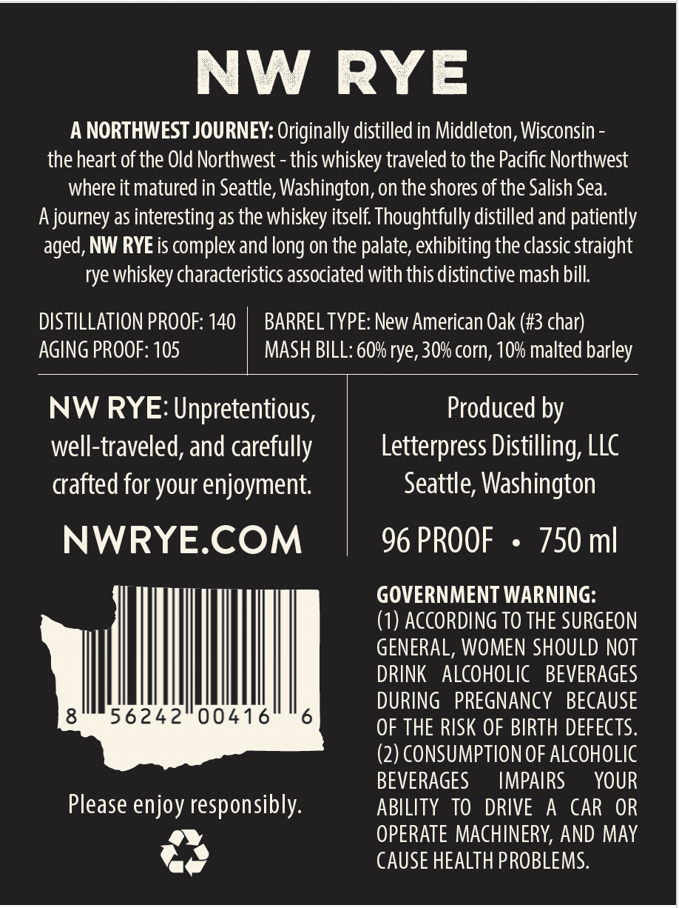
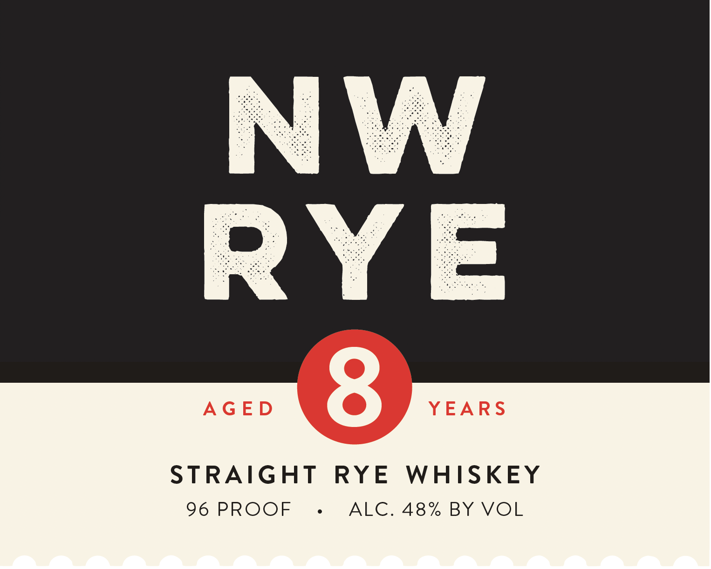

# TTB COLA Label Images - TTBID 26168001000473

**Brand Name:** NW RYE

**Issue Date:** 06/25/2026

**Origin Code:** 07

**Product Class/Type:** 102

**Source:** [TTB Public COLA Registry](https://ttbonline.gov/colasonline/viewColaDetails.do?action=publicFormDisplay&ttbid=26168001000473)

## Label Images

### Back Label

### Front Label

## Extracted Label Text

*Text extracted via OCR - may contain errors*

**Detected Proof:** 140

### Back Label

NW
RYE
A NORTHWEST JOURNEY: Originally distilled in Middleton; Wisconsin
the heart of the Old Northwest
this whiskey traveled to the Pacific Northwest
where it matured in Seattle; Washington,on the shores of the Salish Sea;
Ajourney as interesting as the whiskey itself Thoughtfully distilled and patiently
NW RYE is complex and long on the palate, exhibiting the classic straight
rye whiskey characteristics associated with this distinctive mash bill
DISTILLATION PROOF: 140
BARREL TYPE: New American Oak (#3 char)
AGing PROOF: 105
MASH BILL: 60% rye, 30% corn; 10% malted barley
NW RYE: Unpretentious,
Produced by
well-traveled, and carefully
Letterpress Distilling; LLC
crafted for your enjoyment;
Seattle; Washington
NWRYECOM
96 PROOF
750 ml
GOVERNMENT WARNING:
(1) ACCORDING TO THE SURGEON
GENERAL, WOMEN SHOULD NOT
DRINK
ALCOHOLIC
BEVERAGES
DURING
PREGNANCY
BECAUSE
8
56242
00416
6
OF THE RISK OF BIRTH DEFECTS.
(2) CONSUMPTION OF ALCOHOLIC
BEVERAGES
IMPAIRS
YOUR
Please enjoy responsibly:
ABILITY
TO
DRIVE
A
CAR
OR
OPERATE MACHINERY, AND May
CAUSE HEALTH PROBLEMS:
aged, +

### Front Label

AGED

YEARS

STRAIGHT RYE WHISKEY

96 PROOF

ALC. 48% BY VOL
