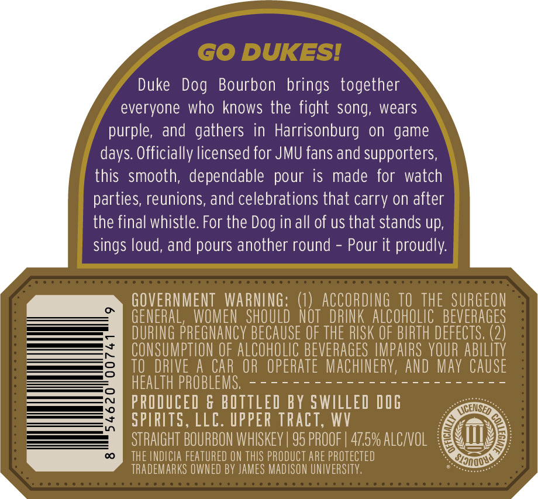
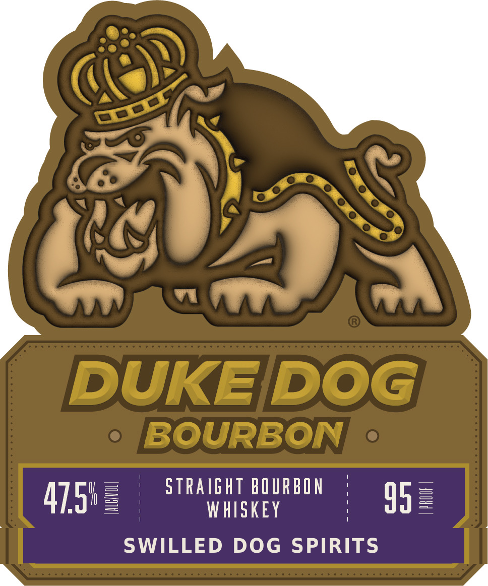
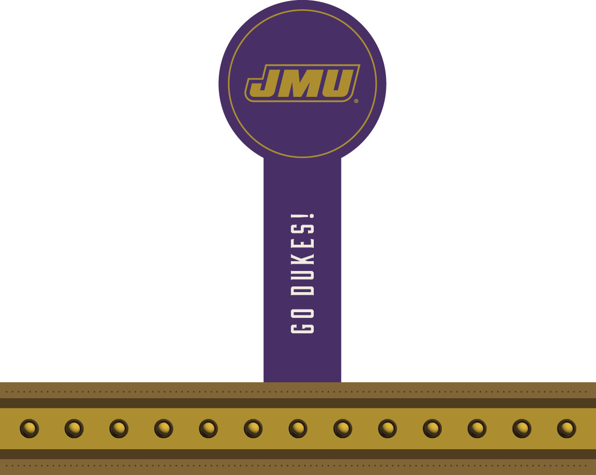

# TTB COLA Label Images - TTBID 26168001000675

**Brand Name:** SWILLED DOG SPIRITS

**Fanciful Name:** DUKE DOG BOURBON

**Issue Date:** 06/24/2026

**Origin Code:** 47

**Product Class/Type:** 101

**Source:** [TTB Public COLA Registry](https://ttbonline.gov/colasonline/viewColaDetails.do?action=publicFormDisplay&ttbid=26168001000675)

## Label Images

### Back Label

### Front Label

### Label 3

## Extracted Label Text

*Text extracted via OCR - may contain errors*

*1 image(s) excluded: text did not meet readability threshold*

**Detected Proof:** 95

### Back Label

GO DUKESI
Duke  Dog Bourbon brings together
everyone who knows the fight song; wears
purple, and gathers in Harrisonburg on game
Officially licensed for JMU fans and supporters,
this  smooth, dependable pour is made for watch
parties, reunions, and celebrations that carry on after
the final whistle For the Dog in all of us that stands up,
sings loud, and pours another round
Pour it proudly:
GOVERNMENT   WARNING:
ACCORDing TO THE SURGEON
GENERAL,
WOMEN  ShOULD   Not  DRINK AlCohOLIC   BEVERAGES
DURING
Pregnancy BECAUSE OF THE RISK OF BIRTH defects 2)
CONSUMPTION OF AlCohOLIC BEVERAGES IMPALRS YOUR abIlITy
TO  dRIVE A CAR OR operate MAChINERY, ANd May CAUSe
hEALTh PROBLEMS;
PRODUCED & BOTTLED BY SWILLED DOG
(CENSED
SPIRITS
LLC. UPPER TRact, WV
STRAIGHT BOURBON WHISKEY | 95 PROOF | 47.5% ALCVOL
THE INDICIA FEATURED ON THIS PRODUCT ARE PROTECTED
TRADEMARKS OWNED BY JAMES MADISON UNIVERSITY,
days:

### Front Label

DUKEDOG
BOURBON
straIght BOURBON
47.582
W HISkEY
95
SWILLED
DOG SPIRITS
