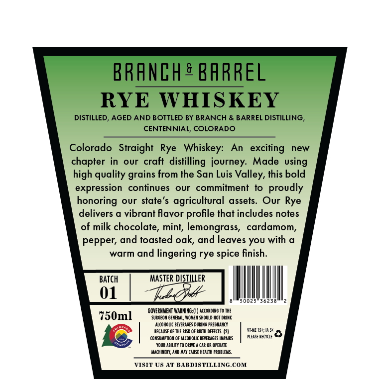
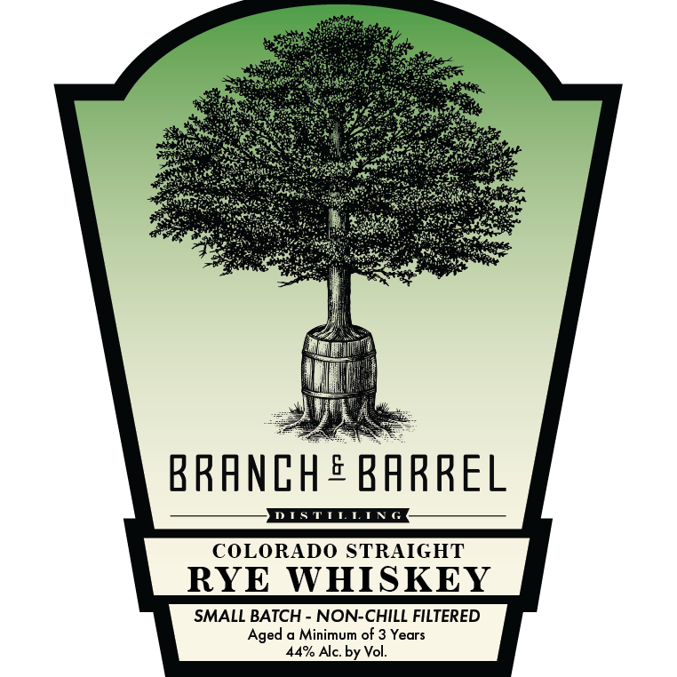

# TTB COLA Label Images - TTBID 26168001000835

**Brand Name:** BRANCH & BARREL

**Issue Date:** 06/24/2026

**Origin Code:** 13

**Product Class/Type:** 102

**Source:** [TTB Public COLA Registry](https://ttbonline.gov/colasonline/viewColaDetails.do?action=publicFormDisplay&ttbid=26168001000835)

## Label Images

### Back Label

### Front Label

## Extracted Label Text

*Text extracted via OCR - may contain errors*

**Detected Proof:** 88
**Detected Age:** 3 Years

### Back Label

RRANCH & BARREL
RYE
WHISKEY
DISTILLED, AGED AND BOTTLED BY BRANCH & BARREL DISTILLING _
CENTENNIAL; COLORADO
Colorado   Straight Rye   Whiskey:
An  exciting
new
chapter in
our  craft
distilling journey:
Made
high quality
from the San Luis Valley, this bold
expression
continues
our   commitment
to
proudly
honoring
our state'$
agricultural
assets. Our Rye
delivers a vibrant flavor profile that includes notes
of milk chocolate, mint, lemongrass,
cardamom,
pepper; and toasted oak, and leaves You with a
warm and lingering rye spice finish_
BATch
MasteR diSillleR
01
56 2 >
GOVERNMEMT WARNING; (I | according to The
750ml
SUIGEON GENERAL, 'NoWeM should MoT Dring
alcohovc BEvERAGES DurIAG PREGRANCY
BECAUSE OF IHE BISK OF EIEIH DEFECTS: (2)
Isc;Wa5t
(OnSuupii0m
alcohouc BEVERAGES WupaiRs
PLEASE ReCYCLe
YouR ABILITY T0 DEIVE A Car
OFERATE
MachiMeRU, AND May CauSE HealTh peoblems,
VISIT US AT BAKDISTILLINGCOM
using
grains
ViMI

### Front Label

BRANCH E BARREL
TISTTTT
COLORADO STRAIGHT
RYE
WHISKEY
SMALL BATCH
NON-CHILL FILTERED
Aged
Minimum of 3 Years
44% Alc. by Vol:.
