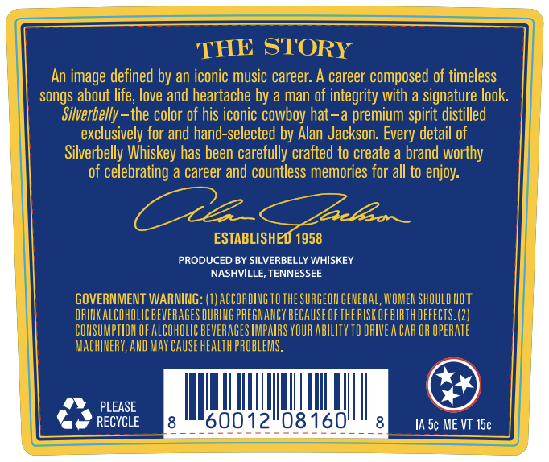

# TTB COLA Label Images - TTBID 26168001000844

**Brand Name:** SILVERBELLY WHISKEY

**Issue Date:** 06/25/2026

**Origin Code:** 43

**Product Class/Type:** 101

**Source:** [TTB Public COLA Registry](https://ttbonline.gov/colasonline/viewColaDetails.do?action=publicFormDisplay&ttbid=26168001000844)

## Label Images

### Back Label

## Extracted Label Text

*Text extracted via OCR - may contain errors*

### Back Label

THE STORY
An image defined by an iconic music career: A career composed of timeless
songs about life; love and heartache by a man of integrity with a signature look:
Silverbelly-the color of his iconic cowboy hat-a premium spirit distilled
exclusively for and hand-selected by Alan Jackson. Every detail of
Silverbelly Whiskey has been carefully crafted to create a brand worthy
of celebrating a career and countless memories for all to enjoy:
Zeelov _
ESTABLISHED 1958
PRODUCED BY SILVERBELLY WHISKEY
NASHVILLE, TENNESSEE
GOVERMMENT WARNING
ACCORDING TO THE SURGEON GERERAL, WOMEN ShOuLD HOT
IFINKALCOHOLCbeVeRAGES DURLNG PREGHAUCY BECauSE OF THE FISK OF BIRTH DEFECTS.(2|
CONSUMPTIOH OFALCOHOLIC BEVERAGES IMPAIRS YOUR AbILITY TO DRIVEA CAR OR OPERATE
MACHINERY,AND May Cause heaLth PROBLEMS
PLEASE
RECYCLE
60012108160'
IA 5c ME VT 15c
