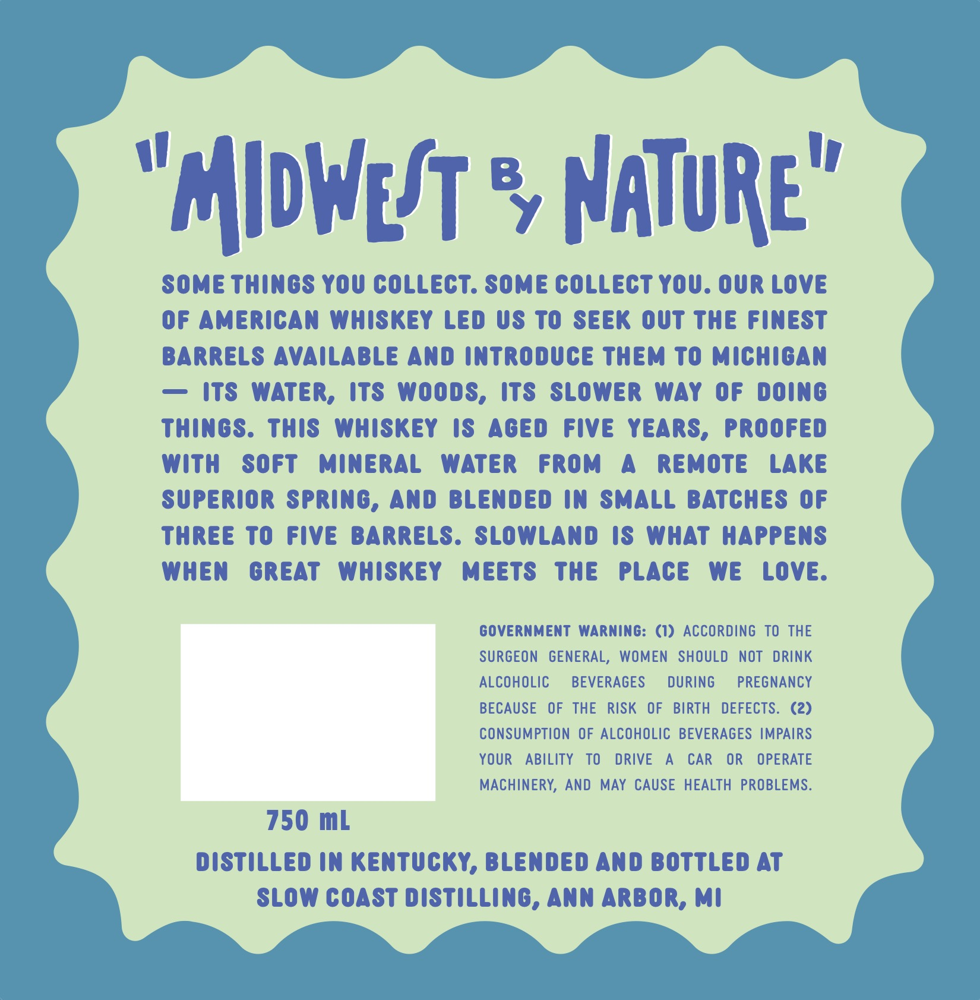
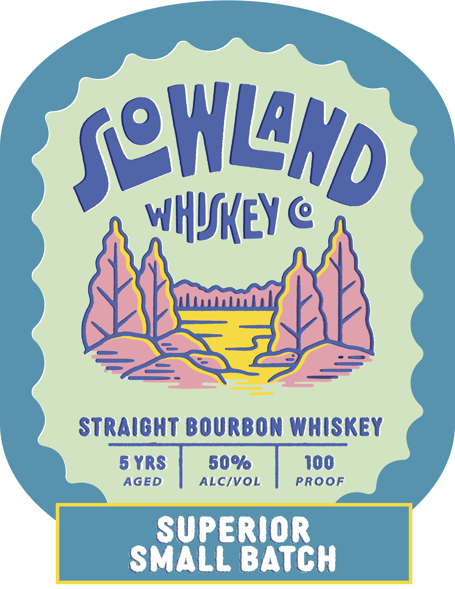

# TTB COLA Label Images - TTBID 26168001000871

**Brand Name:** SLOWLAND WHISKEY CO.

**Fanciful Name:** SUPERIOR SMALL BATCH

**Issue Date:** 06/26/2026

**Origin Code:** 06

**Product Class/Type:** 101

**Source:** [TTB Public COLA Registry](https://ttbonline.gov/colasonline/viewColaDetails.do?action=publicFormDisplay&ttbid=26168001000871)

## Label Images

### Back Label

### Front Label

## Extracted Label Text

*Text extracted via OCR - may contain errors*

**Detected Age:** 5 Years

### Back Label

"MldWeot % NAuRe'
Some Things YOU COLLecT. Some COLLECT You. OUR Love
0f American Whiskey Led Us To Seek out The Finest
BARRELS AvailabLe And introduce Them To Michigan
its WaTER,
ItS WoOdS,
Its
SLOWER
WAY 0f
doing
Things:
This
Whiskey
IS
Aged
Five YEARS,
Proofed
With
SoFT
MinERaL
WATER
FROm
Remote
LAKE
Superior Spring, And BLended in SMALL BatchES 0f
ThRee To
Five
BARRELS. SLOWLANd Is WHAT
HAPPENS
When
GREAT
Whiskey
MeetS
The
PLACE
We
Love.
GovernMenT WARninG: (1) According TO THE
SURGEON   GENERAL, WOMEN
SHOULD
nOT
DRINK
AlcOHOLIC
BEVERAGES
DURiNG
PREGNANCY
BECAUSE
OF THE
RISK
OF
BIRTH
DEFECTS.   (2)
consumption OF ALCOHOLIC BEVERAGES IMPAIRS
YOUR
ABILITY
TO
DRIVE
A
CAR
OR
OPERATE
MACHINERY, AND MAY CAUSE HEALTH PROBLEMS:
750 mL
distilled in Kentucky, BLended And bottled At
SLOW coAst distilling, Ann ARBOR, mi

### Front Label

(eHLHd
WHUeY @
StRAiGHT BOURBON Whiskey
5 YRS
509
100
AGED
ALCIVOL
PROOF
Superior
SMALL BATCH
3
