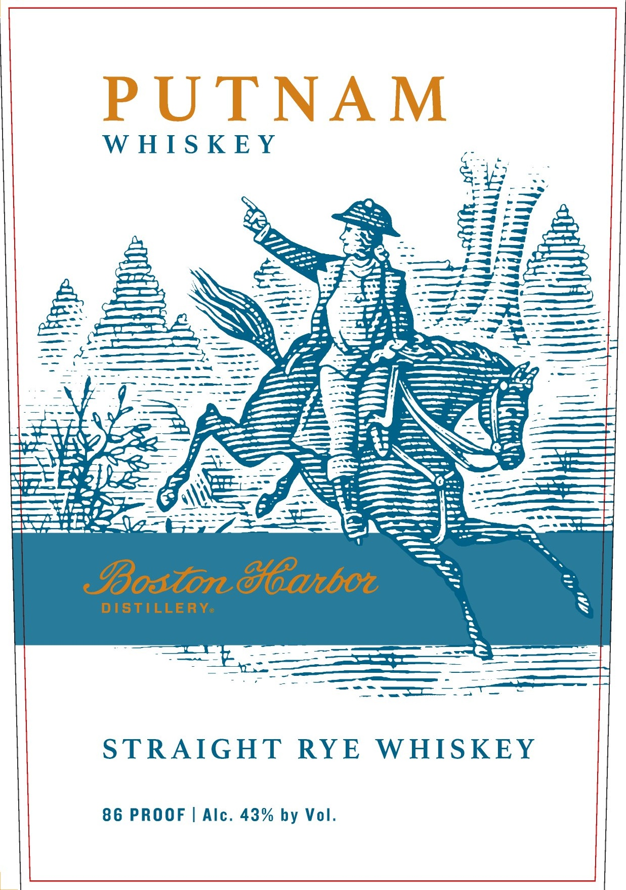
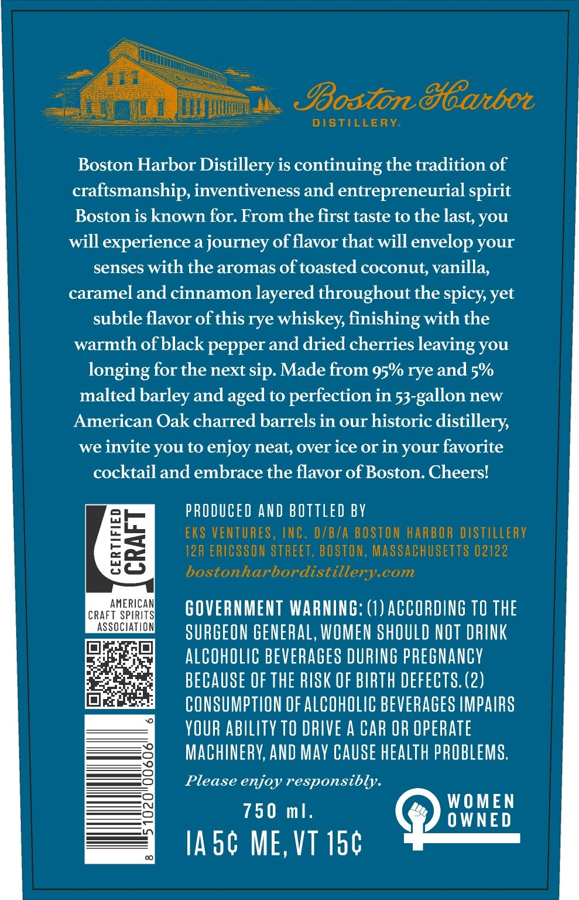

# TTB COLA Label Images - TTBID 26169001000020

**Brand Name:** PUTNAM

**Fanciful Name:** STRAIGHT RYE WHISKEY

**Issue Date:** 06/24/2026

**Origin Code:** 26

**Product Class/Type:** 102

**Source:** [TTB Public COLA Registry](https://ttbonline.gov/colasonline/viewColaDetails.do?action=publicFormDisplay&ttbid=26169001000020)

## Label Images

### Label 1

### Label 2

### Label 3

## Extracted Label Text

*Text extracted via OCR - may contain errors*

*2 image(s) excluded: text did not meet readability threshold*

### Label 2

Boston&eanbot
DISTILLERY
Boston Harbor Distillery is continuing the tradition of
craftsmanship, inventiveness and entrepreneurial spirit
Boston is known for. From the first taste to the last you
will
experience a journey of flavor that will envelop your
senses with the aromas of toasted coconut; vanilla;
caramel and cinnamon layered throughout the spicy yet
subtle flavor ofthis rye whiskey, finishing with the
warmth ofblack pepper and dried cherries leaving you
longing for the next sip. Made from 95% rye and 5%
malted barley and aged to perfection in 53-gallon new
American Oak charred barrels in our historic distillery
we
invite you to enjoy neat over ice Or in your favorite
cocktail and embrace the flavor of Boston. Cheersl
PRODUCED AND BOTTLEd BV
EKS VENTURES, INC. DZBTA BOSTON HARBOR DISTILLERV
8i
12R ERICSSON STREET, BOSTON, MASSACHUSETTS 02122
bostonharbordistillery.com
CRAFAMERICAS
GOVERNMENT WARNING: (1) ACCORDING TO THE
ASSOCIATION
SURGEON GENERAL, WOMEN SHOULD NOT DRINK
alCohOLIC BeVERAGeS DURING pREGNANCY
BECAUSE OF THE RISK OF BIRTH DEFECTS. (2)
CONSUMPTION OF AlCOhOLIC BEVERAGES IMPAIRS
YOUR abILITY TO DRIVE A CAR OR OPERATE
MAChINERV; AND May Cause hEalth PROBLEMS;
Please enjoy responsibly.
WOMEN
750 m],
0 WNED
Ia5c ME, VT 150
