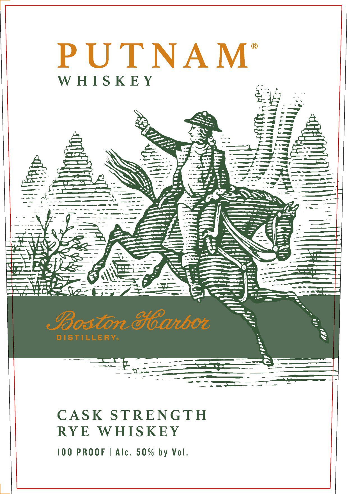
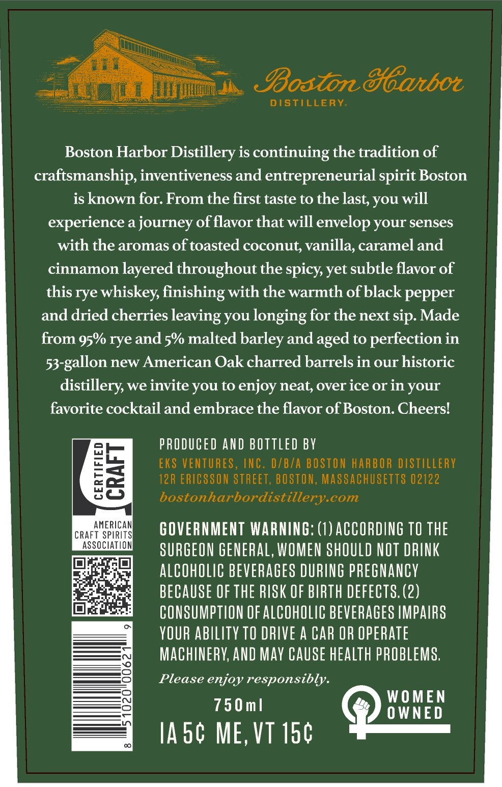
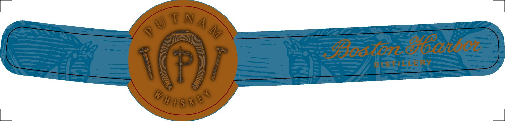

# TTB COLA Label Images - TTBID 26169001000021

**Brand Name:** PUTNAM

**Fanciful Name:** CASK STRENGTH RYE WHISKEY

**Issue Date:** 07/16/2026

**Origin Code:** 26

**Product Class/Type:** 142

**Source:** [TTB Public COLA Registry](https://ttbonline.gov/colasonline/viewColaDetails.do?action=publicFormDisplay&ttbid=26169001000021)

## Label Images

### Label 1

### Label 2

### Label 3

## Extracted Label Text

*Text extracted via OCR - may contain errors*

*2 image(s) excluded: text did not meet readability threshold*

### Label 2

SBostondoatbol
distillery
Boston Harbor Distillery is continuing the tradition of
craftsmanship, inventiveness and entrepreneurial
Boston
is known for: From the first taste to the
you will
experience a journey offlavor that will envelop your senses
with the aromas of toasted coconut vanilla; carameland
cinnamon layered throughout the spicy yet subtle flavor of
this rye whiskey, finishing with the warmth ofblack pepper
and dried cherries leaving you longing for the next sip Made
from 95% rye and 5% malted barley and aged to perfection in
53-gallon new American Oak charred barrels in our historic
distillery we invite you to enjoy neat; over ice or in your
favorite cocktail and embrace the flavor of Boston. Cheersl
PRODUCED AND BOTTLed BV
EKS VENTURES, INC. D/BTA BOSTON HARBOR DISTILLERY
85
12R ERICSSON STREET, BOSTON, MASSACHUSETTS 02122
bostonharbordistillery com
CRAFHMERRS
GOVERNMENT WARNING: (1) ACCORDING TO THE
ASSOCIATION
SURGEON GENERAL, WOMEN SHOULD NOT DRINK
alcoholIC beveRAGeS DURING prEGNanCY
BECAUSE OF THE RISK OF BIRTH DEFECTS. (2)
CONSUMPTION OF ALCOhOLIC bevERAGES LMPAIRS
YOUR abILITY TO DRIVE
CAR OR OpERATe
MAChINERY; AND MaY Cause hEaLth PROBLEMS,
Please enjoy responsibly.
WOMEN
750 m |
0 WNED
IA 5c ME, VT 150
spirit
last,
